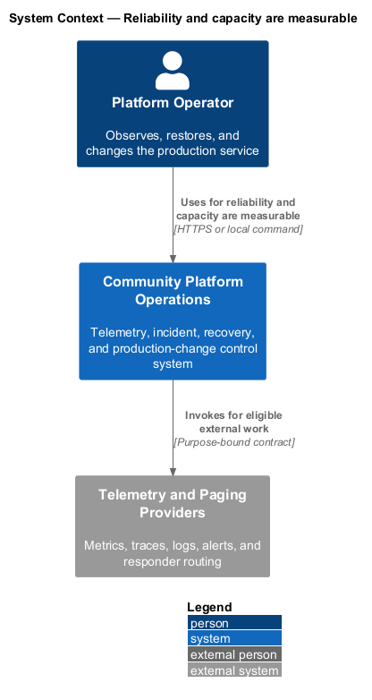
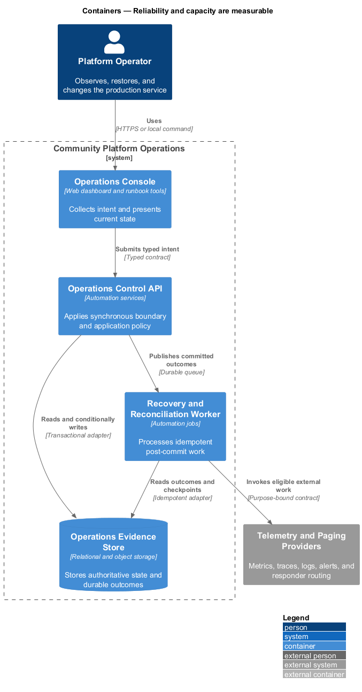
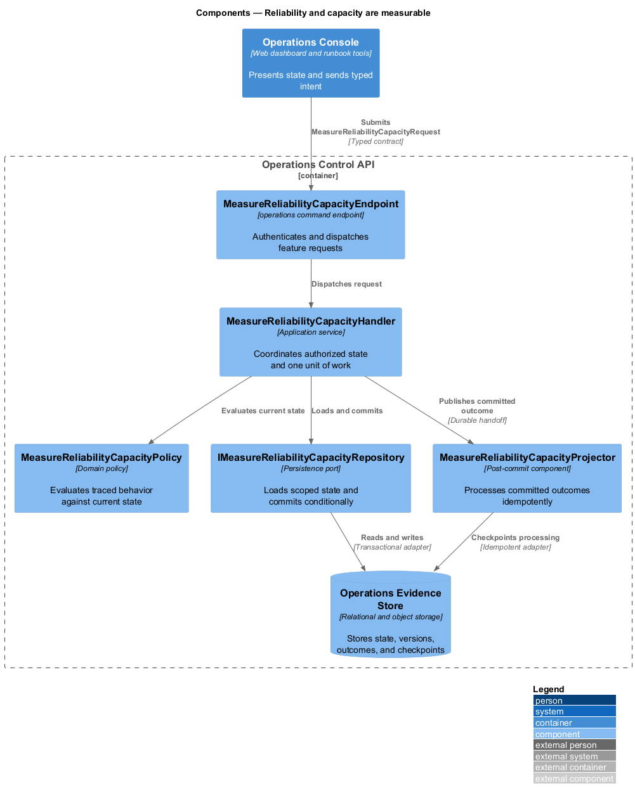
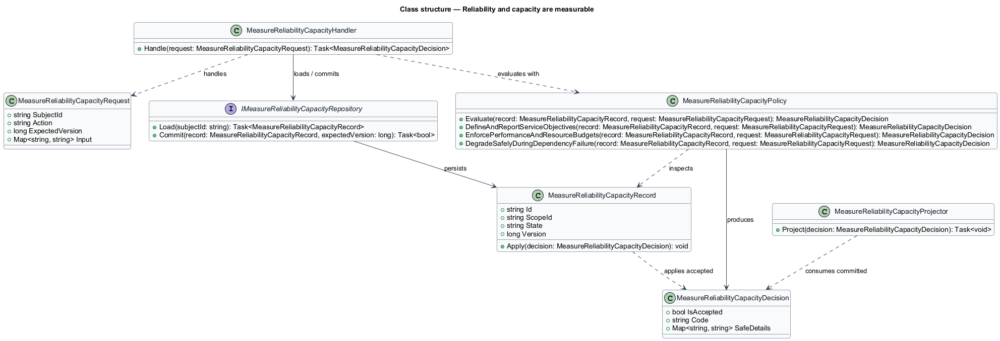
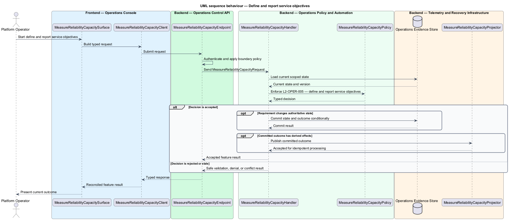
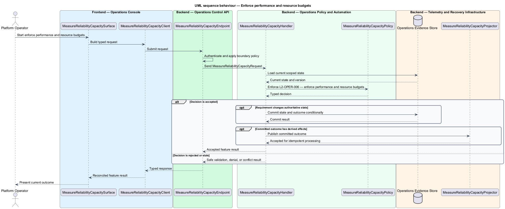
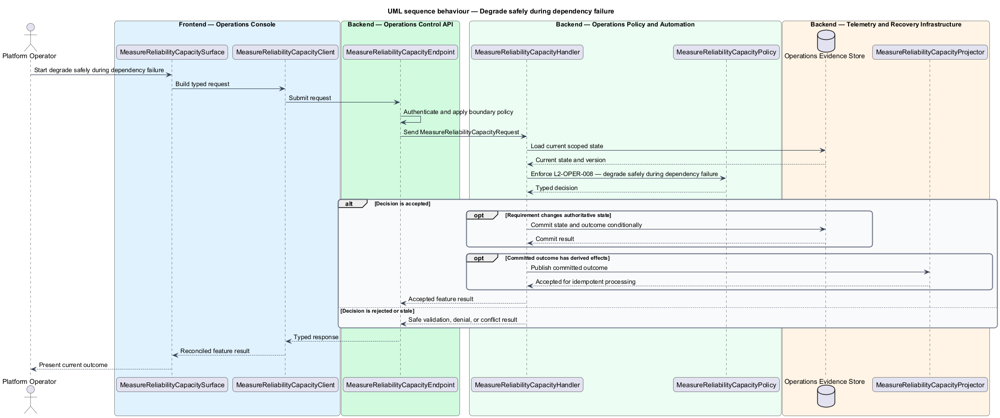

# Reliability and capacity are measurable

## Overview

Community Starter is a community platform divided into product and platform subsystems. The
Operations and reliability subsystem owns this feature.

*reliability and capacity are measurable* — subsystem capability that covers define and report service objectives, enforce performance and resource budgets, and degrade safely during dependency failure

Members and Community teams need predictable service while Platform Operators need privacy-safe evidence, owned alerts, repeatable recovery, and bounded failure modes. Production-scale means the starter defines measurable objectives and proves recovery and capacity; it does not merely contain a health endpoint or pass a build. Service objectives, performance budgets, resource bounds, and graceful degradation are declared and validated against representative MVP workloads.

The feature groups 3 traced behaviors behind one policy and evidence
boundary: `L2-OPER-005`, `L2-OPER-006`, and `L2-OPER-008`. Authoritative state commits before projections, delivery, or external work reports
success.

## Description

The repository contains specifications but no application implementation. This greenfield slice
defines the following building blocks across `Operations Console`, `Operations Control API`, the
application and domain layer, and infrastructure.

- **`MeasureReliabilityCapacitySurface`** — operations console surface in `Operations Console`. It presents current
  state, submits user intent, and reconciles the typed result.
- **`MeasureReliabilityCapacityClient`** — typed operations adapter. It creates `MeasureReliabilityCapacityRequest` values and maps stable
  transport failures into feature results.
- **`MeasureReliabilityCapacityEndpoint`** — operations command endpoint in `Operations Control API`. It authenticates the
  caller, applies boundary policy, and dispatches the request.
- **`MeasureReliabilityCapacityRequest`** — immutable request carrying `SubjectId`, `Action`, `ExpectedVersion`, and the
  scoped input needed by one traced behavior.
- **`MeasureReliabilityCapacityHandler`** — application service that loads authorized state through
  `IMeasureReliabilityCapacityRepository`, invokes `MeasureReliabilityCapacityPolicy`, and commits an accepted transition.
- **`MeasureReliabilityCapacityPolicy`** — domain policy that evaluates current state and returns a typed
  `MeasureReliabilityCapacityDecision` without performing external work.
- **`MeasureReliabilityCapacityRecord`** — authoritative record containing the feature state, scope, and concurrency
  version.
- **`IMeasureReliabilityCapacityRepository`** — persistence port that loads scoped state and commits one conditional
  unit of work.
- **`MeasureReliabilityCapacityProjector`** — idempotent post-commit component in `Recovery and Reconciliation Worker`. It updates
  eligible projections and invokes configured external providers.

`MeasureReliabilityCapacityPolicy` exposes one named operation for each traced behavior:

- **`MeasureReliabilityCapacityPolicy.DefineAndReportServiceObjectives(record, request)`** — evaluates `L2-OPER-005` (define and report service objectives) and returns a typed decision before any state change.
- **`MeasureReliabilityCapacityPolicy.EnforcePerformanceAndResourceBudgets(record, request)`** — evaluates `L2-OPER-006` (enforce performance and resource budgets) and returns a typed decision before any state change.
- **`MeasureReliabilityCapacityPolicy.DegradeSafelyDuringDependencyFailure(record, request)`** — evaluates `L2-OPER-008` (degrade safely during dependency failure) and returns a typed decision before any state change.

## Requirements

The feature realizes the following level-2 (L2) requirements. Each row preserves the specification
identifier, its level-1 (L1) parent, and the requirement statement verbatim.

| L2 ID | Refines (L1) | Requirement |
|-------|--------------|-------------|
| `L2-OPER-005` | `L1-OPER-002` | Before launch, owners define service-level indicators and objectives for availability, request and Job latency, critical journey success, Feed and Search freshness, and Notification timeliness. Each objective states population, window, exclusions, data source, error budget, and response policy. |
| `L2-OPER-006` | `L1-OPER-002` | The product defines representative budgets for marketing first render, Angular route loading, critical API latency, query count and size, media handling, memory, CPU, outbound calls, and Job duration. Inputs, pages, concurrency, timeouts, and payloads are bounded at every untrusted boundary. |
| `L2-OPER-008` | `L1-OPER-002` | Every required and optional dependency has a timeout, failure classification, user effect, retry or queue behavior, recovery/reconciliation rule, and owner. Core authorization and privacy never fail open; REST and persisted state remain authoritative when realtime, Search, analytics, or delivery is degraded. |

## Diagrams

### System context

The `Platform Operator` uses `Community Platform Operations` for the feature. The system invokes
`Telemetry and Paging Providers` only for configured external work after authoritative decisions.

### Containers

`Operations Console` collects intent, `Operations Control API` applies the synchronous boundary,
and `Operations Evidence Store` holds authoritative state. `Recovery and Reconciliation Worker` handles eligible
post-commit work against `Telemetry and Paging Providers`.

### Components

Inside `Operations Control API`, `MeasureReliabilityCapacityEndpoint` dispatches `MeasureReliabilityCapacityHandler`. The handler evaluates
`MeasureReliabilityCapacityPolicy`, persists through `IMeasureReliabilityCapacityRepository`, and hands committed outcomes to
`MeasureReliabilityCapacityProjector`.

### Class structure

`MeasureReliabilityCapacityHandler` depends on the immutable request, domain policy, and repository port.
`MeasureReliabilityCapacityRecord` owns versioned state, while `MeasureReliabilityCapacityProjector` consumes committed results.

### Behaviour — define and report service objectives

The interaction loads current scoped state before `MeasureReliabilityCapacityPolicy` enforces
`L2-OPER-005`. Rejected decisions return without changing authoritative state; accepted
state changes commit before optional derived work starts.

### Behaviour — enforce performance and resource budgets

The interaction loads current scoped state before `MeasureReliabilityCapacityPolicy` enforces
`L2-OPER-006`. Rejected decisions return without changing authoritative state; accepted
state changes commit before optional derived work starts.

### Behaviour — degrade safely during dependency failure

The interaction loads current scoped state before `MeasureReliabilityCapacityPolicy` enforces
`L2-OPER-008`. Rejected decisions return without changing authoritative state; accepted
state changes commit before optional derived work starts.

