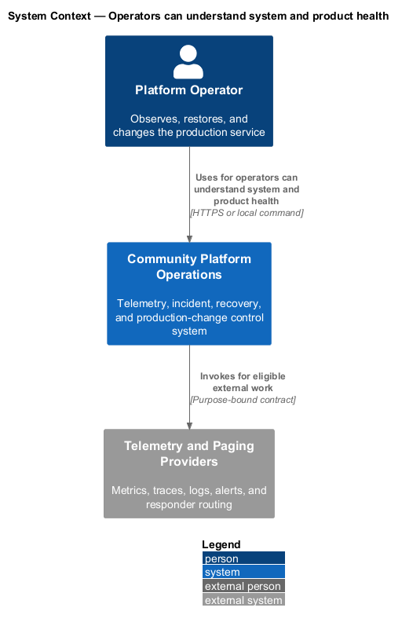
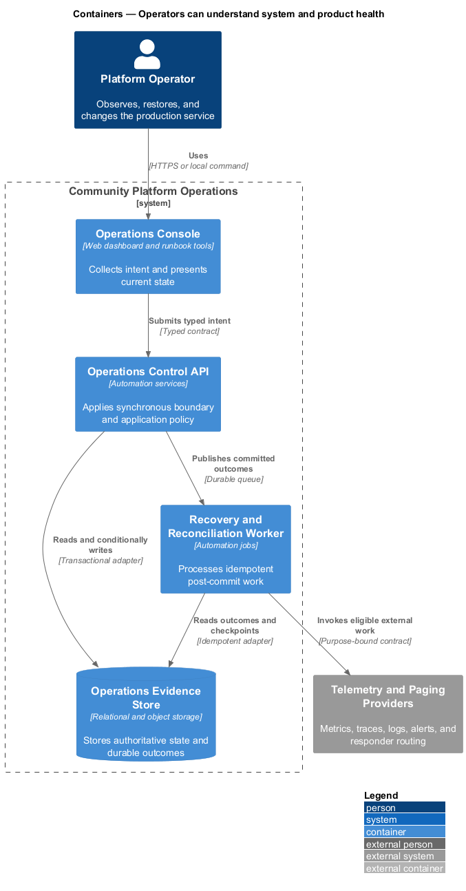
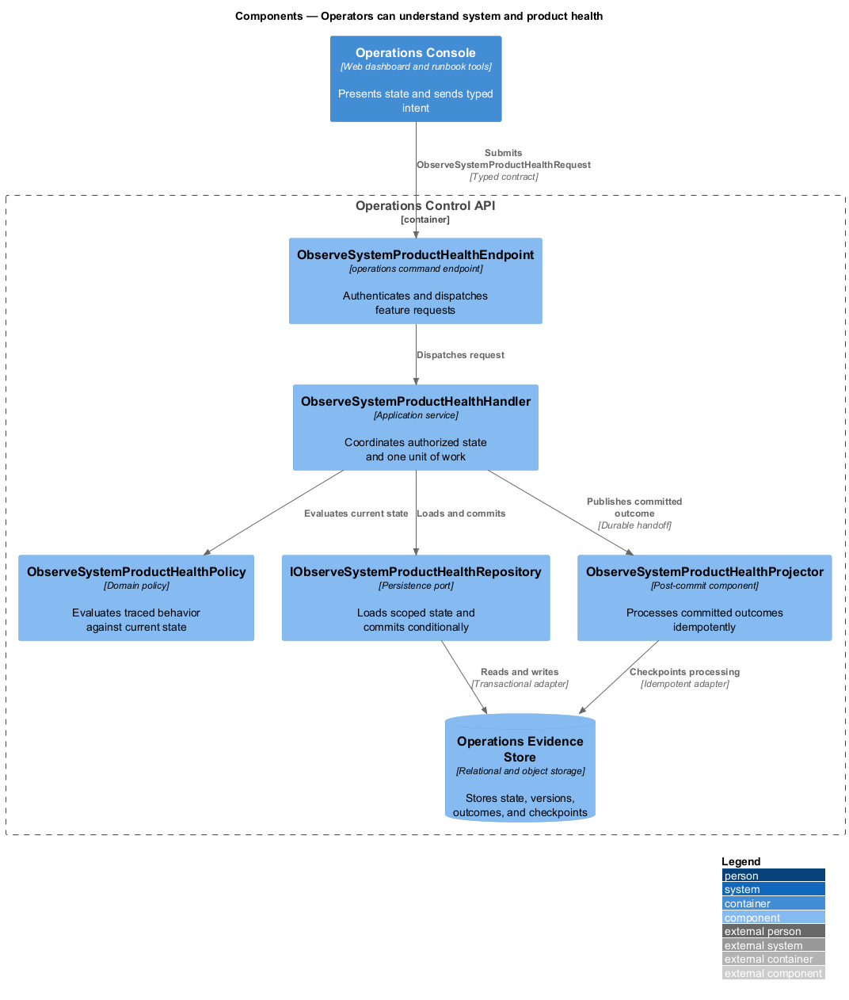
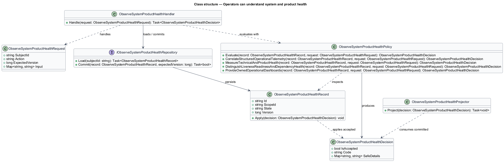
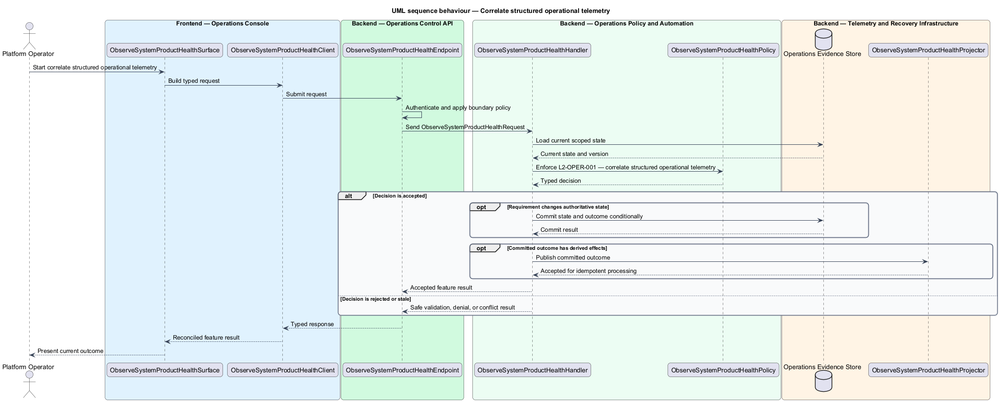
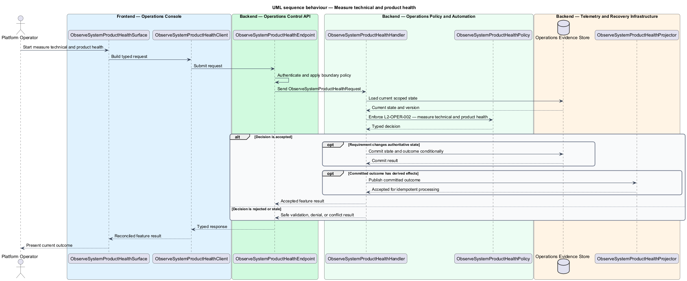
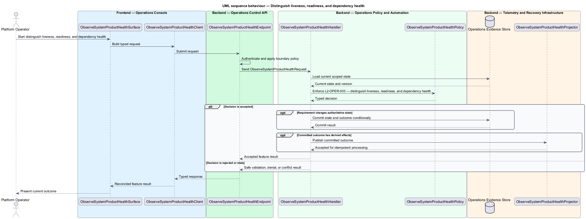
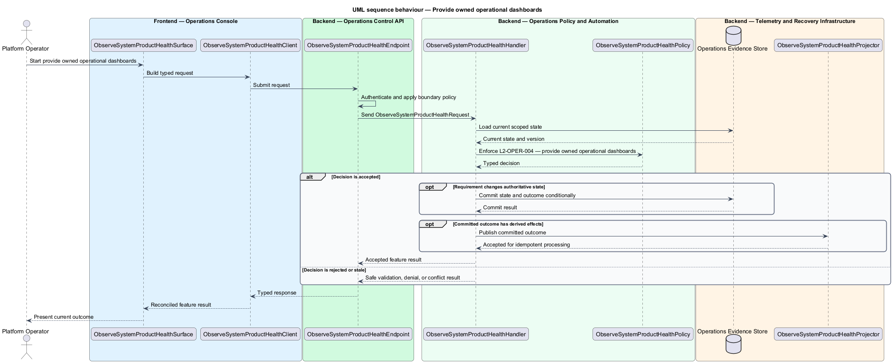

# Operators can understand system and product health

## Overview

Community Starter is a community platform divided into product and platform subsystems. The
Operations and reliability subsystem owns this feature.

*operators can understand system and product health* — subsystem capability that covers correlate structured operational telemetry, measure technical and product health, distinguish liveness, readiness, and dependency health, and provide owned operational dashboards

Members and Community teams need predictable service while Platform Operators need privacy-safe evidence, owned alerts, repeatable recovery, and bounded failure modes. Production-scale means the starter defines measurable objectives and proves recovery and capacity; it does not merely contain a health endpoint or pass a build. Logs, traces, metrics, health probes, and dashboards correlate requests, Jobs, external calls, realtime work, and product-defining transitions without exposing sensitive content.

The feature groups 4 traced behaviors behind one policy and evidence
boundary: `L2-OPER-001`, `L2-OPER-002`, `L2-OPER-003`, and `L2-OPER-004`. Authoritative state commits before projections, delivery, or external work reports
success.

## Description

The repository contains specifications but no application implementation. This greenfield slice
defines the following building blocks across `Operations Console`, `Operations Control API`, the
application and domain layer, and infrastructure.

- **`ObserveSystemProductHealthSurface`** — operations console surface in `Operations Console`. It presents current
  state, submits user intent, and reconciles the typed result.
- **`ObserveSystemProductHealthClient`** — typed operations adapter. It creates `ObserveSystemProductHealthRequest` values and maps stable
  transport failures into feature results.
- **`ObserveSystemProductHealthEndpoint`** — operations command endpoint in `Operations Control API`. It authenticates the
  caller, applies boundary policy, and dispatches the request.
- **`ObserveSystemProductHealthRequest`** — immutable request carrying `SubjectId`, `Action`, `ExpectedVersion`, and the
  scoped input needed by one traced behavior.
- **`ObserveSystemProductHealthHandler`** — application service that loads authorized state through
  `IObserveSystemProductHealthRepository`, invokes `ObserveSystemProductHealthPolicy`, and commits an accepted transition.
- **`ObserveSystemProductHealthPolicy`** — domain policy that evaluates current state and returns a typed
  `ObserveSystemProductHealthDecision` without performing external work.
- **`ObserveSystemProductHealthRecord`** — authoritative record containing the feature state, scope, and concurrency
  version.
- **`IObserveSystemProductHealthRepository`** — persistence port that loads scoped state and commits one conditional
  unit of work.
- **`ObserveSystemProductHealthProjector`** — idempotent post-commit component in `Recovery and Reconciliation Worker`. It updates
  eligible projections and invokes configured external providers.

`ObserveSystemProductHealthPolicy` exposes one named operation for each traced behavior:

- **`ObserveSystemProductHealthPolicy.CorrelateStructuredOperationalTelemetry(record, request)`** — evaluates `L2-OPER-001` (correlate structured operational telemetry) and returns a typed decision before any state change.
- **`ObserveSystemProductHealthPolicy.MeasureTechnicalAndProductHealth(record, request)`** — evaluates `L2-OPER-002` (measure technical and product health) and returns a typed decision before any state change.
- **`ObserveSystemProductHealthPolicy.DistinguishLivenessReadinessAndDependencyHealth(record, request)`** — evaluates `L2-OPER-003` (distinguish liveness, readiness, and dependency health) and returns a typed decision before any state change.
- **`ObserveSystemProductHealthPolicy.ProvideOwnedOperationalDashboards(record, request)`** — evaluates `L2-OPER-004` (provide owned operational dashboards) and returns a typed decision before any state change.

## Requirements

The feature realizes the following level-2 (L2) requirements. Each row preserves the specification
identifier, its level-1 (L1) parent, and the requirement statement verbatim.

| L2 ID | Refines (L1) | Requirement |
|-------|--------------|-------------|
| `L2-OPER-001` | `L1-OPER-001` | The API, Application handlers, persistence, external clients, Jobs, and realtime adapters emit structured events with stable names, severity, UTC time, environment, service version, and propagated correlation and trace context. Telemetry follows the privacy allow-list and never uses content bodies as diagnostic context. |
| `L2-OPER-002` | `L1-OPER-001` | Metrics cover latency, throughput, failure, and saturation plus critical product transitions and queues such as Membership activation, content publication, Search freshness, Feed freshness, media processing, Notification Delivery, provider feedback, and Moderation Case age. Dimensions are bounded and privacy safe. |
| `L2-OPER-003` | `L1-OPER-001` | Health endpoints distinguish a running process from readiness to receive traffic. Readiness checks only dependencies required for safe request handling, use strict timeouts, return machine-readable status without secrets, and do not amplify a dependency outage. |
| `L2-OPER-004` | `L1-OPER-001` | Each service objective and critical subsystem has a version-controlled or reproducibly configured dashboard that identifies owner, source, units, expected range, deploy markers, and links to alerts and runbooks. Dashboard access is least privilege and does not expose Community content. |

## Diagrams

### System context

The `Platform Operator` uses `Community Platform Operations` for the feature. The system invokes
`Telemetry and Paging Providers` only for configured external work after authoritative decisions.

### Containers

`Operations Console` collects intent, `Operations Control API` applies the synchronous boundary,
and `Operations Evidence Store` holds authoritative state. `Recovery and Reconciliation Worker` handles eligible
post-commit work against `Telemetry and Paging Providers`.

### Components

Inside `Operations Control API`, `ObserveSystemProductHealthEndpoint` dispatches `ObserveSystemProductHealthHandler`. The handler evaluates
`ObserveSystemProductHealthPolicy`, persists through `IObserveSystemProductHealthRepository`, and hands committed outcomes to
`ObserveSystemProductHealthProjector`.

### Class structure

`ObserveSystemProductHealthHandler` depends on the immutable request, domain policy, and repository port.
`ObserveSystemProductHealthRecord` owns versioned state, while `ObserveSystemProductHealthProjector` consumes committed results.

### Behaviour — correlate structured operational telemetry

The interaction loads current scoped state before `ObserveSystemProductHealthPolicy` enforces
`L2-OPER-001`. Rejected decisions return without changing authoritative state; accepted
state changes commit before optional derived work starts.

### Behaviour — measure technical and product health

The interaction loads current scoped state before `ObserveSystemProductHealthPolicy` enforces
`L2-OPER-002`. Rejected decisions return without changing authoritative state; accepted
state changes commit before optional derived work starts.

### Behaviour — distinguish liveness, readiness, and dependency health

The interaction loads current scoped state before `ObserveSystemProductHealthPolicy` enforces
`L2-OPER-003`. Rejected decisions return without changing authoritative state; accepted
state changes commit before optional derived work starts.

### Behaviour — provide owned operational dashboards

The interaction loads current scoped state before `ObserveSystemProductHealthPolicy` enforces
`L2-OPER-004`. Rejected decisions return without changing authoritative state; accepted
state changes commit before optional derived work starts.

