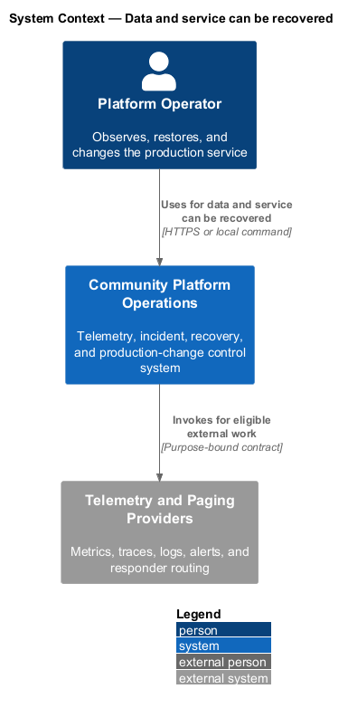
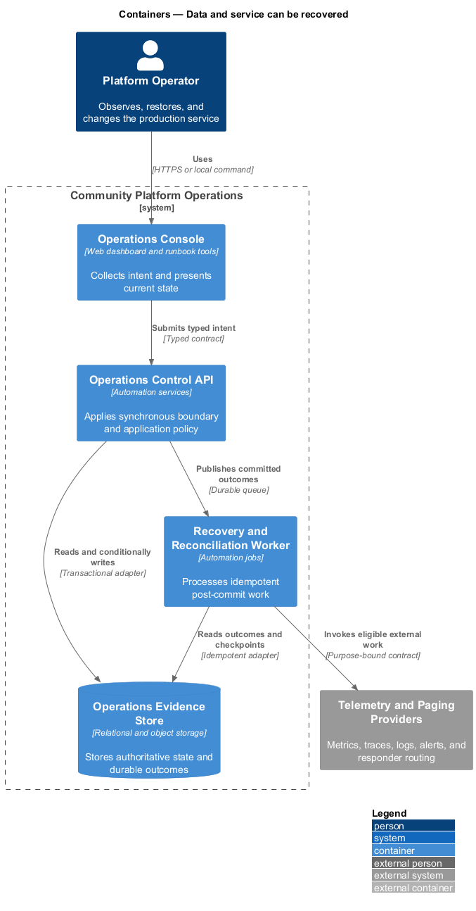
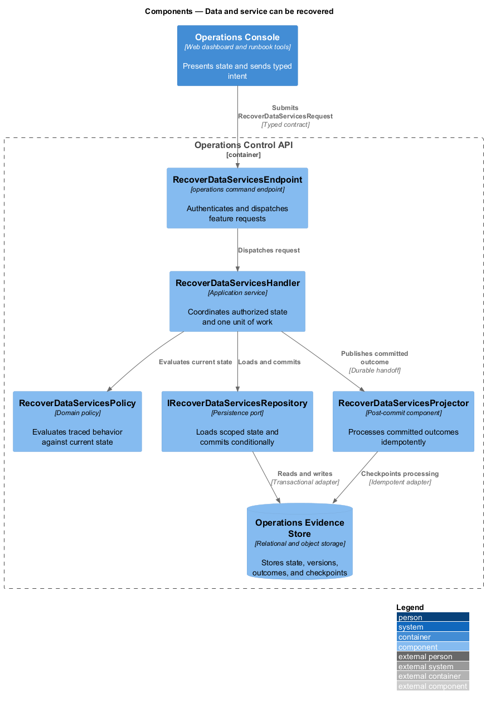
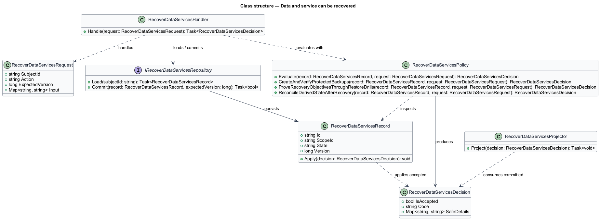
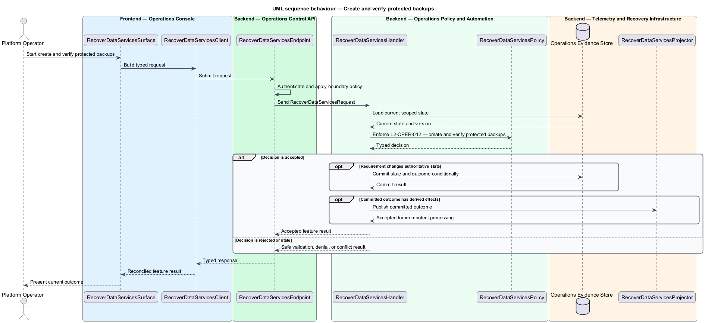
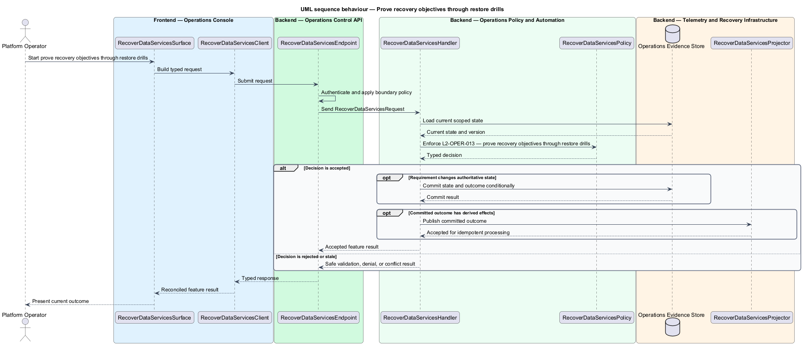

# Data and service can be recovered

## Overview

Community Starter is a community platform divided into product and platform subsystems. The
Operations and reliability subsystem owns this feature.

*data and service can be recovered* — subsystem capability that covers create and verify protected backups, prove recovery objectives through restore drills, and reconcile derived state after recovery

Members and Community teams need predictable service while Platform Operators need privacy-safe evidence, owned alerts, repeatable recovery, and bounded failure modes. Production-scale means the starter defines measurable objectives and proves recovery and capacity; it does not merely contain a health endpoint or pass a build. Encrypted backups, point-in-time capabilities, restore procedures, recovery objectives, and disaster exercises prove that authoritative state can return without silently reviving deleted or unauthorized data.

The feature groups 3 traced behaviors behind one policy and evidence
boundary: `L2-OPER-012`, `L2-OPER-013`, and `L2-OPER-014`. Authoritative state commits before projections, delivery, or external work reports
success.

## Description

The repository contains specifications but no application implementation. This greenfield slice
defines the following building blocks across `Operations Console`, `Operations Control API`, the
application and domain layer, and infrastructure.

- **`RecoverDataServicesSurface`** — operations console surface in `Operations Console`. It presents current
  state, submits user intent, and reconciles the typed result.
- **`RecoverDataServicesClient`** — typed operations adapter. It creates `RecoverDataServicesRequest` values and maps stable
  transport failures into feature results.
- **`RecoverDataServicesEndpoint`** — operations command endpoint in `Operations Control API`. It authenticates the
  caller, applies boundary policy, and dispatches the request.
- **`RecoverDataServicesRequest`** — immutable request carrying `SubjectId`, `Action`, `ExpectedVersion`, and the
  scoped input needed by one traced behavior.
- **`RecoverDataServicesHandler`** — application service that loads authorized state through
  `IRecoverDataServicesRepository`, invokes `RecoverDataServicesPolicy`, and commits an accepted transition.
- **`RecoverDataServicesPolicy`** — domain policy that evaluates current state and returns a typed
  `RecoverDataServicesDecision` without performing external work.
- **`RecoverDataServicesRecord`** — authoritative record containing the feature state, scope, and concurrency
  version.
- **`IRecoverDataServicesRepository`** — persistence port that loads scoped state and commits one conditional
  unit of work.
- **`RecoverDataServicesProjector`** — idempotent post-commit component in `Recovery and Reconciliation Worker`. It updates
  eligible projections and invokes configured external providers.

`RecoverDataServicesPolicy` exposes one named operation for each traced behavior:

- **`RecoverDataServicesPolicy.CreateAndVerifyProtectedBackups(record, request)`** — evaluates `L2-OPER-012` (create and verify protected backups) and returns a typed decision before any state change.
- **`RecoverDataServicesPolicy.ProveRecoveryObjectivesThroughRestoreDrills(record, request)`** — evaluates `L2-OPER-013` (prove recovery objectives through restore drills) and returns a typed decision before any state change.
- **`RecoverDataServicesPolicy.ReconcileDerivedStateAfterRecovery(record, request)`** — evaluates `L2-OPER-014` (reconcile derived state after recovery) and returns a typed decision before any state change.

## Requirements

The feature realizes the following level-2 (L2) requirements. Each row preserves the specification
identifier, its level-1 (L1) parent, and the requirement statement verbatim.

| L2 ID | Refines (L1) | Requirement |
|-------|--------------|-------------|
| `L2-OPER-012` | `L1-OPER-004` | Authoritative relational data, required object metadata and content, and essential configuration have encrypted, access-controlled backups with declared frequency, retention, immutability where needed, region/account boundaries, key ownership, inventory, and automated completion verification. |
| `L2-OPER-013` | `L1-OPER-004` | Accepted recovery point and recovery time objectives identify covered failure scenarios, dependencies, owners, and measurement. Scheduled drills restore into an isolated environment, validate data and critical journeys, measure actual objectives, and record gaps without exposing production data to an uncontrolled destination. |
| `L2-OPER-014` | `L1-OPER-004` | Recovery has a deterministic procedure for pending Jobs, outbox events, Search, caches, Feeds, realtime connections, Attachments, Notifications, email-provider feedback, and deletions that occurred after the recovery point. Derived systems rebuild from authorized source state and do not become independent truth. |

## Diagrams

### System context

The `Platform Operator` uses `Community Platform Operations` for the feature. The system invokes
`Telemetry and Paging Providers` only for configured external work after authoritative decisions.

### Containers

`Operations Console` collects intent, `Operations Control API` applies the synchronous boundary,
and `Operations Evidence Store` holds authoritative state. `Recovery and Reconciliation Worker` handles eligible
post-commit work against `Telemetry and Paging Providers`.

### Components

Inside `Operations Control API`, `RecoverDataServicesEndpoint` dispatches `RecoverDataServicesHandler`. The handler evaluates
`RecoverDataServicesPolicy`, persists through `IRecoverDataServicesRepository`, and hands committed outcomes to
`RecoverDataServicesProjector`.

### Class structure

`RecoverDataServicesHandler` depends on the immutable request, domain policy, and repository port.
`RecoverDataServicesRecord` owns versioned state, while `RecoverDataServicesProjector` consumes committed results.

### Behaviour — create and verify protected backups

The interaction loads current scoped state before `RecoverDataServicesPolicy` enforces
`L2-OPER-012`. Rejected decisions return without changing authoritative state; accepted
state changes commit before optional derived work starts.

### Behaviour — prove recovery objectives through restore drills

The interaction loads current scoped state before `RecoverDataServicesPolicy` enforces
`L2-OPER-013`. Rejected decisions return without changing authoritative state; accepted
state changes commit before optional derived work starts.

### Behaviour — reconcile derived state after recovery

The interaction loads current scoped state before `RecoverDataServicesPolicy` enforces
`L2-OPER-014`. Rejected decisions return without changing authoritative state; accepted
state changes commit before optional derived work starts.

