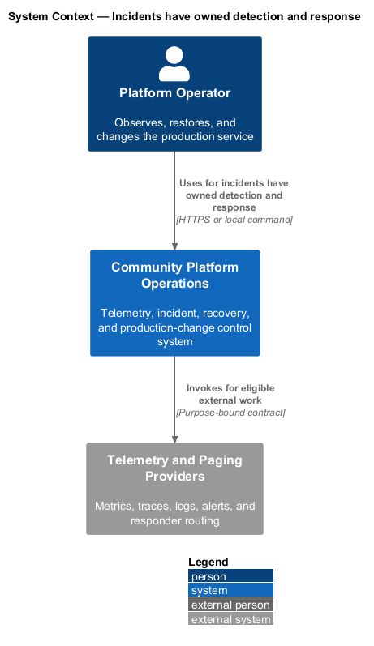
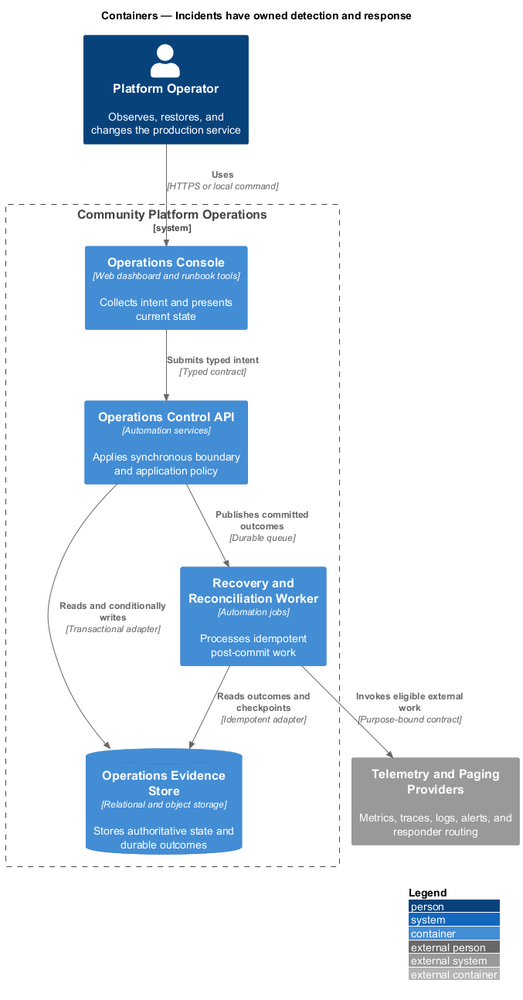
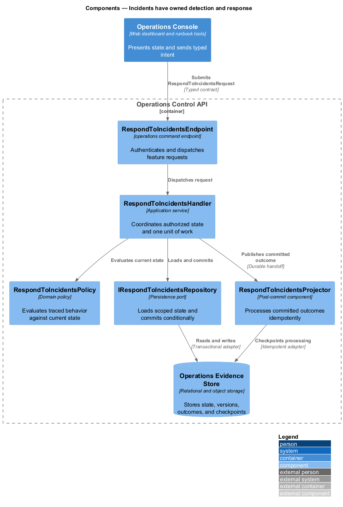
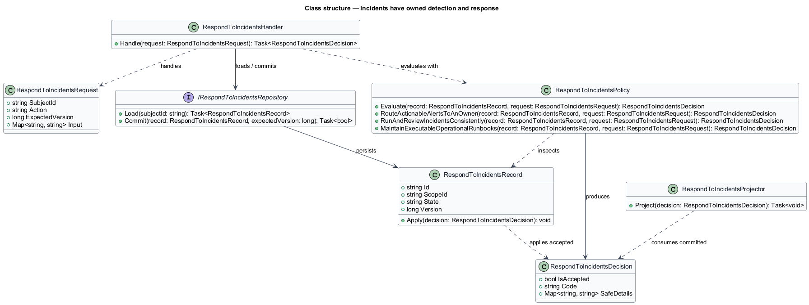
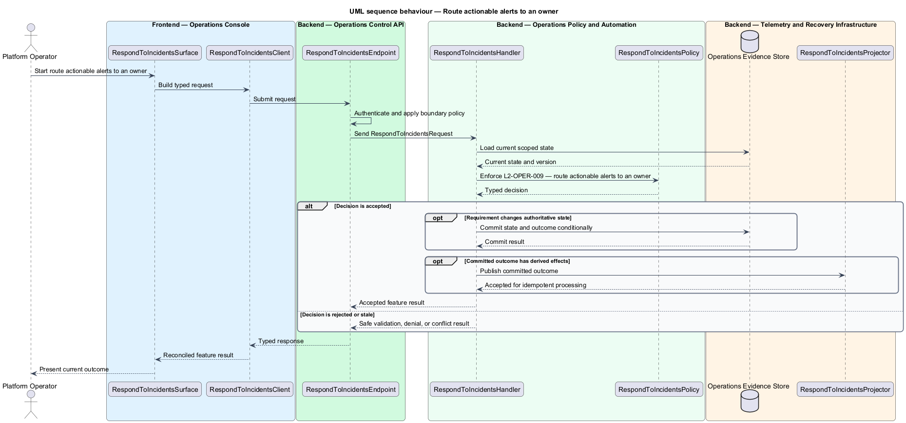
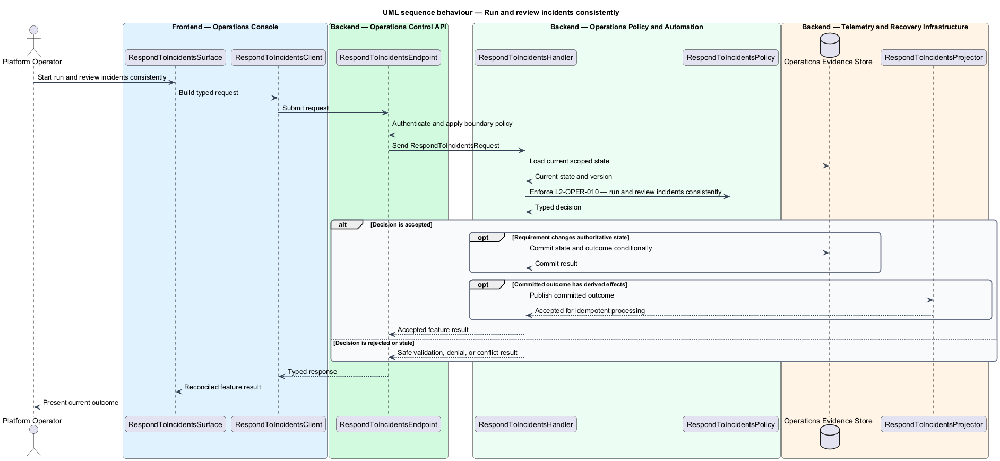
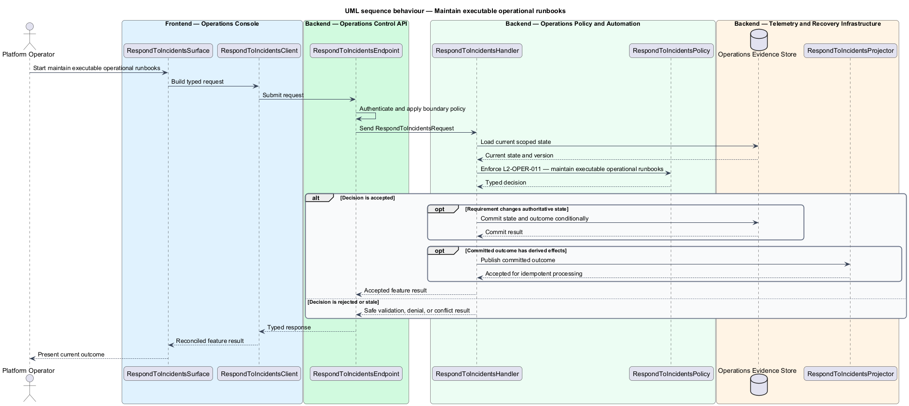

# Incidents have owned detection and response

## Overview

Community Starter is a community platform divided into product and platform subsystems. The
Operations and reliability subsystem owns this feature.

*incidents have owned detection and response* — subsystem capability that covers route actionable alerts to an owner, run and review incidents consistently, and maintain executable operational runbooks

Members and Community teams need predictable service while Platform Operators need privacy-safe evidence, owned alerts, repeatable recovery, and bounded failure modes. Production-scale means the starter defines measurable objectives and proves recovery and capacity; it does not merely contain a health endpoint or pass a build. Actionable alerts, severity and escalation rules, incident communication, runbooks, and review turn unexpected behavior into a traceable response rather than ad hoc production access.

The feature groups 3 traced behaviors behind one policy and evidence
boundary: `L2-OPER-009`, `L2-OPER-010`, and `L2-OPER-011`. Authoritative state commits before projections, delivery, or external work reports
success.

## Description

The repository contains specifications but no application implementation. This greenfield slice
defines the following building blocks across `Operations Console`, `Operations Control API`, the
application and domain layer, and infrastructure.

- **`RespondToIncidentsSurface`** — operations console surface in `Operations Console`. It presents current
  state, submits user intent, and reconciles the typed result.
- **`RespondToIncidentsClient`** — typed operations adapter. It creates `RespondToIncidentsRequest` values and maps stable
  transport failures into feature results.
- **`RespondToIncidentsEndpoint`** — operations command endpoint in `Operations Control API`. It authenticates the
  caller, applies boundary policy, and dispatches the request.
- **`RespondToIncidentsRequest`** — immutable request carrying `SubjectId`, `Action`, `ExpectedVersion`, and the
  scoped input needed by one traced behavior.
- **`RespondToIncidentsHandler`** — application service that loads authorized state through
  `IRespondToIncidentsRepository`, invokes `RespondToIncidentsPolicy`, and commits an accepted transition.
- **`RespondToIncidentsPolicy`** — domain policy that evaluates current state and returns a typed
  `RespondToIncidentsDecision` without performing external work.
- **`RespondToIncidentsRecord`** — authoritative record containing the feature state, scope, and concurrency
  version.
- **`IRespondToIncidentsRepository`** — persistence port that loads scoped state and commits one conditional
  unit of work.
- **`RespondToIncidentsProjector`** — idempotent post-commit component in `Recovery and Reconciliation Worker`. It updates
  eligible projections and invokes configured external providers.

`RespondToIncidentsPolicy` exposes one named operation for each traced behavior:

- **`RespondToIncidentsPolicy.RouteActionableAlertsToAnOwner(record, request)`** — evaluates `L2-OPER-009` (route actionable alerts to an owner) and returns a typed decision before any state change.
- **`RespondToIncidentsPolicy.RunAndReviewIncidentsConsistently(record, request)`** — evaluates `L2-OPER-010` (run and review incidents consistently) and returns a typed decision before any state change.
- **`RespondToIncidentsPolicy.MaintainExecutableOperationalRunbooks(record, request)`** — evaluates `L2-OPER-011` (maintain executable operational runbooks) and returns a typed decision before any state change.

## Requirements

The feature realizes the following level-2 (L2) requirements. Each row preserves the specification
identifier, its level-1 (L1) parent, and the requirement statement verbatim.

| L2 ID | Refines (L1) | Requirement |
|-------|--------------|-------------|
| `L2-OPER-009` | `L1-OPER-003` | Alerts correspond to an observable user or operational risk, declare severity, threshold, evaluation window, owner, notification path, runbook, deduplication, silence limits, and resolution signal. Alerts contain safe context and are tested without paging from untrusted environments. |
| `L2-OPER-010` | `L1-OPER-003` | An incident process defines severity, command and technical roles, secure coordination, customer and status communication, evidence preservation, escalation for security/privacy/safety events, resolution criteria, and blameless follow-up with owned actions. |
| `L2-OPER-011` | `L1-OPER-003` | Versioned runbooks cover deployment and rollback, migration failure, database outage, queue backlog, Search rebuild, media or delivery provider outage, secret rotation, certificate expiry, abuse event, data incident, and restore. Each states trigger, access, safe diagnostics, decision points, verification, rollback or forward-fix, escalation, and owner. |

## Diagrams

### System context

The `Platform Operator` uses `Community Platform Operations` for the feature. The system invokes
`Telemetry and Paging Providers` only for configured external work after authoritative decisions.

### Containers

`Operations Console` collects intent, `Operations Control API` applies the synchronous boundary,
and `Operations Evidence Store` holds authoritative state. `Recovery and Reconciliation Worker` handles eligible
post-commit work against `Telemetry and Paging Providers`.

### Components

Inside `Operations Control API`, `RespondToIncidentsEndpoint` dispatches `RespondToIncidentsHandler`. The handler evaluates
`RespondToIncidentsPolicy`, persists through `IRespondToIncidentsRepository`, and hands committed outcomes to
`RespondToIncidentsProjector`.

### Class structure

`RespondToIncidentsHandler` depends on the immutable request, domain policy, and repository port.
`RespondToIncidentsRecord` owns versioned state, while `RespondToIncidentsProjector` consumes committed results.

### Behaviour — route actionable alerts to an owner

The interaction loads current scoped state before `RespondToIncidentsPolicy` enforces
`L2-OPER-009`. Rejected decisions return without changing authoritative state; accepted
state changes commit before optional derived work starts.

### Behaviour — run and review incidents consistently

The interaction loads current scoped state before `RespondToIncidentsPolicy` enforces
`L2-OPER-010`. Rejected decisions return without changing authoritative state; accepted
state changes commit before optional derived work starts.

### Behaviour — maintain executable operational runbooks

The interaction loads current scoped state before `RespondToIncidentsPolicy` enforces
`L2-OPER-011`. Rejected decisions return without changing authoritative state; accepted
state changes commit before optional derived work starts.

