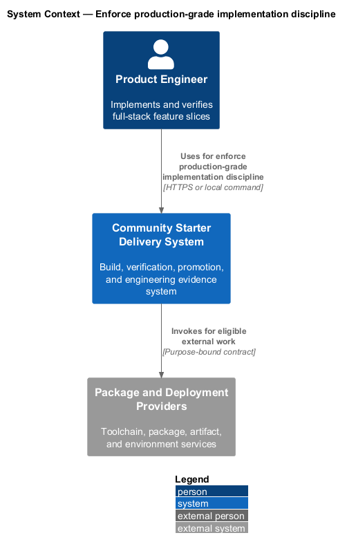
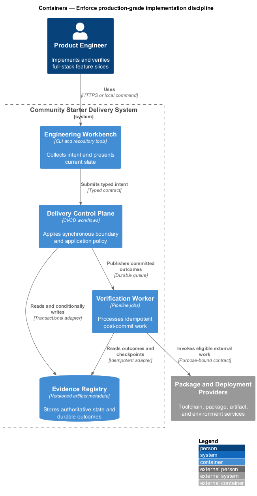
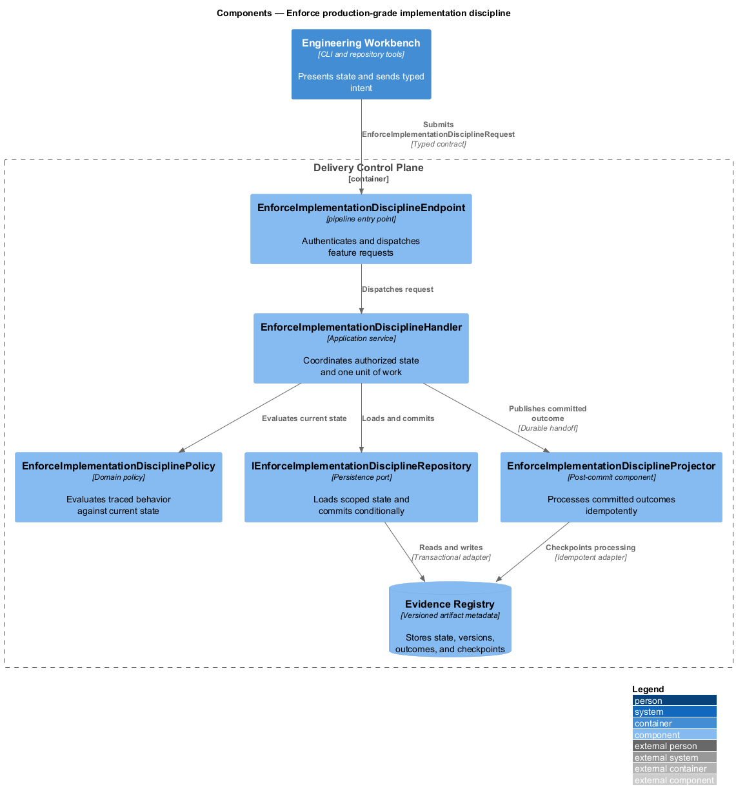
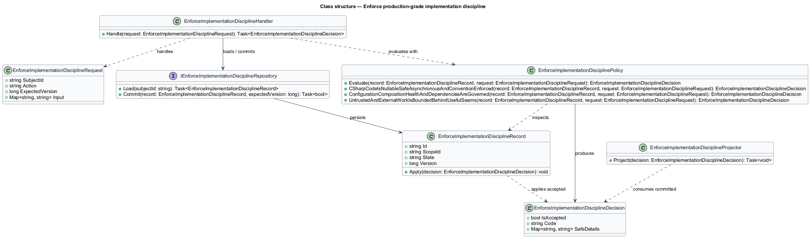
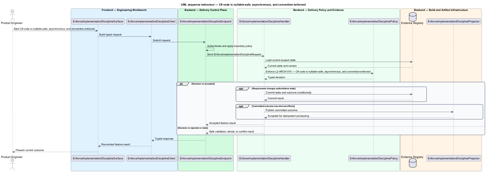

# Enforce production-grade implementation discipline

## Overview

Community Starter is a community platform divided into product and platform subsystems. The
Platform architecture subsystem owns this feature.

*enforce production-grade implementation discipline* — subsystem capability that covers C# code is nullable-safe, asynchronous, and convention-enforced, configuration, composition, health, and dependencies are governed, and untrusted and external work is bounded behind useful seams

The starter is a production-scale, multi-Community platform rather than a compact CRUD tool. It shall provide explicit full-stack boundaries, server-owned Community rules, safe relational persistence, and an evolution path that remains legible as Membership, moderation, content, Notifications, and external dependencies grow. The architecture shall make one complete Community journey runnable from a clean checkout without introducing speculative services or hollow layers. Backend code, configuration, dependencies, and external work shall be deterministic, bounded, testable, and readable enough to remain safe under community-scale traffic and operational change.

The feature groups 3 traced behaviors behind one policy and evidence
boundary: `L2-ARCH-010`, `L2-ARCH-011`, and `L2-ARCH-012`. Authoritative state commits before projections, delivery, or external work reports
success.

## Description

The repository contains specifications but no application implementation. This greenfield slice
defines the following building blocks across `Engineering Workbench`, `Delivery Control Plane`, the
application and domain layer, and infrastructure.

- **`EnforceImplementationDisciplineSurface`** — engineering command surface in `Engineering Workbench`. It presents current
  state, submits user intent, and reconciles the typed result.
- **`EnforceImplementationDisciplineClient`** — typed workflow adapter. It creates `EnforceImplementationDisciplineRequest` values and maps stable
  transport failures into feature results.
- **`EnforceImplementationDisciplineEndpoint`** — pipeline entry point in `Delivery Control Plane`. It authenticates the
  caller, applies boundary policy, and dispatches the request.
- **`EnforceImplementationDisciplineRequest`** — immutable request carrying `SubjectId`, `Action`, `ExpectedVersion`, and the
  scoped input needed by one traced behavior.
- **`EnforceImplementationDisciplineHandler`** — application service that loads authorized state through
  `IEnforceImplementationDisciplineRepository`, invokes `EnforceImplementationDisciplinePolicy`, and commits an accepted transition.
- **`EnforceImplementationDisciplinePolicy`** — domain policy that evaluates current state and returns a typed
  `EnforceImplementationDisciplineDecision` without performing external work.
- **`EnforceImplementationDisciplineRecord`** — authoritative record containing the feature state, scope, and concurrency
  version.
- **`IEnforceImplementationDisciplineRepository`** — persistence port that loads scoped state and commits one conditional
  unit of work.
- **`EnforceImplementationDisciplineProjector`** — idempotent post-commit component in `Verification Worker`. It updates
  eligible projections and invokes configured external providers.

`EnforceImplementationDisciplinePolicy` exposes one named operation for each traced behavior:

- **`EnforceImplementationDisciplinePolicy.CSharpCodeIsNullableSafeAsynchronousAndConventionEnforced(record, request)`** — evaluates `L2-ARCH-010` (C# code is nullable-safe, asynchronous, and convention-enforced) and returns a typed decision before any state change.
- **`EnforceImplementationDisciplinePolicy.ConfigurationCompositionHealthAndDependenciesAreGoverned(record, request)`** — evaluates `L2-ARCH-011` (configuration, composition, health, and dependencies are governed) and returns a typed decision before any state change.
- **`EnforceImplementationDisciplinePolicy.UntrustedAndExternalWorkIsBoundedBehindUsefulSeams(record, request)`** — evaluates `L2-ARCH-012` (untrusted and external work is bounded behind useful seams) and returns a typed decision before any state change.

## Requirements

The feature realizes the following level-2 (L2) requirements. Each row preserves the specification
identifier, its level-1 (L1) parent, and the requirement statement verbatim.

| L2 ID | Refines (L1) | Requirement |
|-------|--------------|-------------|
| `L2-ARCH-010` | `L1-ARCH-004` | C# shall use one public type per matching file, file-scoped namespaces, nullable reference types, implicit usings, `PascalCase` public names, `camelCase` locals and parameters, `_camelCase` private fields, and `I` only for behavioral interfaces. Names shall prefer descriptive product vocabulary over abbreviations, and comments shall explain rationale, constraints, or surprising provider behavior rather than narrate syntax. Immutable messages and DTOs should be records; lifecycle entities should be classes. Constructors, `required`, and valid defaults shall be preferred over null-forgiving operators. I/O shall be asynchronous, `Async`-suffixed where not framework-fixed, and cancellation-aware without blocking waits. |
| `L2-ARCH-011` | `L1-ARCH-004` | Related configuration shall bind to typed options and validate mandatory production values at startup. Production secrets shall come from environment or secret stores, while development placeholders are unmistakably non-secret. Services shall register through capability or layer extension methods so `Program.cs` remains a readable composition root and middleware pipeline. The API shall expose health and distinguish liveness from dependency readiness where useful. Each new dependency shall have a clear capability, maintenance, license, security, and runtime or bundle-cost justification. |
| `L2-ARCH-012` | `L1-ARCH-004` | All untrusted input and external process, network, file, mail, identity, and vendor work shall have explicit validation, size, concurrency, timeout, cancellation, and retry boundaries appropriate to its risk. Provider SDKs shall remain in Infrastructure behind focused Application-owned seams. The design shall not add generic repositories over EF Core unless a repository expresses a meaningful aggregate boundary. |

## Diagrams

### System context

The `Product Engineer` uses `Community Starter Delivery System` for the feature. The system invokes
`Package and Deployment Providers` only for configured external work after authoritative decisions.

### Containers

`Engineering Workbench` collects intent, `Delivery Control Plane` applies the synchronous boundary,
and `Evidence Registry` holds authoritative state. `Verification Worker` handles eligible
post-commit work against `Package and Deployment Providers`.

### Components

Inside `Delivery Control Plane`, `EnforceImplementationDisciplineEndpoint` dispatches `EnforceImplementationDisciplineHandler`. The handler evaluates
`EnforceImplementationDisciplinePolicy`, persists through `IEnforceImplementationDisciplineRepository`, and hands committed outcomes to
`EnforceImplementationDisciplineProjector`.

### Class structure

`EnforceImplementationDisciplineHandler` depends on the immutable request, domain policy, and repository port.
`EnforceImplementationDisciplineRecord` owns versioned state, while `EnforceImplementationDisciplineProjector` consumes committed results.

### Behaviour — C# code is nullable-safe, asynchronous, and convention-enforced

The interaction loads current scoped state before `EnforceImplementationDisciplinePolicy` enforces
`L2-ARCH-010`. Rejected decisions return without changing authoritative state; accepted
state changes commit before optional derived work starts.

### Behaviour — configuration, composition, health, and dependencies are governed

The interaction loads current scoped state before `EnforceImplementationDisciplinePolicy` enforces
`L2-ARCH-011`. Rejected decisions return without changing authoritative state; accepted
state changes commit before optional derived work starts.

### Behaviour — untrusted and external work is bounded behind useful seams

The interaction loads current scoped state before `EnforceImplementationDisciplinePolicy` enforces
`L2-ARCH-012`. Rejected decisions return without changing authoritative state; accepted
state changes commit before optional derived work starts.

