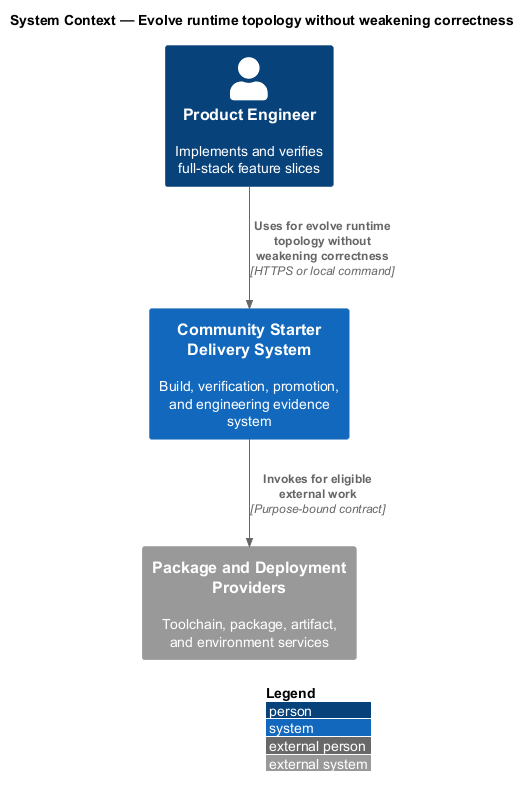
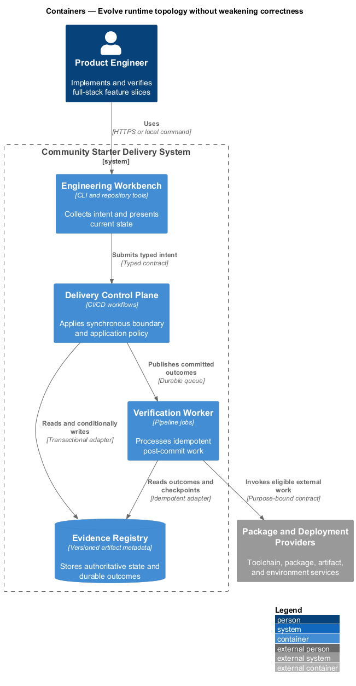
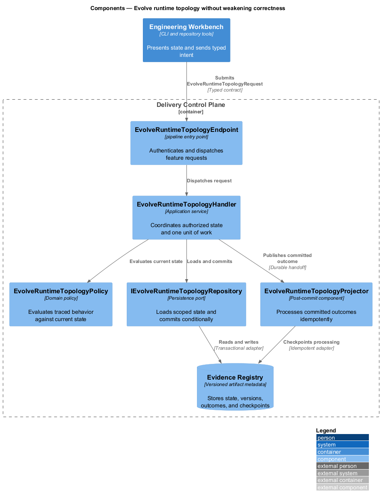
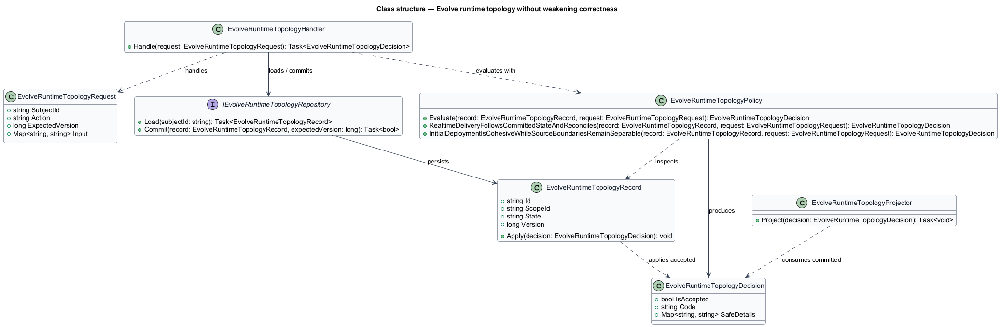
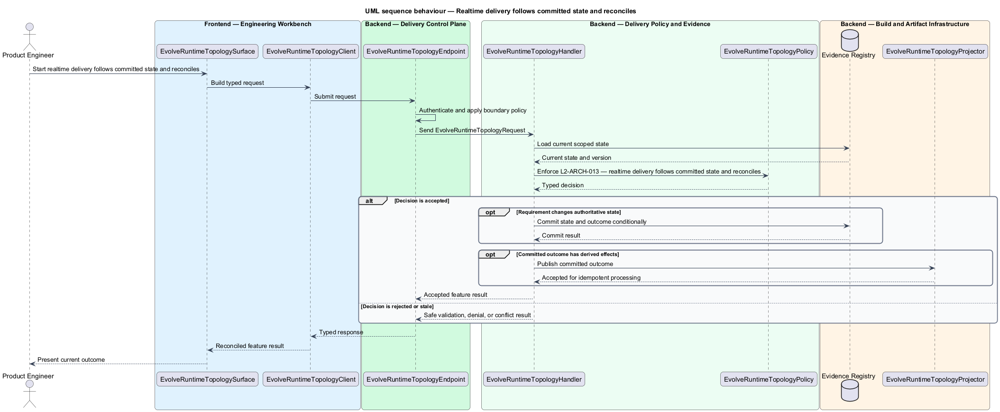
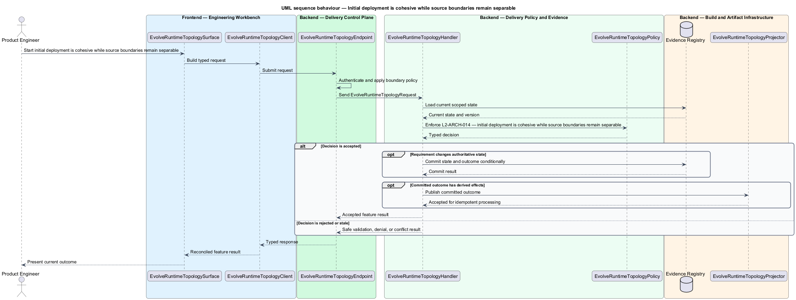

# Evolve runtime topology without weakening correctness

## Overview

Community Starter is a community platform divided into product and platform subsystems. The
Platform architecture subsystem owns this feature.

*evolve runtime topology without weakening correctness* — subsystem capability that covers realtime delivery follows committed state and reconciles and initial deployment is cohesive while source boundaries remain separable

The starter is a production-scale, multi-Community platform rather than a compact CRUD tool. It shall provide explicit full-stack boundaries, server-owned Community rules, safe relational persistence, and an evolution path that remains legible as Membership, moderation, content, Notifications, and external dependencies grow. The architecture shall make one complete Community journey runnable from a clean checkout without introducing speculative services or hollow layers. Realtime delivery and deployment topology shall remain secondary to committed server state and shall be evolvable without rewriting product policy or client libraries.

The feature groups 2 traced behaviors behind one policy and evidence
boundary: `L2-ARCH-013` and `L2-ARCH-014`. Authoritative state commits before projections, delivery, or external work reports
success.

## Description

The repository contains specifications but no application implementation. This greenfield slice
defines the following building blocks across `Engineering Workbench`, `Delivery Control Plane`, the
application and domain layer, and infrastructure.

- **`EvolveRuntimeTopologySurface`** — engineering command surface in `Engineering Workbench`. It presents current
  state, submits user intent, and reconciles the typed result.
- **`EvolveRuntimeTopologyClient`** — typed workflow adapter. It creates `EvolveRuntimeTopologyRequest` values and maps stable
  transport failures into feature results.
- **`EvolveRuntimeTopologyEndpoint`** — pipeline entry point in `Delivery Control Plane`. It authenticates the
  caller, applies boundary policy, and dispatches the request.
- **`EvolveRuntimeTopologyRequest`** — immutable request carrying `SubjectId`, `Action`, `ExpectedVersion`, and the
  scoped input needed by one traced behavior.
- **`EvolveRuntimeTopologyHandler`** — application service that loads authorized state through
  `IEvolveRuntimeTopologyRepository`, invokes `EvolveRuntimeTopologyPolicy`, and commits an accepted transition.
- **`EvolveRuntimeTopologyPolicy`** — domain policy that evaluates current state and returns a typed
  `EvolveRuntimeTopologyDecision` without performing external work.
- **`EvolveRuntimeTopologyRecord`** — authoritative record containing the feature state, scope, and concurrency
  version.
- **`IEvolveRuntimeTopologyRepository`** — persistence port that loads scoped state and commits one conditional
  unit of work.
- **`EvolveRuntimeTopologyProjector`** — idempotent post-commit component in `Verification Worker`. It updates
  eligible projections and invokes configured external providers.

`EvolveRuntimeTopologyPolicy` exposes one named operation for each traced behavior:

- **`EvolveRuntimeTopologyPolicy.RealtimeDeliveryFollowsCommittedStateAndReconciles(record, request)`** — evaluates `L2-ARCH-013` (realtime delivery follows committed state and reconciles) and returns a typed decision before any state change.
- **`EvolveRuntimeTopologyPolicy.InitialDeploymentIsCohesiveWhileSourceBoundariesRemainSeparable(record, request)`** — evaluates `L2-ARCH-014` (initial deployment is cohesive while source boundaries remain separable) and returns a typed decision before any state change.

## Requirements

The feature realizes the following level-2 (L2) requirements. Each row preserves the specification
identifier, its level-1 (L1) parent, and the requirement statement verbatim.

| L2 ID | Refines (L1) | Requirement |
|-------|--------------|-------------|
| `L2-ARCH-013` | `L1-ARCH-005` | Realtime delivery shall be used only for community experiences where concurrent users need timely updates. SignalR or another transport shall remain behind an Application abstraction, and stable events shall publish only after successful persistence. The client shall treat REST and persisted server state as authoritative, reconnect with bounded behavior, reconcile missed or conflicting state, and retain a usable REST path when the realtime channel is unavailable. |
| `L2-ARCH-014` | `L1-ARCH-005` | The first production topology shall allow one API deployable to host the built Angular application, canonical design assets, and static marketing site when that reduces operational cost. Source and configuration boundaries shall remain independent so marketing can later move to `www` and the app/API to `app` without rewriting community policy, reusable libraries, or hard-coded origins. |

## Diagrams

### System context

The `Product Engineer` uses `Community Starter Delivery System` for the feature. The system invokes
`Package and Deployment Providers` only for configured external work after authoritative decisions.

### Containers

`Engineering Workbench` collects intent, `Delivery Control Plane` applies the synchronous boundary,
and `Evidence Registry` holds authoritative state. `Verification Worker` handles eligible
post-commit work against `Package and Deployment Providers`.

### Components

Inside `Delivery Control Plane`, `EvolveRuntimeTopologyEndpoint` dispatches `EvolveRuntimeTopologyHandler`. The handler evaluates
`EvolveRuntimeTopologyPolicy`, persists through `IEvolveRuntimeTopologyRepository`, and hands committed outcomes to
`EvolveRuntimeTopologyProjector`.

### Class structure

`EvolveRuntimeTopologyHandler` depends on the immutable request, domain policy, and repository port.
`EvolveRuntimeTopologyRecord` owns versioned state, while `EvolveRuntimeTopologyProjector` consumes committed results.

### Behaviour — realtime delivery follows committed state and reconciles

The interaction loads current scoped state before `EvolveRuntimeTopologyPolicy` enforces
`L2-ARCH-013`. Rejected decisions return without changing authoritative state; accepted
state changes commit before optional derived work starts.

### Behaviour — initial deployment is cohesive while source boundaries remain separable

The interaction loads current scoped state before `EvolveRuntimeTopologyPolicy` enforces
`L2-ARCH-014`. Rejected decisions return without changing authoritative state; accepted
state changes commit before optional derived work starts.

