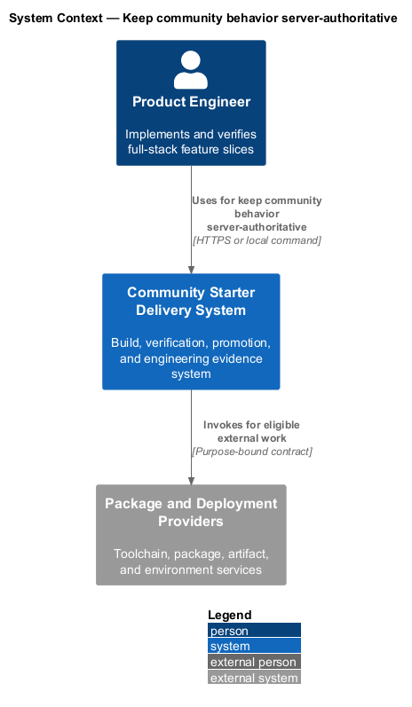
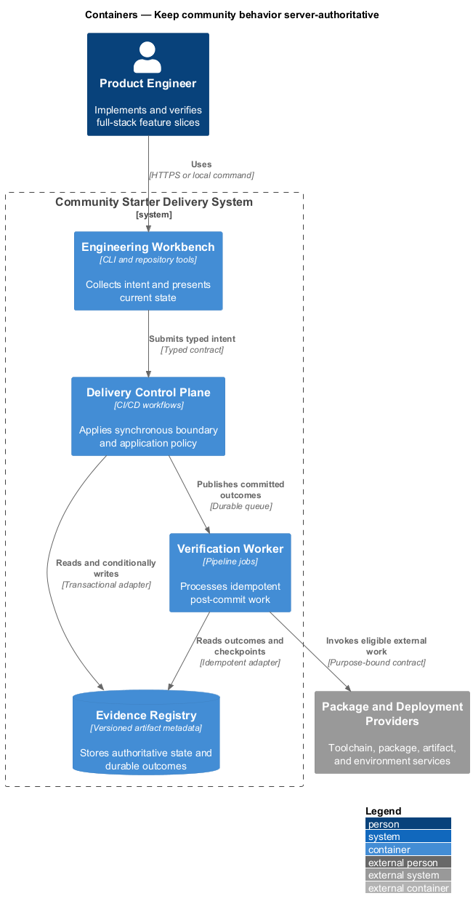
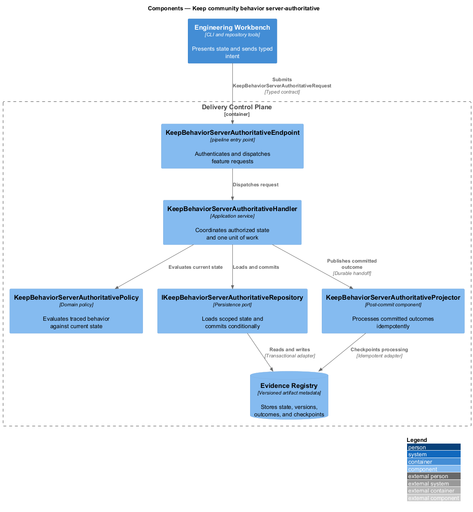
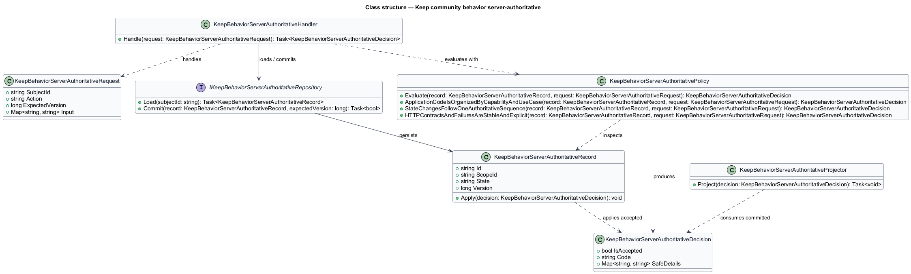
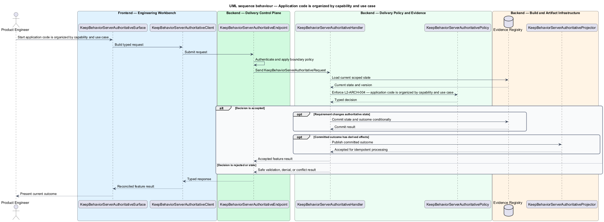
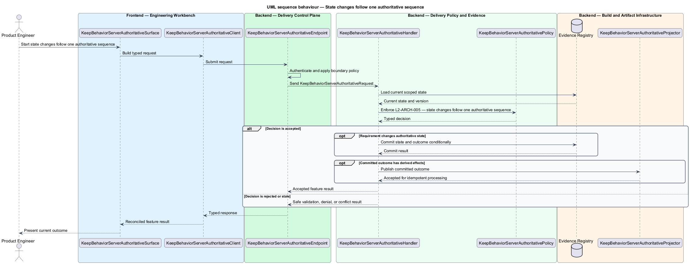
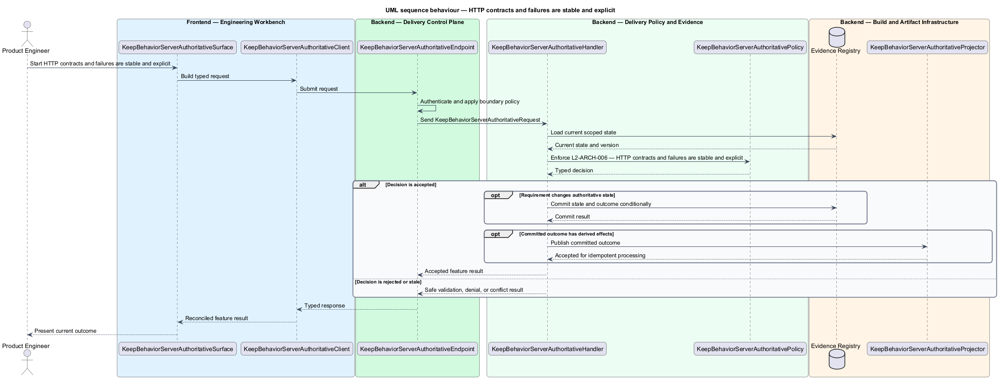

# Keep community behavior server-authoritative

## Overview

Community Starter is a community platform divided into product and platform subsystems. The
Platform architecture subsystem owns this feature.

*keep community behavior server-authoritative* — subsystem capability that covers application code is organized by capability and use case, state changes follow one authoritative sequence, and HTTP contracts and failures are stable and explicit

The starter is a production-scale, multi-Community platform rather than a compact CRUD tool. It shall provide explicit full-stack boundaries, server-owned Community rules, safe relational persistence, and an evolution path that remains legible as Membership, moderation, content, Notifications, and external dependencies grow. The architecture shall make one complete Community journey runnable from a clean checkout without introducing speculative services or hollow layers. Every use case shall make authentication, Community scope, business policy, persistence, and public error behavior explicit so browser affordances never become the enforcement boundary.

The feature groups 3 traced behaviors behind one policy and evidence
boundary: `L2-ARCH-004`, `L2-ARCH-005`, and `L2-ARCH-006`. Authoritative state commits before projections, delivery, or external work reports
success.

## Description

The repository contains specifications but no application implementation. This greenfield slice
defines the following building blocks across `Engineering Workbench`, `Delivery Control Plane`, the
application and domain layer, and infrastructure.

- **`KeepBehaviorServerAuthoritativeSurface`** — engineering command surface in `Engineering Workbench`. It presents current
  state, submits user intent, and reconciles the typed result.
- **`KeepBehaviorServerAuthoritativeClient`** — typed workflow adapter. It creates `KeepBehaviorServerAuthoritativeRequest` values and maps stable
  transport failures into feature results.
- **`KeepBehaviorServerAuthoritativeEndpoint`** — pipeline entry point in `Delivery Control Plane`. It authenticates the
  caller, applies boundary policy, and dispatches the request.
- **`KeepBehaviorServerAuthoritativeRequest`** — immutable request carrying `SubjectId`, `Action`, `ExpectedVersion`, and the
  scoped input needed by one traced behavior.
- **`KeepBehaviorServerAuthoritativeHandler`** — application service that loads authorized state through
  `IKeepBehaviorServerAuthoritativeRepository`, invokes `KeepBehaviorServerAuthoritativePolicy`, and commits an accepted transition.
- **`KeepBehaviorServerAuthoritativePolicy`** — domain policy that evaluates current state and returns a typed
  `KeepBehaviorServerAuthoritativeDecision` without performing external work.
- **`KeepBehaviorServerAuthoritativeRecord`** — authoritative record containing the feature state, scope, and concurrency
  version.
- **`IKeepBehaviorServerAuthoritativeRepository`** — persistence port that loads scoped state and commits one conditional
  unit of work.
- **`KeepBehaviorServerAuthoritativeProjector`** — idempotent post-commit component in `Verification Worker`. It updates
  eligible projections and invokes configured external providers.

`KeepBehaviorServerAuthoritativePolicy` exposes one named operation for each traced behavior:

- **`KeepBehaviorServerAuthoritativePolicy.ApplicationCodeIsOrganizedByCapabilityAndUseCase(record, request)`** — evaluates `L2-ARCH-004` (application code is organized by capability and use case) and returns a typed decision before any state change.
- **`KeepBehaviorServerAuthoritativePolicy.StateChangesFollowOneAuthoritativeSequence(record, request)`** — evaluates `L2-ARCH-005` (state changes follow one authoritative sequence) and returns a typed decision before any state change.
- **`KeepBehaviorServerAuthoritativePolicy.HTTPContractsAndFailuresAreStableAndExplicit(record, request)`** — evaluates `L2-ARCH-006` (HTTP contracts and failures are stable and explicit) and returns a typed decision before any state change.

## Requirements

The feature realizes the following level-2 (L2) requirements. Each row preserves the specification
identifier, its level-1 (L1) parent, and the requirement statement verbatim.

| L2 ID | Refines (L1) | Requirement |
|-------|--------------|-------------|
| `L2-ARCH-004` | `L1-ARCH-002` | Application code shall be grouped by community capability and use case rather than technical grab-bag folders. A command changes state, a query does not, and one handler owns one use case. Handlers shall load only required state, consult domain or application policy, persist changes, and notify only after success; validators shall handle request shape and cheap invariants while state-dependent rules remain authoritative policy. |
| `L2-ARCH-005` | `L1-ARCH-002` | Every state-changing request shall authenticate the actor, establish Community scope, validate request shape, load required state, ask authoritative policy whether the transition is legal, persist atomically, publish or broadcast only after persistence, and return a typed result. Authorization, workflow transitions, quotas, moderation rules, and validation with business meaning shall never rely on browser enforcement. |
| `L2-ARCH-006` | `L1-ARCH-002` | Product APIs shall use a consistent `/api` prefix, plural resource nouns, stable identifiers, explicit request/response DTOs, and dedicated action or subresource routes where a transition would otherwise be ambiguous. Route identifiers are authoritative. Creation shall return `201` with a location when practical, contentless deletion `204`, and failures sanitized Problem Details using `400`, `401`, `403`, `404`, `409`, and only a deliberately adopted `422` policy according to their documented semantics. OpenAPI shall include representative success and error contracts. API versioning shall be introduced only for a real external compatibility contract, not as speculative duplicate controllers. |

## Diagrams

### System context

The `Product Engineer` uses `Community Starter Delivery System` for the feature. The system invokes
`Package and Deployment Providers` only for configured external work after authoritative decisions.

### Containers

`Engineering Workbench` collects intent, `Delivery Control Plane` applies the synchronous boundary,
and `Evidence Registry` holds authoritative state. `Verification Worker` handles eligible
post-commit work against `Package and Deployment Providers`.

### Components

Inside `Delivery Control Plane`, `KeepBehaviorServerAuthoritativeEndpoint` dispatches `KeepBehaviorServerAuthoritativeHandler`. The handler evaluates
`KeepBehaviorServerAuthoritativePolicy`, persists through `IKeepBehaviorServerAuthoritativeRepository`, and hands committed outcomes to
`KeepBehaviorServerAuthoritativeProjector`.

### Class structure

`KeepBehaviorServerAuthoritativeHandler` depends on the immutable request, domain policy, and repository port.
`KeepBehaviorServerAuthoritativeRecord` owns versioned state, while `KeepBehaviorServerAuthoritativeProjector` consumes committed results.

### Behaviour — application code is organized by capability and use case

The interaction loads current scoped state before `KeepBehaviorServerAuthoritativePolicy` enforces
`L2-ARCH-004`. Rejected decisions return without changing authoritative state; accepted
state changes commit before optional derived work starts.

### Behaviour — state changes follow one authoritative sequence

The interaction loads current scoped state before `KeepBehaviorServerAuthoritativePolicy` enforces
`L2-ARCH-005`. Rejected decisions return without changing authoritative state; accepted
state changes commit before optional derived work starts.

### Behaviour — HTTP contracts and failures are stable and explicit

The interaction loads current scoped state before `KeepBehaviorServerAuthoritativePolicy` enforces
`L2-ARCH-006`. Rejected decisions return without changing authoritative state; accepted
state changes commit before optional derived work starts.

