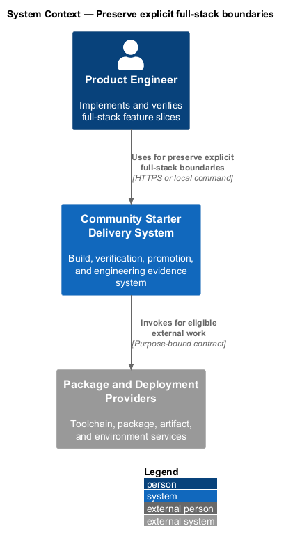
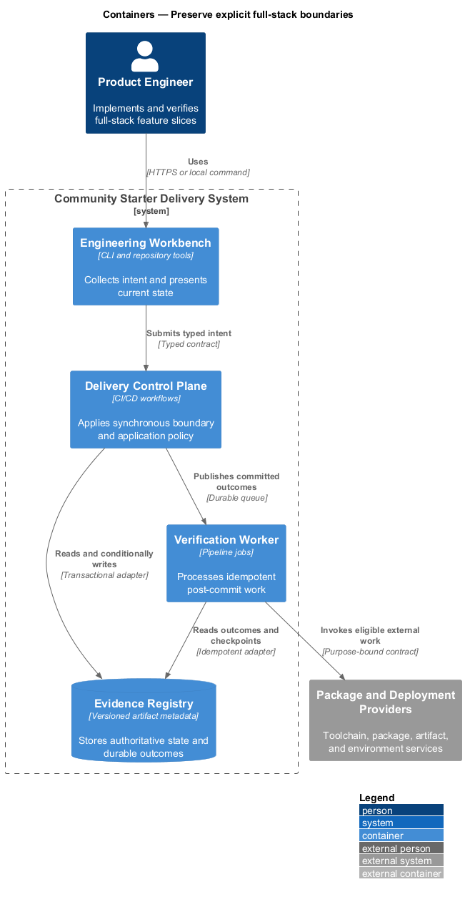
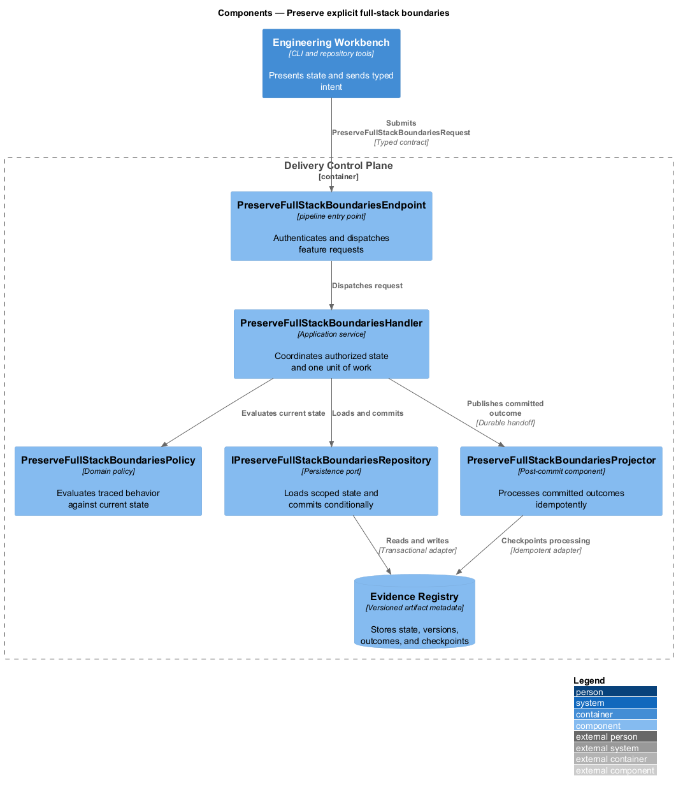
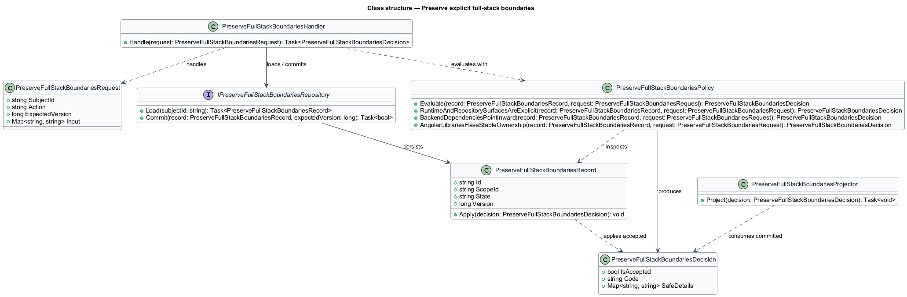
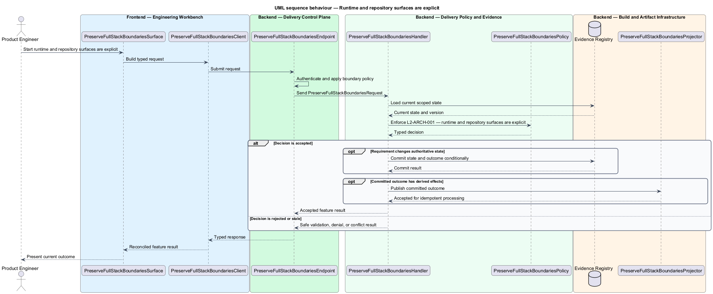
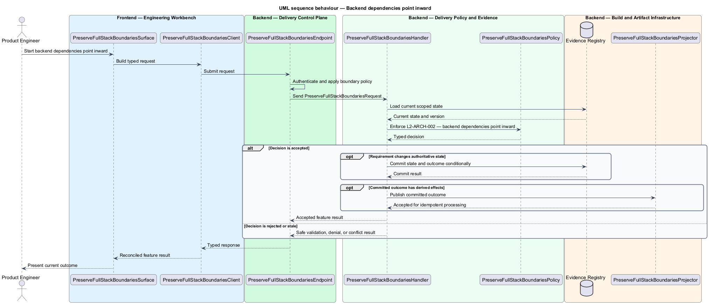

# Preserve explicit full-stack boundaries

## Overview

Community Starter is a community platform divided into product and platform subsystems. The
Platform architecture subsystem owns this feature.

*preserve explicit full-stack boundaries* — subsystem capability that covers runtime and repository surfaces are explicit, backend dependencies point inward, and angular libraries have stable ownership

The starter is a production-scale, multi-Community platform rather than a compact CRUD tool. It shall provide explicit full-stack boundaries, server-owned Community rules, safe relational persistence, and an evolution path that remains legible as Membership, moderation, content, Notifications, and external dependencies grow. The architecture shall make one complete Community journey runnable from a clean checkout without introducing speculative services or hollow layers. The starter shall provide a mandatory layered .NET backend, a library-oriented Angular workspace, a static public site, and one shared design language with dependencies directed toward product policy.

The feature groups 3 traced behaviors behind one policy and evidence
boundary: `L2-ARCH-001`, `L2-ARCH-002`, and `L2-ARCH-003`. Authoritative state commits before projections, delivery, or external work reports
success.

## Description

The repository contains specifications but no application implementation. This greenfield slice
defines the following building blocks across `Engineering Workbench`, `Delivery Control Plane`, the
application and domain layer, and infrastructure.

- **`PreserveFullStackBoundariesSurface`** — engineering command surface in `Engineering Workbench`. It presents current
  state, submits user intent, and reconciles the typed result.
- **`PreserveFullStackBoundariesClient`** — typed workflow adapter. It creates `PreserveFullStackBoundariesRequest` values and maps stable
  transport failures into feature results.
- **`PreserveFullStackBoundariesEndpoint`** — pipeline entry point in `Delivery Control Plane`. It authenticates the
  caller, applies boundary policy, and dispatches the request.
- **`PreserveFullStackBoundariesRequest`** — immutable request carrying `SubjectId`, `Action`, `ExpectedVersion`, and the
  scoped input needed by one traced behavior.
- **`PreserveFullStackBoundariesHandler`** — application service that loads authorized state through
  `IPreserveFullStackBoundariesRepository`, invokes `PreserveFullStackBoundariesPolicy`, and commits an accepted transition.
- **`PreserveFullStackBoundariesPolicy`** — domain policy that evaluates current state and returns a typed
  `PreserveFullStackBoundariesDecision` without performing external work.
- **`PreserveFullStackBoundariesRecord`** — authoritative record containing the feature state, scope, and concurrency
  version.
- **`IPreserveFullStackBoundariesRepository`** — persistence port that loads scoped state and commits one conditional
  unit of work.
- **`PreserveFullStackBoundariesProjector`** — idempotent post-commit component in `Verification Worker`. It updates
  eligible projections and invokes configured external providers.

`PreserveFullStackBoundariesPolicy` exposes one named operation for each traced behavior:

- **`PreserveFullStackBoundariesPolicy.RuntimeAndRepositorySurfacesAreExplicit(record, request)`** — evaluates `L2-ARCH-001` (runtime and repository surfaces are explicit) and returns a typed decision before any state change.
- **`PreserveFullStackBoundariesPolicy.BackendDependenciesPointInward(record, request)`** — evaluates `L2-ARCH-002` (backend dependencies point inward) and returns a typed decision before any state change.
- **`PreserveFullStackBoundariesPolicy.AngularLibrariesHaveStableOwnership(record, request)`** — evaluates `L2-ARCH-003` (angular libraries have stable ownership) and returns a typed decision before any state change.

## Requirements

The feature realizes the following level-2 (L2) requirements. Each row preserves the specification
identifier, its level-1 (L1) parent, and the requirement statement verbatim.

| L2 ID | Refines (L1) | Requirement |
|-------|--------------|-------------|
| `L2-ARCH-001` | `L1-ARCH-001` | The starter shall contain `backend/`, `frontend/`, `design-system/`, `marketing/`, `e2e/`, `docs/`, `eng/`, and `infra/` boundaries. Its production runtime shall use an ASP.NET Core API, an Angular member application, an independent static marketing site, relational persistence, and a canonical cross-surface design-system source. Supported stable or LTS toolchains and dependency versions shall be selected and pinned when the product is created; .NET package versions shall be centrally managed and package-manager lockfiles shall be committed. |
| `L2-ARCH-002` | `L1-ARCH-001` | The backend shall contain mandatory `Domain`, `Application`, `Infrastructure`, and `Api` projects. Domain shall own community nouns, value objects, lifecycle, transitions, and pure policy without framework dependencies; Application shall coordinate capability use cases and declare ports; Infrastructure shall implement those ports; Api shall own protocol translation and composition. Application shall not depend on Infrastructure, and Domain shall not depend on any outer project. |
| `L2-ARCH-003` | `L1-ARCH-001` | The Angular workspace shall contain an application shell and `api`, `components`, and `domain` libraries. The app owns pages, routing, and composition; `api` owns typed remote contracts, authentication, interceptors, HTTP, and realtime clients; `components` owns deliberate reusable presentation; `domain` owns justified pure shared logic. Libraries shall receive deployment configuration through injection tokens and shall not hard-code origins or read deployment-specific globals. |

## Diagrams

### System context

The `Product Engineer` uses `Community Starter Delivery System` for the feature. The system invokes
`Package and Deployment Providers` only for configured external work after authoritative decisions.

### Containers

`Engineering Workbench` collects intent, `Delivery Control Plane` applies the synchronous boundary,
and `Evidence Registry` holds authoritative state. `Verification Worker` handles eligible
post-commit work against `Package and Deployment Providers`.

### Components

Inside `Delivery Control Plane`, `PreserveFullStackBoundariesEndpoint` dispatches `PreserveFullStackBoundariesHandler`. The handler evaluates
`PreserveFullStackBoundariesPolicy`, persists through `IPreserveFullStackBoundariesRepository`, and hands committed outcomes to
`PreserveFullStackBoundariesProjector`.

### Class structure

`PreserveFullStackBoundariesHandler` depends on the immutable request, domain policy, and repository port.
`PreserveFullStackBoundariesRecord` owns versioned state, while `PreserveFullStackBoundariesProjector` consumes committed results.

### Behaviour — runtime and repository surfaces are explicit

The interaction loads current scoped state before `PreserveFullStackBoundariesPolicy` enforces
`L2-ARCH-001`. Rejected decisions return without changing authoritative state; accepted
state changes commit before optional derived work starts.

### Behaviour — backend dependencies point inward

The interaction loads current scoped state before `PreserveFullStackBoundariesPolicy` enforces
`L2-ARCH-002`. Rejected decisions return without changing authoritative state; accepted
state changes commit before optional derived work starts.

### Behaviour — angular libraries have stable ownership

The interaction loads current scoped state before `PreserveFullStackBoundariesPolicy` enforces
`L2-ARCH-003`. Rejected decisions return without changing authoritative state; accepted
state changes commit before optional derived work starts.

