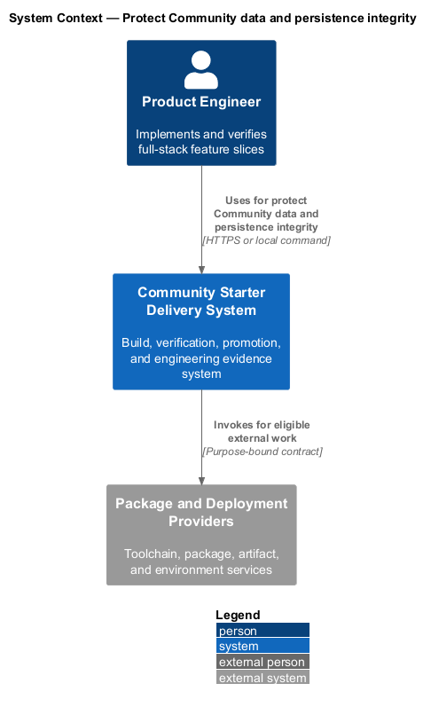
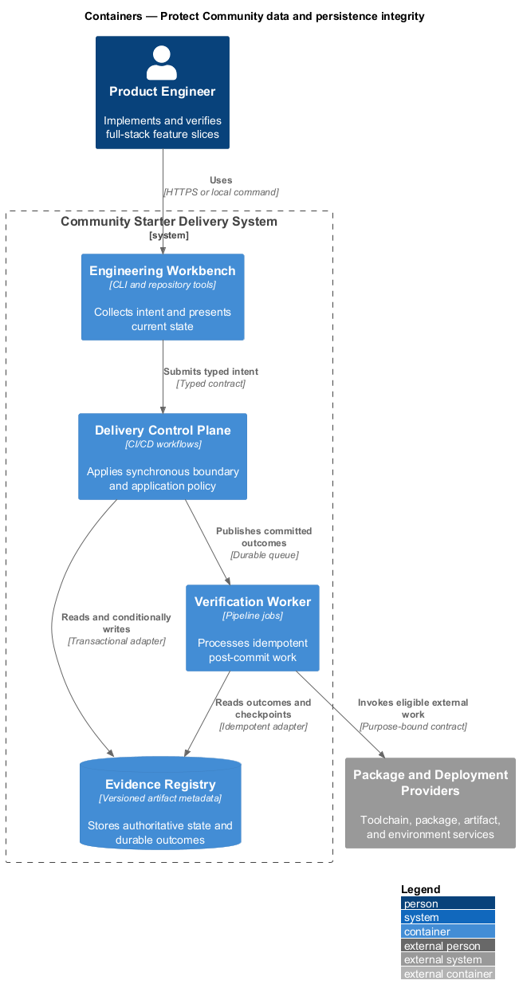
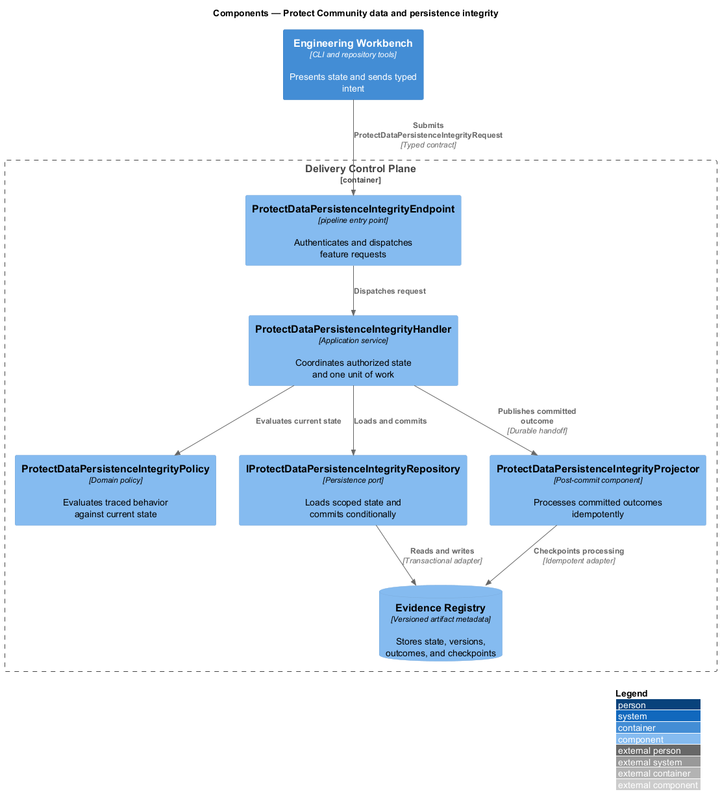
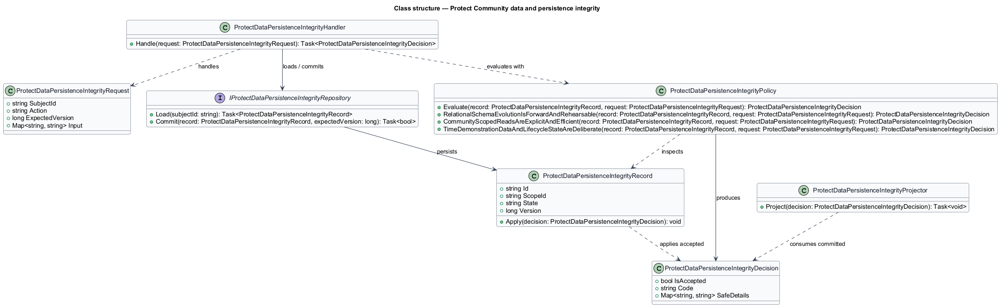
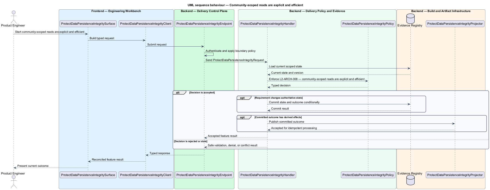
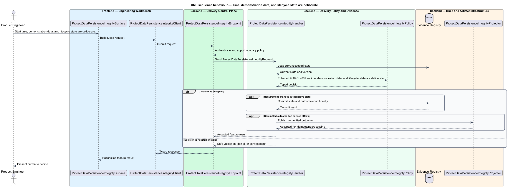

# Protect Community data and persistence integrity

## Overview

Community Starter is a community platform divided into product and platform subsystems. The
Platform architecture subsystem owns this feature.

*protect Community data and persistence integrity* — subsystem capability that covers relational schema evolution is forward and rehearsable, community-scoped reads are explicit and efficient, and time, demonstration data, and lifecycle state are deliberate

The starter is a production-scale, multi-Community platform rather than a compact CRUD tool. It shall provide explicit full-stack boundaries, server-owned Community rules, safe relational persistence, and an evolution path that remains legible as Membership, moderation, content, Notifications, and external dependencies grow. The architecture shall make one complete Community journey runnable from a clean checkout without introducing speculative services or hollow layers. Community data shall be represented relationally, scoped to the authorized Community on every access path, evolved through reviewed forward migrations, and read or changed without hidden provider behavior.

The feature groups 3 traced behaviors behind one policy and evidence
boundary: `L2-ARCH-007`, `L2-ARCH-008`, and `L2-ARCH-009`. Authoritative state commits before projections, delivery, or external work reports
success.

## Description

The repository contains specifications but no application implementation. This greenfield slice
defines the following building blocks across `Engineering Workbench`, `Delivery Control Plane`, the
application and domain layer, and infrastructure.

- **`ProtectDataPersistenceIntegritySurface`** — engineering command surface in `Engineering Workbench`. It presents current
  state, submits user intent, and reconciles the typed result.
- **`ProtectDataPersistenceIntegrityClient`** — typed workflow adapter. It creates `ProtectDataPersistenceIntegrityRequest` values and maps stable
  transport failures into feature results.
- **`ProtectDataPersistenceIntegrityEndpoint`** — pipeline entry point in `Delivery Control Plane`. It authenticates the
  caller, applies boundary policy, and dispatches the request.
- **`ProtectDataPersistenceIntegrityRequest`** — immutable request carrying `SubjectId`, `Action`, `ExpectedVersion`, and the
  scoped input needed by one traced behavior.
- **`ProtectDataPersistenceIntegrityHandler`** — application service that loads authorized state through
  `IProtectDataPersistenceIntegrityRepository`, invokes `ProtectDataPersistenceIntegrityPolicy`, and commits an accepted transition.
- **`ProtectDataPersistenceIntegrityPolicy`** — domain policy that evaluates current state and returns a typed
  `ProtectDataPersistenceIntegrityDecision` without performing external work.
- **`ProtectDataPersistenceIntegrityRecord`** — authoritative record containing the feature state, scope, and concurrency
  version.
- **`IProtectDataPersistenceIntegrityRepository`** — persistence port that loads scoped state and commits one conditional
  unit of work.
- **`ProtectDataPersistenceIntegrityProjector`** — idempotent post-commit component in `Verification Worker`. It updates
  eligible projections and invokes configured external providers.

`ProtectDataPersistenceIntegrityPolicy` exposes one named operation for each traced behavior:

- **`ProtectDataPersistenceIntegrityPolicy.RelationalSchemaEvolutionIsForwardAndRehearsable(record, request)`** — evaluates `L2-ARCH-007` (relational schema evolution is forward and rehearsable) and returns a typed decision before any state change.
- **`ProtectDataPersistenceIntegrityPolicy.CommunityScopedReadsAreExplicitAndEfficient(record, request)`** — evaluates `L2-ARCH-008` (community-scoped reads are explicit and efficient) and returns a typed decision before any state change.
- **`ProtectDataPersistenceIntegrityPolicy.TimeDemonstrationDataAndLifecycleStateAreDeliberate(record, request)`** — evaluates `L2-ARCH-009` (time, demonstration data, and lifecycle state are deliberate) and returns a typed decision before any state change.

## Requirements

The feature realizes the following level-2 (L2) requirements. Each row preserves the specification
identifier, its level-1 (L1) parent, and the requirement statement verbatim.

| L2 ID | Refines (L1) | Requirement |
|-------|--------------|-------------|
| `L2-ARCH-007` | `L1-ARCH-003` | Community relationships and invariants shall use a relational model with explicit constraints, relationships, and indexes where conventions do not communicate intent. Every schema change shall add a reviewed, checked-in, forward migration; an already-applied migration shall not be edited outside a disposable environment. Changes requiring transformation shall include compatibility, backfill, clean-apply, upgrade-rehearsal, and forward-fix or rollback plans. |
| `L2-ARCH-008` | `L1-ARCH-003` | Every Community-owned query shall derive and enforce authorized Community scope on the server. Read paths shall project purpose-built DTOs directly, use no-tracking behavior when entities will not be updated, avoid lazy loading and accidental N+1 access, omit unneeded large columns or graphs, and propagate cancellation through HTTP, EF Core, and external I/O. |
| `L2-ARCH-009` | `L1-ARCH-003` | Persisted and event timestamps shall use UTC `DateTimeOffset`, and policy affected by time shall depend on an injected clock. Demonstration data shall be deterministic and enabled only in development or dedicated demo environments. Reversible resource lifecycle states such as Community archive, Account deactivation, suspension, cancellation, or Case/Conversation closure shall remain distinct from irreversible deletion, with retention and deletion policy made explicit. |

## Diagrams

### System context

The `Product Engineer` uses `Community Starter Delivery System` for the feature. The system invokes
`Package and Deployment Providers` only for configured external work after authoritative decisions.

### Containers

`Engineering Workbench` collects intent, `Delivery Control Plane` applies the synchronous boundary,
and `Evidence Registry` holds authoritative state. `Verification Worker` handles eligible
post-commit work against `Package and Deployment Providers`.

### Components

Inside `Delivery Control Plane`, `ProtectDataPersistenceIntegrityEndpoint` dispatches `ProtectDataPersistenceIntegrityHandler`. The handler evaluates
`ProtectDataPersistenceIntegrityPolicy`, persists through `IProtectDataPersistenceIntegrityRepository`, and hands committed outcomes to
`ProtectDataPersistenceIntegrityProjector`.

### Class structure

`ProtectDataPersistenceIntegrityHandler` depends on the immutable request, domain policy, and repository port.
`ProtectDataPersistenceIntegrityRecord` owns versioned state, while `ProtectDataPersistenceIntegrityProjector` consumes committed results.

### Behaviour — relational schema evolution is forward and rehearsable

The interaction loads current scoped state before `ProtectDataPersistenceIntegrityPolicy` enforces
`L2-ARCH-007`. Rejected decisions return without changing authoritative state; accepted
state changes commit before optional derived work starts.

### Behaviour — community-scoped reads are explicit and efficient

The interaction loads current scoped state before `ProtectDataPersistenceIntegrityPolicy` enforces
`L2-ARCH-008`. Rejected decisions return without changing authoritative state; accepted
state changes commit before optional derived work starts.

### Behaviour — time, demonstration data, and lifecycle state are deliberate

The interaction loads current scoped state before `ProtectDataPersistenceIntegrityPolicy` enforces
`L2-ARCH-009`. Rejected decisions return without changing authoritative state; accepted
state changes commit before optional derived work starts.

