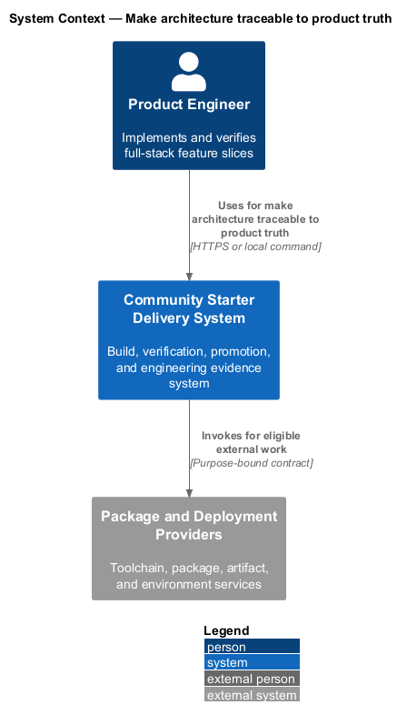
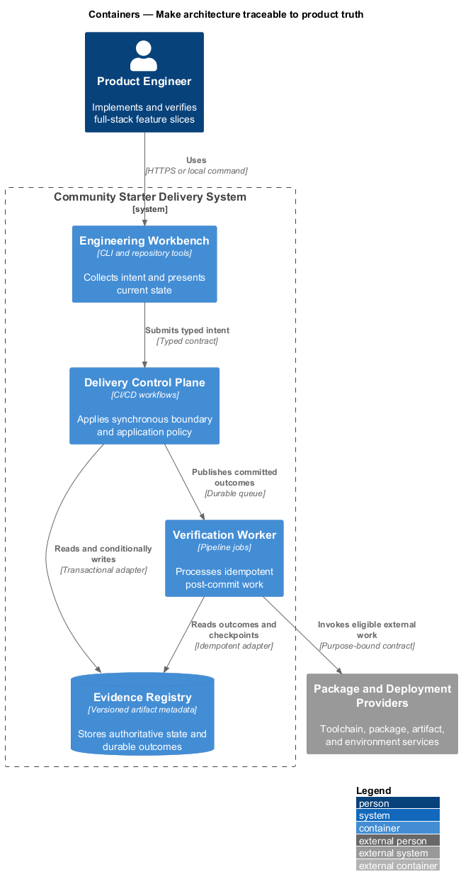
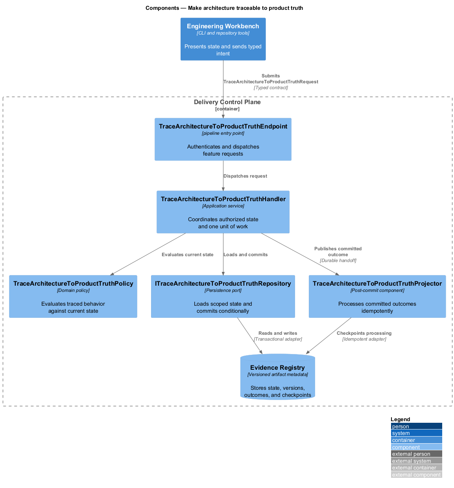
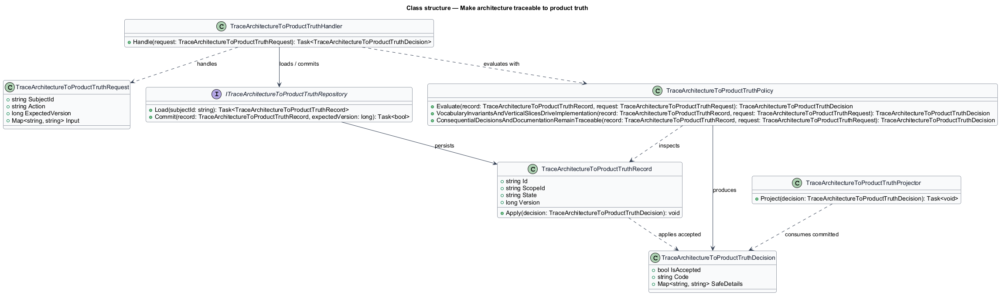
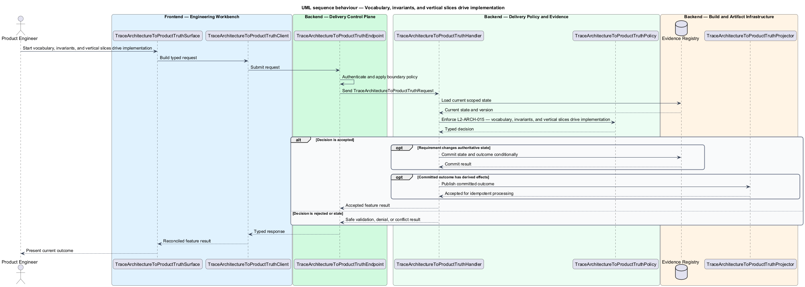

# Make architecture traceable to product truth

## Overview

Community Starter is a community platform divided into product and platform subsystems. The
Platform architecture subsystem owns this feature.

*make architecture traceable to product truth* — subsystem capability that covers vocabulary, invariants, and vertical slices drive implementation and consequential decisions and documentation remain traceable

The starter is a production-scale, multi-Community platform rather than a compact CRUD tool. It shall provide explicit full-stack boundaries, server-owned Community rules, safe relational persistence, and an evolution path that remains legible as Membership, moderation, content, Notifications, and external dependencies grow. The architecture shall make one complete Community journey runnable from a clean checkout without introducing speculative services or hollow layers. Canonical community vocabulary, product-defining invariants, vertical-slice delivery, and immutable decision records shall keep architecture aligned with user outcomes rather than generated scaffolding.

The feature groups 2 traced behaviors behind one policy and evidence
boundary: `L2-ARCH-015` and `L2-ARCH-016`. Authoritative state commits before projections, delivery, or external work reports
success.

## Description

The repository contains specifications but no application implementation. This greenfield slice
defines the following building blocks across `Engineering Workbench`, `Delivery Control Plane`, the
application and domain layer, and infrastructure.

- **`TraceArchitectureToProductTruthSurface`** — engineering command surface in `Engineering Workbench`. It presents current
  state, submits user intent, and reconciles the typed result.
- **`TraceArchitectureToProductTruthClient`** — typed workflow adapter. It creates `TraceArchitectureToProductTruthRequest` values and maps stable
  transport failures into feature results.
- **`TraceArchitectureToProductTruthEndpoint`** — pipeline entry point in `Delivery Control Plane`. It authenticates the
  caller, applies boundary policy, and dispatches the request.
- **`TraceArchitectureToProductTruthRequest`** — immutable request carrying `SubjectId`, `Action`, `ExpectedVersion`, and the
  scoped input needed by one traced behavior.
- **`TraceArchitectureToProductTruthHandler`** — application service that loads authorized state through
  `ITraceArchitectureToProductTruthRepository`, invokes `TraceArchitectureToProductTruthPolicy`, and commits an accepted transition.
- **`TraceArchitectureToProductTruthPolicy`** — domain policy that evaluates current state and returns a typed
  `TraceArchitectureToProductTruthDecision` without performing external work.
- **`TraceArchitectureToProductTruthRecord`** — authoritative record containing the feature state, scope, and concurrency
  version.
- **`ITraceArchitectureToProductTruthRepository`** — persistence port that loads scoped state and commits one conditional
  unit of work.
- **`TraceArchitectureToProductTruthProjector`** — idempotent post-commit component in `Verification Worker`. It updates
  eligible projections and invokes configured external providers.

`TraceArchitectureToProductTruthPolicy` exposes one named operation for each traced behavior:

- **`TraceArchitectureToProductTruthPolicy.VocabularyInvariantsAndVerticalSlicesDriveImplementation(record, request)`** — evaluates `L2-ARCH-015` (vocabulary, invariants, and vertical slices drive implementation) and returns a typed decision before any state change.
- **`TraceArchitectureToProductTruthPolicy.ConsequentialDecisionsAndDocumentationRemainTraceable(record, request)`** — evaluates `L2-ARCH-016` (consequential decisions and documentation remain traceable) and returns a typed decision before any state change.

## Requirements

The feature realizes the following level-2 (L2) requirements. Each row preserves the specification
identifier, its level-1 (L1) parent, and the requirement statement verbatim.

| L2 ID | Refines (L1) | Requirement |
|-------|--------------|-------------|
| `L2-ARCH-015` | `L1-ARCH-006` | The product thesis, canonical community nouns, primary member journey, product-defining server invariant, measures, risks, and non-goals shall be established before broad scaffolding. One canonical code name shall exist per concept, with unavoidable UI synonyms documented. Delivery shall begin with a differentiating vertical slice through route, UI, typed client, endpoint, use case, domain rule, real persistence, response or event, refreshed UI, failures, tests, and documentation before dashboard or administration breadth. |
| `L2-ARCH-016` | `L1-ARCH-006` | Choices affecting dependency direction, data ownership or shape, security, external services, public contracts, deployment, design-system semantics, licensing, or operational cost shall be recorded as numbered ADRs. ADR history shall be immutable through Proposed, Accepted, Superseded, or Deprecated states, with replacements linked both ways. Behavior, commands, configuration, architecture, data, deployment, specifications, runbooks, support notes, and changelog shall be updated in the same change that makes them stale. |

## Diagrams

### System context

The `Product Engineer` uses `Community Starter Delivery System` for the feature. The system invokes
`Package and Deployment Providers` only for configured external work after authoritative decisions.

### Containers

`Engineering Workbench` collects intent, `Delivery Control Plane` applies the synchronous boundary,
and `Evidence Registry` holds authoritative state. `Verification Worker` handles eligible
post-commit work against `Package and Deployment Providers`.

### Components

Inside `Delivery Control Plane`, `TraceArchitectureToProductTruthEndpoint` dispatches `TraceArchitectureToProductTruthHandler`. The handler evaluates
`TraceArchitectureToProductTruthPolicy`, persists through `ITraceArchitectureToProductTruthRepository`, and hands committed outcomes to
`TraceArchitectureToProductTruthProjector`.

### Class structure

`TraceArchitectureToProductTruthHandler` depends on the immutable request, domain policy, and repository port.
`TraceArchitectureToProductTruthRecord` owns versioned state, while `TraceArchitectureToProductTruthProjector` consumes committed results.

### Behaviour — vocabulary, invariants, and vertical slices drive implementation

The interaction loads current scoped state before `TraceArchitectureToProductTruthPolicy` enforces
`L2-ARCH-015`. Rejected decisions return without changing authoritative state; accepted
state changes commit before optional derived work starts.

### Behaviour — consequential decisions and documentation remain traceable

The interaction loads current scoped state before `TraceArchitectureToProductTruthPolicy` enforces
`L2-ARCH-016`. Rejected decisions return without changing authoritative state; accepted
state changes commit before optional derived work starts.

