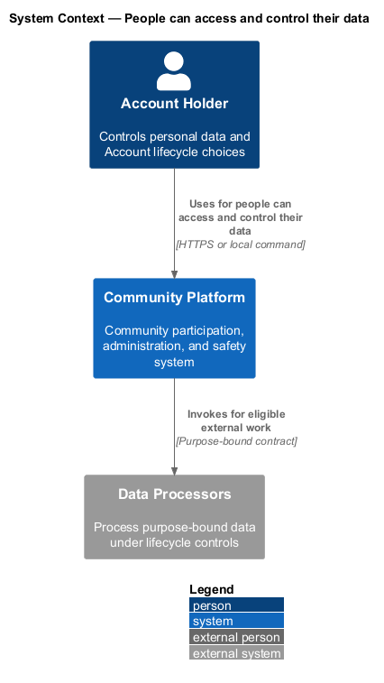
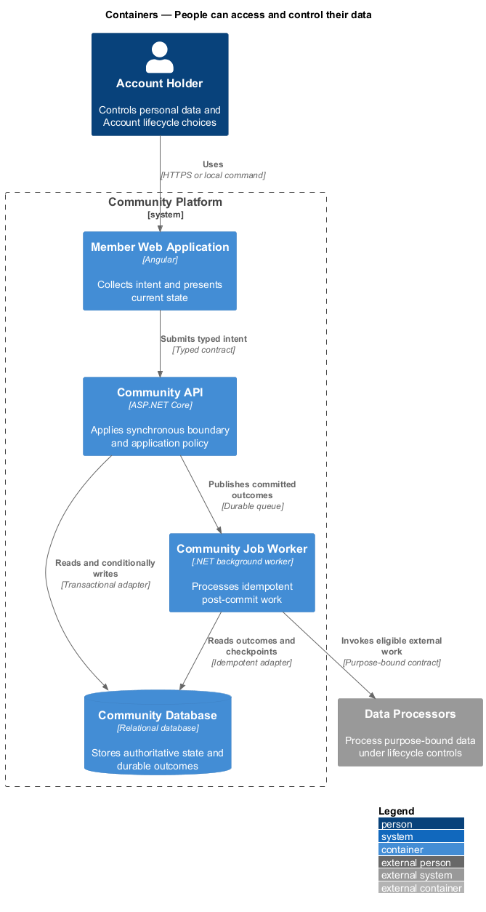
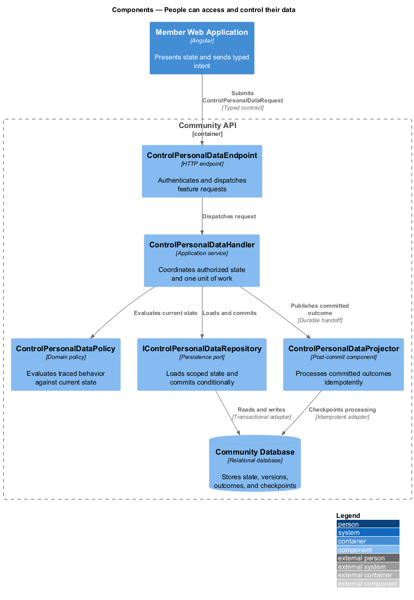
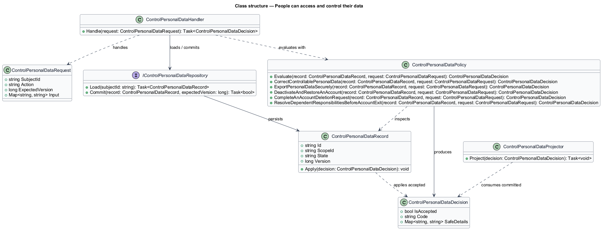
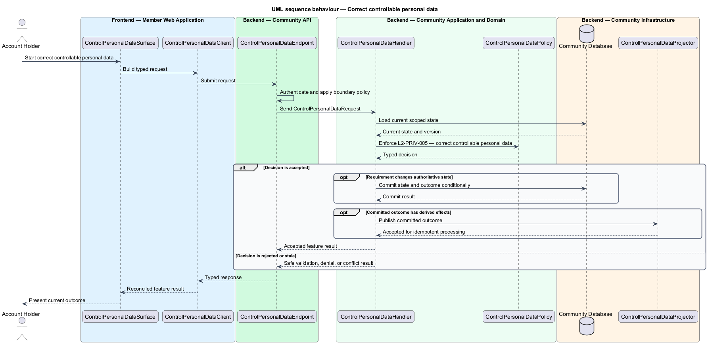
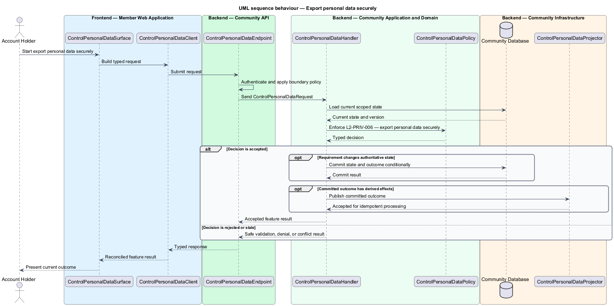
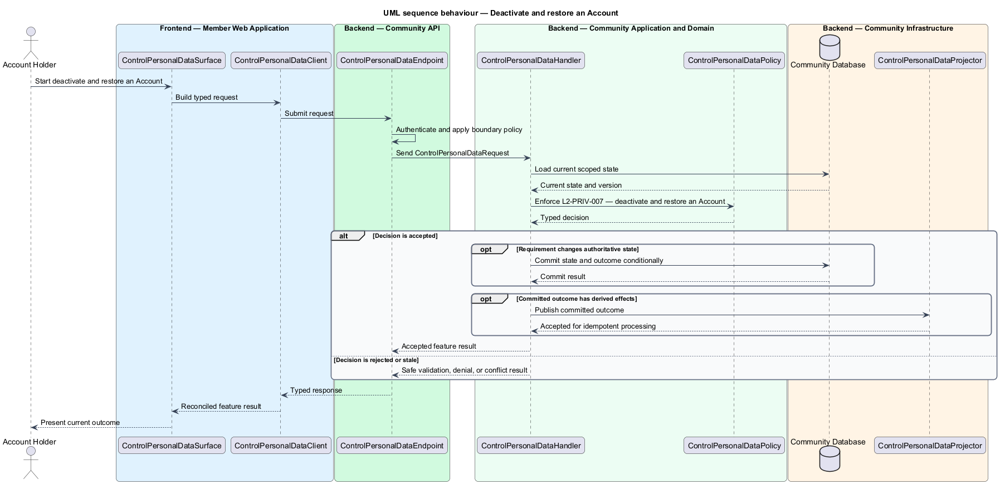
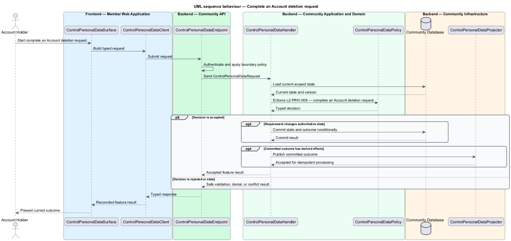
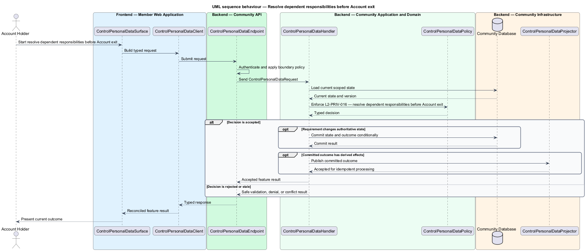

# People can access and control their data

## Overview

Community Starter is a community platform divided into product and platform subsystems. The
Privacy and data lifecycle subsystem owns this feature.

*people can access and control their data* — subsystem capability that covers correct controllable personal data, export personal data securely, deactivate and restore an Account, complete an Account deletion request, and resolve dependent responsibilities before Account exit

Account holders, Members, affected non-members, Community teams, and Platform Operators need personal data to be collected for declared purposes, protected by usable choices, and removed or retained predictably. Privacy rules apply to primary records and every derived system, including media, Search, caches, analytics, Jobs, Deliveries, integrations, and backups. An authenticated Account holder can inspect, correct, export, deactivate, and request deletion of personal data without receiving another person's private information or restricted safety records.

The feature groups 5 traced behaviors behind one policy and evidence
boundary: `L2-PRIV-005`, `L2-PRIV-006`, `L2-PRIV-007`, `L2-PRIV-008`, and `L2-PRIV-016`. Authoritative state commits before projections, delivery, or external work reports
success.

## Description

The repository contains specifications but no application implementation. This greenfield slice
defines the following building blocks across `Member Web Application`, `Community API`, the
application and domain layer, and infrastructure.

- **`ControlPersonalDataSurface`** — page component in `Member Web Application`. It presents current
  state, submits user intent, and reconciles the typed result.
- **`ControlPersonalDataClient`** — typed Angular client. It creates `ControlPersonalDataRequest` values and maps stable
  transport failures into feature results.
- **`ControlPersonalDataEndpoint`** — HTTP endpoint in `Community API`. It authenticates the
  caller, applies boundary policy, and dispatches the request.
- **`ControlPersonalDataRequest`** — immutable request carrying `SubjectId`, `Action`, `ExpectedVersion`, and the
  scoped input needed by one traced behavior.
- **`ControlPersonalDataHandler`** — application service that loads authorized state through
  `IControlPersonalDataRepository`, invokes `ControlPersonalDataPolicy`, and commits an accepted transition.
- **`ControlPersonalDataPolicy`** — domain policy that evaluates current state and returns a typed
  `ControlPersonalDataDecision` without performing external work.
- **`ControlPersonalDataRecord`** — authoritative record containing the feature state, scope, and concurrency
  version.
- **`IControlPersonalDataRepository`** — persistence port that loads scoped state and commits one conditional
  unit of work.
- **`ControlPersonalDataProjector`** — idempotent post-commit component in `Community Job Worker`. It updates
  eligible projections and invokes configured external providers.

`ControlPersonalDataPolicy` exposes one named operation for each traced behavior:

- **`ControlPersonalDataPolicy.CorrectControllablePersonalData(record, request)`** — evaluates `L2-PRIV-005` (correct controllable personal data) and returns a typed decision before any state change.
- **`ControlPersonalDataPolicy.ExportPersonalDataSecurely(record, request)`** — evaluates `L2-PRIV-006` (export personal data securely) and returns a typed decision before any state change.
- **`ControlPersonalDataPolicy.DeactivateAndRestoreAnAccount(record, request)`** — evaluates `L2-PRIV-007` (deactivate and restore an Account) and returns a typed decision before any state change.
- **`ControlPersonalDataPolicy.CompleteAnAccountDeletionRequest(record, request)`** — evaluates `L2-PRIV-008` (complete an Account deletion request) and returns a typed decision before any state change.
- **`ControlPersonalDataPolicy.ResolveDependentResponsibilitiesBeforeAccountExit(record, request)`** — evaluates `L2-PRIV-016` (resolve dependent responsibilities before Account exit) and returns a typed decision before any state change.

## Requirements

The feature realizes the following level-2 (L2) requirements. Each row preserves the specification
identifier, its level-1 (L1) parent, and the requirement statement verbatim.

| L2 ID | Refines (L1) | Requirement |
|-------|--------------|-------------|
| `L2-PRIV-005` | `L1-PRIV-002` | An authenticated Account holder can inspect and correct user-managed personal data. Security attributes, verified identifiers, audit history, and disputed records use their governed workflows rather than arbitrary inline editing. |
| `L2-PRIV-006` | `L1-PRIV-002` | An Account holder can request a documented, machine-readable export of their personal data. Export generation is asynchronous, audited, rate limited, and delivered through an expiring, revocable mechanism after recent authentication. |
| `L2-PRIV-007` | `L1-PRIV-002` | Deactivation is the canonical reversible `active → deactivated` Account transition and remains distinct from `deletion-pending → deleted`. It first resolves every registered responsibility, then revokes ordinary Sessions, prevents participation and optional Deliveries, hides the Account as policy requires, and preserves a time-bounded restoration path unless a Moderation Action forbids it. |
| `L2-PRIV-008` | `L1-PRIV-002` | Account deletion is the canonical `active\|deactivated → deletion-pending → deleted` workflow with recent authentication or restricted remediation, a disclosed cooling-off period, all dependent responsibility preconditions, legal exceptions, progress state, cancellation rules, and a durable completion record that contains no unnecessary personal data. |
| `L2-PRIV-016` | `L1-PRIV-002` | One Account-responsibility registry is authoritative for voluntary exit and forced eligibility-loss continuity. It includes Community and Space continuity, Event organization, direct-Conversation lifecycle work, owned Moderation Cases, Appeals, and Support Cases, pending Membership invitations/requests, owned privacy exports, active legal holds, and any retained MVP capability that declares a last-controller invariant. |

## Diagrams

### System context

The `Account Holder` uses `Community Platform` for the feature. The system invokes
`Data Processors` only for configured external work after authoritative decisions.

### Containers

`Member Web Application` collects intent, `Community API` applies the synchronous boundary,
and `Community Database` holds authoritative state. `Community Job Worker` handles eligible
post-commit work against `Data Processors`.

### Components

Inside `Community API`, `ControlPersonalDataEndpoint` dispatches `ControlPersonalDataHandler`. The handler evaluates
`ControlPersonalDataPolicy`, persists through `IControlPersonalDataRepository`, and hands committed outcomes to
`ControlPersonalDataProjector`.

### Class structure

`ControlPersonalDataHandler` depends on the immutable request, domain policy, and repository port.
`ControlPersonalDataRecord` owns versioned state, while `ControlPersonalDataProjector` consumes committed results.

### Behaviour — correct controllable personal data

The interaction loads current scoped state before `ControlPersonalDataPolicy` enforces
`L2-PRIV-005`. Rejected decisions return without changing authoritative state; accepted
state changes commit before optional derived work starts.

### Behaviour — export personal data securely

The interaction loads current scoped state before `ControlPersonalDataPolicy` enforces
`L2-PRIV-006`. Rejected decisions return without changing authoritative state; accepted
state changes commit before optional derived work starts.

### Behaviour — deactivate and restore an Account

The interaction loads current scoped state before `ControlPersonalDataPolicy` enforces
`L2-PRIV-007`. Rejected decisions return without changing authoritative state; accepted
state changes commit before optional derived work starts.

### Behaviour — complete an Account deletion request

The interaction loads current scoped state before `ControlPersonalDataPolicy` enforces
`L2-PRIV-008`. Rejected decisions return without changing authoritative state; accepted
state changes commit before optional derived work starts.

### Behaviour — resolve dependent responsibilities before Account exit

The interaction loads current scoped state before `ControlPersonalDataPolicy` enforces
`L2-PRIV-016`. Rejected decisions return without changing authoritative state; accepted
state changes commit before optional derived work starts.

