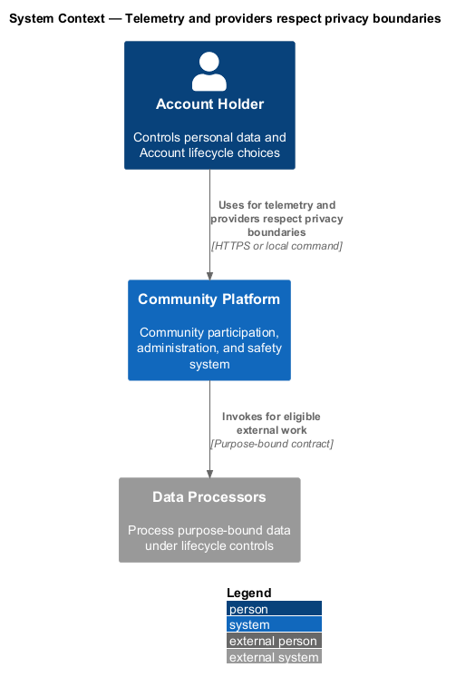
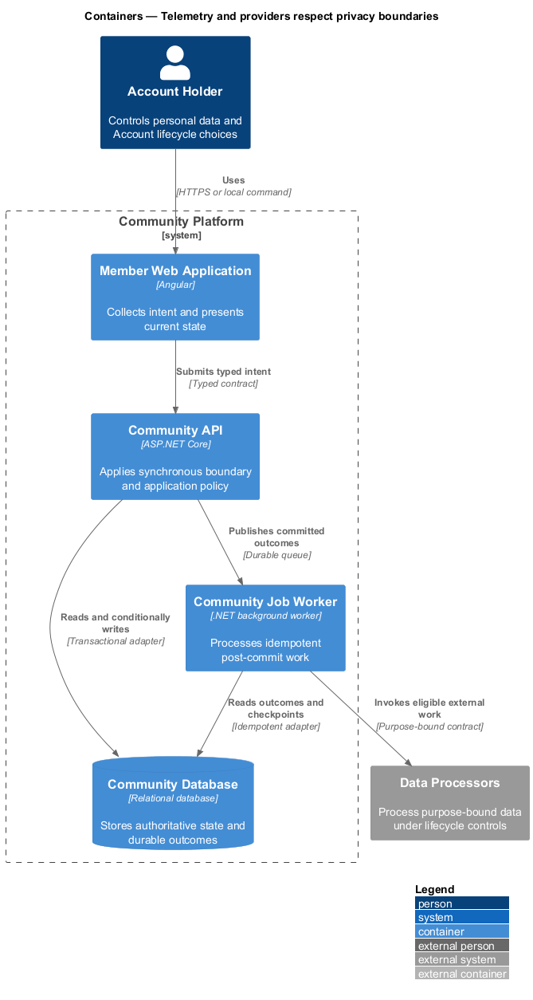
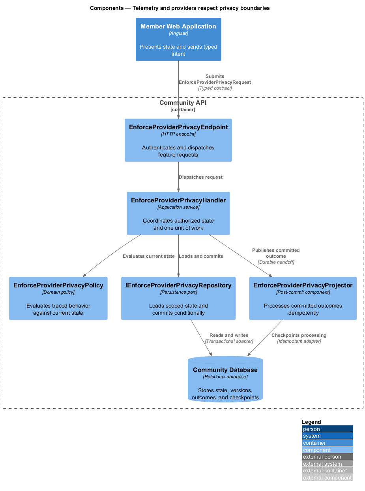
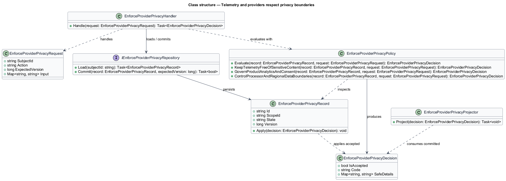
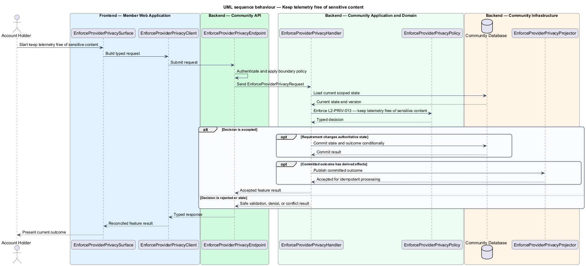
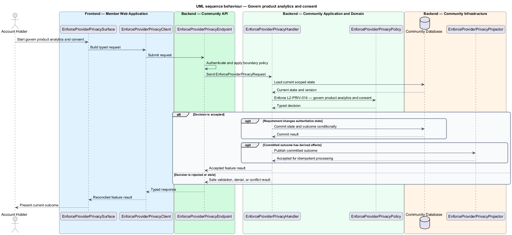
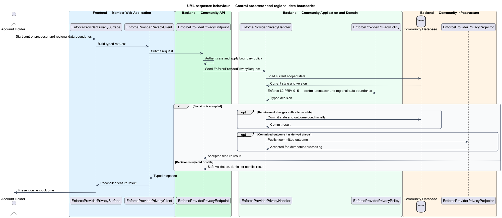

# Telemetry and providers respect privacy boundaries

## Overview

Community Starter is a community platform divided into product and platform subsystems. The
Privacy and data lifecycle subsystem owns this feature.

*telemetry and providers respect privacy boundaries* — subsystem capability that covers keep telemetry free of sensitive content, govern product analytics and consent, and control processor and regional data boundaries

Account holders, Members, affected non-members, Community teams, and Platform Operators need personal data to be collected for declared purposes, protected by usable choices, and removed or retained predictably. Privacy rules apply to primary records and every derived system, including media, Search, caches, analytics, Jobs, Deliveries, integrations, and backups. Operational telemetry, product analytics, support tooling, and external processors disclose only the minimum data needed for declared outcomes and retain traceable ownership.

The feature groups 3 traced behaviors behind one policy and evidence
boundary: `L2-PRIV-013`, `L2-PRIV-014`, and `L2-PRIV-015`. Authoritative state commits before projections, delivery, or external work reports
success.

## Description

The repository contains specifications but no application implementation. This greenfield slice
defines the following building blocks across `Member Web Application`, `Community API`, the
application and domain layer, and infrastructure.

- **`EnforceProviderPrivacySurface`** — page component in `Member Web Application`. It presents current
  state, submits user intent, and reconciles the typed result.
- **`EnforceProviderPrivacyClient`** — typed Angular client. It creates `EnforceProviderPrivacyRequest` values and maps stable
  transport failures into feature results.
- **`EnforceProviderPrivacyEndpoint`** — HTTP endpoint in `Community API`. It authenticates the
  caller, applies boundary policy, and dispatches the request.
- **`EnforceProviderPrivacyRequest`** — immutable request carrying `SubjectId`, `Action`, `ExpectedVersion`, and the
  scoped input needed by one traced behavior.
- **`EnforceProviderPrivacyHandler`** — application service that loads authorized state through
  `IEnforceProviderPrivacyRepository`, invokes `EnforceProviderPrivacyPolicy`, and commits an accepted transition.
- **`EnforceProviderPrivacyPolicy`** — domain policy that evaluates current state and returns a typed
  `EnforceProviderPrivacyDecision` without performing external work.
- **`EnforceProviderPrivacyRecord`** — authoritative record containing the feature state, scope, and concurrency
  version.
- **`IEnforceProviderPrivacyRepository`** — persistence port that loads scoped state and commits one conditional
  unit of work.
- **`EnforceProviderPrivacyProjector`** — idempotent post-commit component in `Community Job Worker`. It updates
  eligible projections and invokes configured external providers.

`EnforceProviderPrivacyPolicy` exposes one named operation for each traced behavior:

- **`EnforceProviderPrivacyPolicy.KeepTelemetryFreeOfSensitiveContent(record, request)`** — evaluates `L2-PRIV-013` (keep telemetry free of sensitive content) and returns a typed decision before any state change.
- **`EnforceProviderPrivacyPolicy.GovernProductAnalyticsAndConsent(record, request)`** — evaluates `L2-PRIV-014` (govern product analytics and consent) and returns a typed decision before any state change.
- **`EnforceProviderPrivacyPolicy.ControlProcessorAndRegionalDataBoundaries(record, request)`** — evaluates `L2-PRIV-015` (control processor and regional data boundaries) and returns a typed decision before any state change.

## Requirements

The feature realizes the following level-2 (L2) requirements. Each row preserves the specification
identifier, its level-1 (L1) parent, and the requirement statement verbatim.

| L2 ID | Refines (L1) | Requirement |
|-------|--------------|-------------|
| `L2-PRIV-013` | `L1-PRIV-004` | Logs, traces, metrics, diagnostics, support artifacts, and error responses exclude credentials, tokens, reset/export URLs, message or content bodies, raw Attachments, unnecessary personal attributes, and unbounded user input. |
| `L2-PRIV-014` | `L1-PRIV-004` | Every analytics event answers a declared product question, has a named owner and versioned schema, uses the least identifying dimensions, obeys current consent, and expires when the question or retention period ends. |
| `L2-PRIV-015` | `L1-PRIV-004` | Each external processor and deployment region is enabled only after its data categories, purpose, contract owner, security review, retention, deletion, incident path, and transfer boundary are recorded. The product makes no residency claim beyond verified configuration and provider evidence. |

## Diagrams

### System context

The `Account Holder` uses `Community Platform` for the feature. The system invokes
`Data Processors` only for configured external work after authoritative decisions.

### Containers

`Member Web Application` collects intent, `Community API` applies the synchronous boundary,
and `Community Database` holds authoritative state. `Community Job Worker` handles eligible
post-commit work against `Data Processors`.

### Components

Inside `Community API`, `EnforceProviderPrivacyEndpoint` dispatches `EnforceProviderPrivacyHandler`. The handler evaluates
`EnforceProviderPrivacyPolicy`, persists through `IEnforceProviderPrivacyRepository`, and hands committed outcomes to
`EnforceProviderPrivacyProjector`.

### Class structure

`EnforceProviderPrivacyHandler` depends on the immutable request, domain policy, and repository port.
`EnforceProviderPrivacyRecord` owns versioned state, while `EnforceProviderPrivacyProjector` consumes committed results.

### Behaviour — keep telemetry free of sensitive content

The interaction loads current scoped state before `EnforceProviderPrivacyPolicy` enforces
`L2-PRIV-013`. Rejected decisions return without changing authoritative state; accepted
state changes commit before optional derived work starts.

### Behaviour — govern product analytics and consent

The interaction loads current scoped state before `EnforceProviderPrivacyPolicy` enforces
`L2-PRIV-014`. Rejected decisions return without changing authoritative state; accepted
state changes commit before optional derived work starts.

### Behaviour — control processor and regional data boundaries

The interaction loads current scoped state before `EnforceProviderPrivacyPolicy` enforces
`L2-PRIV-015`. Rejected decisions return without changing authoritative state; accepted
state changes commit before optional derived work starts.

