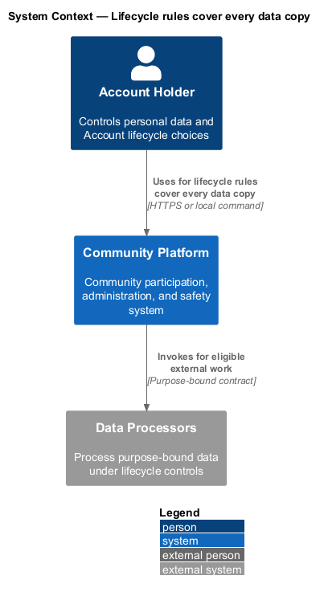
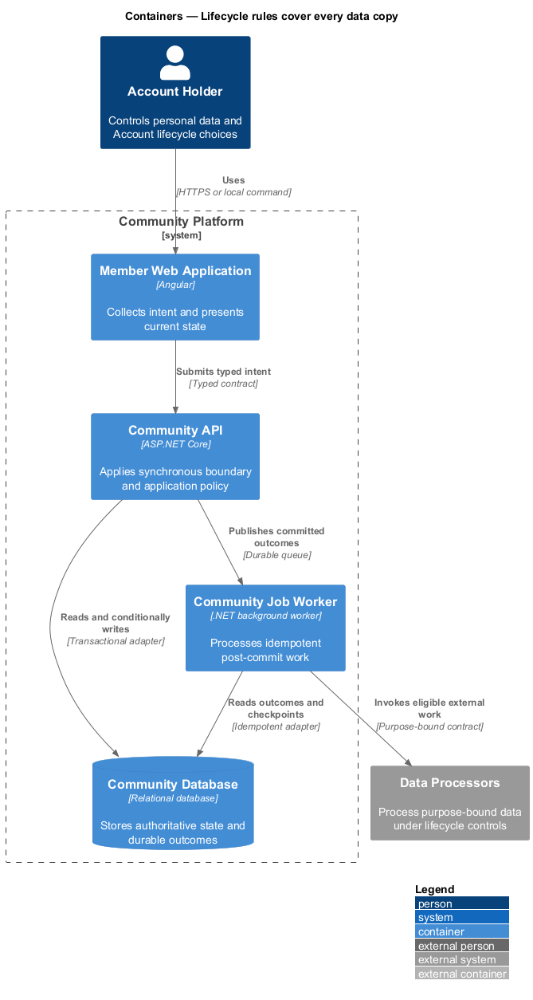
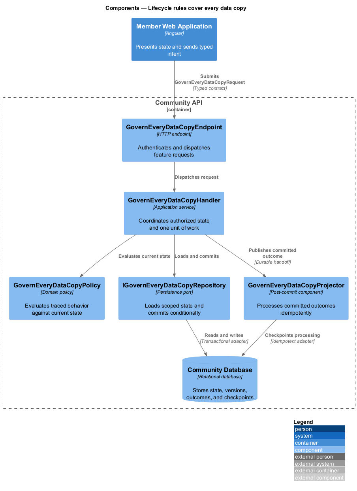
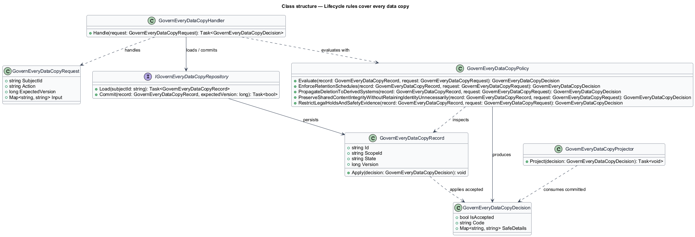
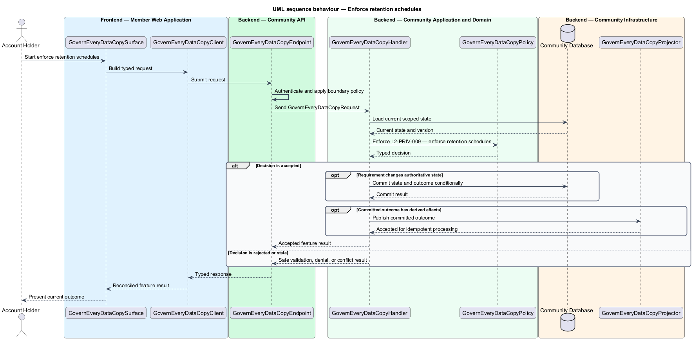
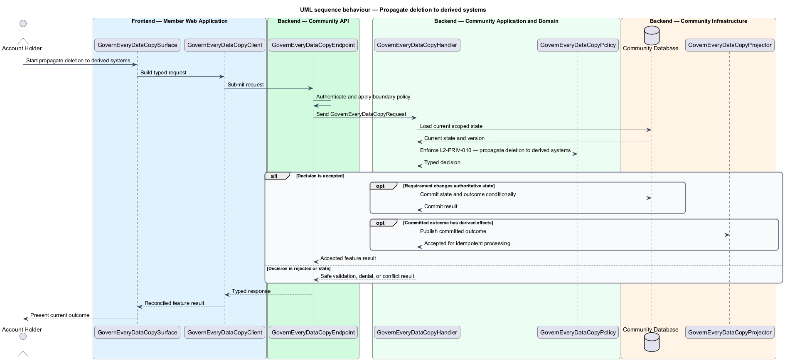
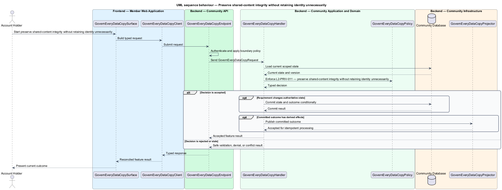
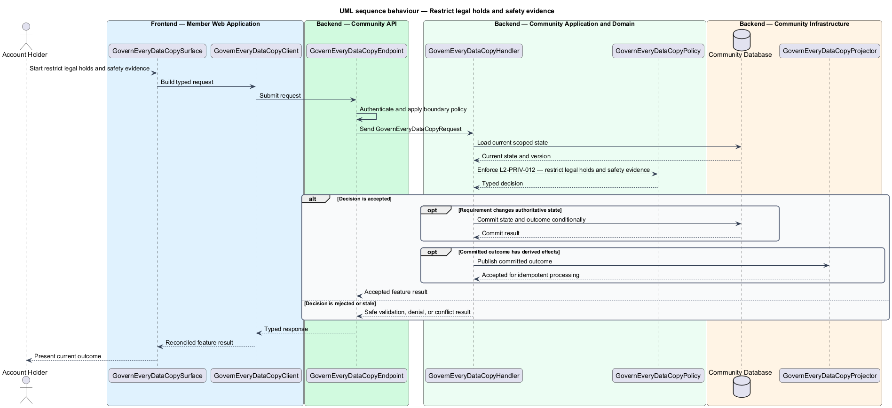

# Lifecycle rules cover every data copy

## Overview

Community Starter is a community platform divided into product and platform subsystems. The
Privacy and data lifecycle subsystem owns this feature.

*lifecycle rules cover every data copy* — subsystem capability that covers enforce retention schedules, propagate deletion to derived systems, preserve shared-content integrity without retaining identity unnecessarily, and restrict legal holds and safety evidence

Account holders, Members, affected non-members, Community teams, and Platform Operators need personal data to be collected for declared purposes, protected by usable choices, and removed or retained predictably. Privacy rules apply to primary records and every derived system, including media, Search, caches, analytics, Jobs, Deliveries, integrations, and backups. Retention, deletion, anonymization, evidence preservation, legal holds, and backup expiry are explicit, auditable, and applied across authoritative and derived stores.

The feature groups 4 traced behaviors behind one policy and evidence
boundary: `L2-PRIV-009`, `L2-PRIV-010`, `L2-PRIV-011`, and `L2-PRIV-012`. Authoritative state commits before projections, delivery, or external work reports
success.

## Description

The repository contains specifications but no application implementation. This greenfield slice
defines the following building blocks across `Member Web Application`, `Community API`, the
application and domain layer, and infrastructure.

- **`GovernEveryDataCopySurface`** — page component in `Member Web Application`. It presents current
  state, submits user intent, and reconciles the typed result.
- **`GovernEveryDataCopyClient`** — typed Angular client. It creates `GovernEveryDataCopyRequest` values and maps stable
  transport failures into feature results.
- **`GovernEveryDataCopyEndpoint`** — HTTP endpoint in `Community API`. It authenticates the
  caller, applies boundary policy, and dispatches the request.
- **`GovernEveryDataCopyRequest`** — immutable request carrying `SubjectId`, `Action`, `ExpectedVersion`, and the
  scoped input needed by one traced behavior.
- **`GovernEveryDataCopyHandler`** — application service that loads authorized state through
  `IGovernEveryDataCopyRepository`, invokes `GovernEveryDataCopyPolicy`, and commits an accepted transition.
- **`GovernEveryDataCopyPolicy`** — domain policy that evaluates current state and returns a typed
  `GovernEveryDataCopyDecision` without performing external work.
- **`GovernEveryDataCopyRecord`** — authoritative record containing the feature state, scope, and concurrency
  version.
- **`IGovernEveryDataCopyRepository`** — persistence port that loads scoped state and commits one conditional
  unit of work.
- **`GovernEveryDataCopyProjector`** — idempotent post-commit component in `Community Job Worker`. It updates
  eligible projections and invokes configured external providers.

`GovernEveryDataCopyPolicy` exposes one named operation for each traced behavior:

- **`GovernEveryDataCopyPolicy.EnforceRetentionSchedules(record, request)`** — evaluates `L2-PRIV-009` (enforce retention schedules) and returns a typed decision before any state change.
- **`GovernEveryDataCopyPolicy.PropagateDeletionToDerivedSystems(record, request)`** — evaluates `L2-PRIV-010` (propagate deletion to derived systems) and returns a typed decision before any state change.
- **`GovernEveryDataCopyPolicy.PreserveSharedContentIntegrityWithoutRetainingIdentityUnnecessarily(record, request)`** — evaluates `L2-PRIV-011` (preserve shared-content integrity without retaining identity unnecessarily) and returns a typed decision before any state change.
- **`GovernEveryDataCopyPolicy.RestrictLegalHoldsAndSafetyEvidence(record, request)`** — evaluates `L2-PRIV-012` (restrict legal holds and safety evidence) and returns a typed decision before any state change.

## Requirements

The feature realizes the following level-2 (L2) requirements. Each row preserves the specification
identifier, its level-1 (L1) parent, and the requirement statement verbatim.

| L2 ID | Refines (L1) | Requirement |
|-------|--------------|-------------|
| `L2-PRIV-009` | `L1-PRIV-003` | Every retained category has a configured start event, duration or review condition, terminal action, and accountable owner. A durable Job applies schedules and exposes safe metrics for overdue records without placing personal values in telemetry. |
| `L2-PRIV-010` | `L1-PRIV-003` | Deletion and visibility-changing events propagate within documented bounds to relational replicas, Attachments, Search, caches, Feed projections, configured analytics, queued work, Notifications, email destinations, and media processors. Backup copies expire through the declared backup lifecycle. |
| `L2-PRIV-011` | `L1-PRIV-003` | Deletion defines per-content-category whether a shared item is erased, retained under a neutral attribution, or replaced by a structural placeholder. Public identity and Profile links disappear unless a narrow retention rule requires otherwise. |
| `L2-PRIV-012` | `L1-PRIV-003` | A legal hold or safety-evidence exception has a defined authority, narrow scope, reason, start, review or expiry, and restricted access policy. It preserves only the required material and never silently restores retained data to ordinary product views. |

## Diagrams

### System context

The `Account Holder` uses `Community Platform` for the feature. The system invokes
`Data Processors` only for configured external work after authoritative decisions.

### Containers

`Member Web Application` collects intent, `Community API` applies the synchronous boundary,
and `Community Database` holds authoritative state. `Community Job Worker` handles eligible
post-commit work against `Data Processors`.

### Components

Inside `Community API`, `GovernEveryDataCopyEndpoint` dispatches `GovernEveryDataCopyHandler`. The handler evaluates
`GovernEveryDataCopyPolicy`, persists through `IGovernEveryDataCopyRepository`, and hands committed outcomes to
`GovernEveryDataCopyProjector`.

### Class structure

`GovernEveryDataCopyHandler` depends on the immutable request, domain policy, and repository port.
`GovernEveryDataCopyRecord` owns versioned state, while `GovernEveryDataCopyProjector` consumes committed results.

### Behaviour — enforce retention schedules

The interaction loads current scoped state before `GovernEveryDataCopyPolicy` enforces
`L2-PRIV-009`. Rejected decisions return without changing authoritative state; accepted
state changes commit before optional derived work starts.

### Behaviour — propagate deletion to derived systems

The interaction loads current scoped state before `GovernEveryDataCopyPolicy` enforces
`L2-PRIV-010`. Rejected decisions return without changing authoritative state; accepted
state changes commit before optional derived work starts.

### Behaviour — preserve shared-content integrity without retaining identity unnecessarily

The interaction loads current scoped state before `GovernEveryDataCopyPolicy` enforces
`L2-PRIV-011`. Rejected decisions return without changing authoritative state; accepted
state changes commit before optional derived work starts.

### Behaviour — restrict legal holds and safety evidence

The interaction loads current scoped state before `GovernEveryDataCopyPolicy` enforces
`L2-PRIV-012`. Rejected decisions return without changing authoritative state; accepted
state changes commit before optional derived work starts.

