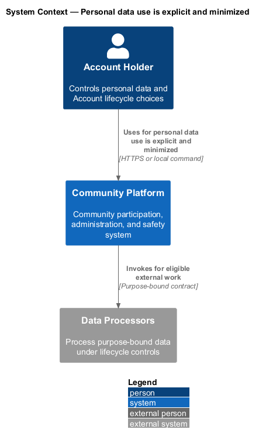
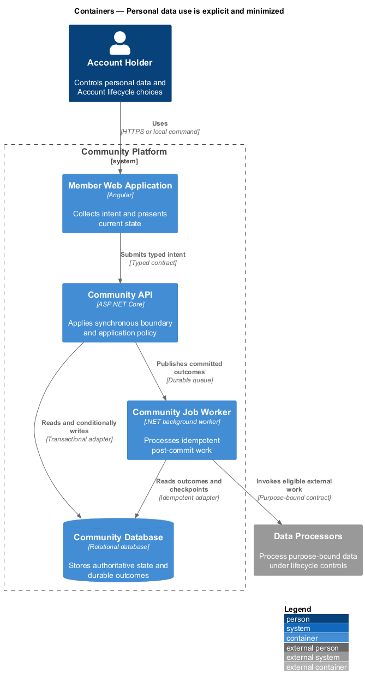
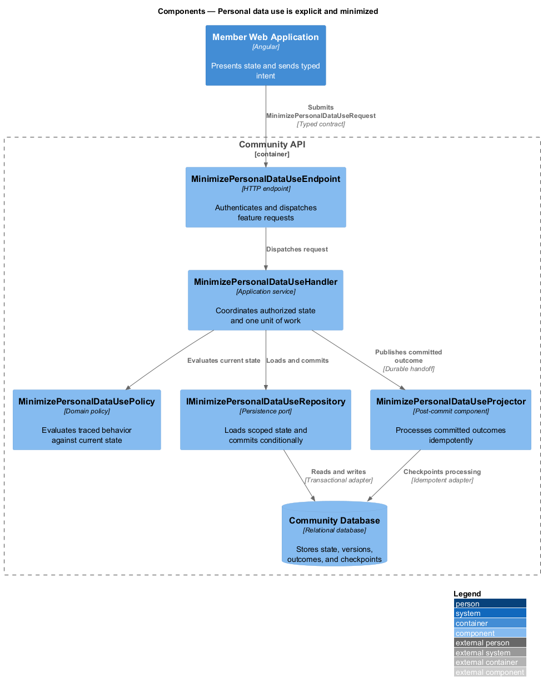
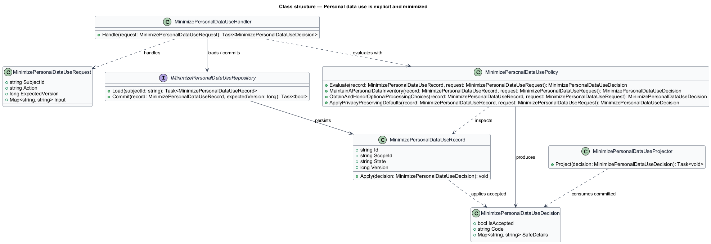
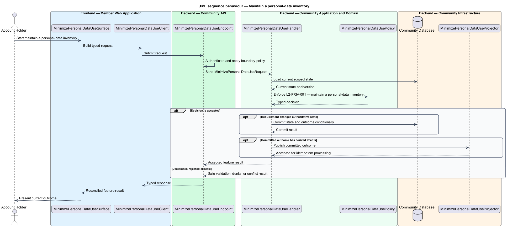
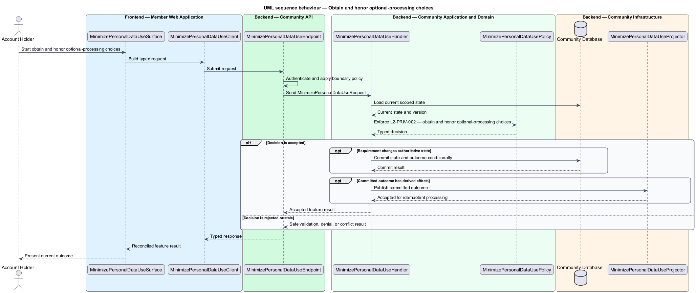
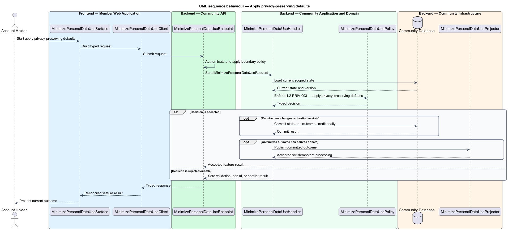

# Personal data use is explicit and minimized

## Overview

Community Starter is a community platform divided into product and platform subsystems. The
Privacy and data lifecycle subsystem owns this feature.

*personal data use is explicit and minimized* — subsystem capability that covers maintain a personal-data inventory, obtain and honor optional-processing choices, and apply privacy-preserving defaults

Account holders, Members, affected non-members, Community teams, and Platform Operators need personal data to be collected for declared purposes, protected by usable choices, and removed or retained predictably. Privacy rules apply to primary records and every derived system, including media, Search, caches, analytics, Jobs, Deliveries, integrations, and backups. The platform collects and uses only data tied to a documented purpose, lawful operating basis, and retention rule, with restrictive defaults for optional processing.

The feature groups 3 traced behaviors behind one policy and evidence
boundary: `L2-PRIV-001`, `L2-PRIV-002`, and `L2-PRIV-003`. Authoritative state commits before projections, delivery, or external work reports
success.

## Description

The repository contains specifications but no application implementation. This greenfield slice
defines the following building blocks across `Member Web Application`, `Community API`, the
application and domain layer, and infrastructure.

- **`MinimizePersonalDataUseSurface`** — page component in `Member Web Application`. It presents current
  state, submits user intent, and reconciles the typed result.
- **`MinimizePersonalDataUseClient`** — typed Angular client. It creates `MinimizePersonalDataUseRequest` values and maps stable
  transport failures into feature results.
- **`MinimizePersonalDataUseEndpoint`** — HTTP endpoint in `Community API`. It authenticates the
  caller, applies boundary policy, and dispatches the request.
- **`MinimizePersonalDataUseRequest`** — immutable request carrying `SubjectId`, `Action`, `ExpectedVersion`, and the
  scoped input needed by one traced behavior.
- **`MinimizePersonalDataUseHandler`** — application service that loads authorized state through
  `IMinimizePersonalDataUseRepository`, invokes `MinimizePersonalDataUsePolicy`, and commits an accepted transition.
- **`MinimizePersonalDataUsePolicy`** — domain policy that evaluates current state and returns a typed
  `MinimizePersonalDataUseDecision` without performing external work.
- **`MinimizePersonalDataUseRecord`** — authoritative record containing the feature state, scope, and concurrency
  version.
- **`IMinimizePersonalDataUseRepository`** — persistence port that loads scoped state and commits one conditional
  unit of work.
- **`MinimizePersonalDataUseProjector`** — idempotent post-commit component in `Community Job Worker`. It updates
  eligible projections and invokes configured external providers.

`MinimizePersonalDataUsePolicy` exposes one named operation for each traced behavior:

- **`MinimizePersonalDataUsePolicy.MaintainAPersonalDataInventory(record, request)`** — evaluates `L2-PRIV-001` (maintain a personal-data inventory) and returns a typed decision before any state change.
- **`MinimizePersonalDataUsePolicy.ObtainAndHonorOptionalProcessingChoices(record, request)`** — evaluates `L2-PRIV-002` (obtain and honor optional-processing choices) and returns a typed decision before any state change.
- **`MinimizePersonalDataUsePolicy.ApplyPrivacyPreservingDefaults(record, request)`** — evaluates `L2-PRIV-003` (apply privacy-preserving defaults) and returns a typed decision before any state change.

## Requirements

The feature realizes the following level-2 (L2) requirements. Each row preserves the specification
identifier, its level-1 (L1) parent, and the requirement statement verbatim.

| L2 ID | Refines (L1) | Requirement |
|-------|--------------|-------------|
| `L2-PRIV-001` | `L1-PRIV-001` | Every personal-data category has an owner, subjects, source, purpose, sensitivity classification, authoritative store, derived destinations, recipients, retention rule, deletion behavior, and production access policy. CI or release review detects an undeclared category or destination. |
| `L2-PRIV-002` | `L1-PRIV-001` | Optional analytics, marketing, and embeds remain off until the applicable Account or Visitor makes a granular, recorded choice. Withdrawal is as direct as opt-in and stops future processing without disabling necessary service behavior. |
| `L2-PRIV-003` | `L1-PRIV-001` | New Accounts, Profiles, Communities, and optional capabilities begin with the least exposure that still supports the selected primary journey. A person must deliberately broaden discoverability, messaging, presence, or analytics visibility. |

## Diagrams

### System context

The `Account Holder` uses `Community Platform` for the feature. The system invokes
`Data Processors` only for configured external work after authoritative decisions.

### Containers

`Member Web Application` collects intent, `Community API` applies the synchronous boundary,
and `Community Database` holds authoritative state. `Community Job Worker` handles eligible
post-commit work against `Data Processors`.

### Components

Inside `Community API`, `MinimizePersonalDataUseEndpoint` dispatches `MinimizePersonalDataUseHandler`. The handler evaluates
`MinimizePersonalDataUsePolicy`, persists through `IMinimizePersonalDataUseRepository`, and hands committed outcomes to
`MinimizePersonalDataUseProjector`.

### Class structure

`MinimizePersonalDataUseHandler` depends on the immutable request, domain policy, and repository port.
`MinimizePersonalDataUseRecord` owns versioned state, while `MinimizePersonalDataUseProjector` consumes committed results.

### Behaviour — maintain a personal-data inventory

The interaction loads current scoped state before `MinimizePersonalDataUsePolicy` enforces
`L2-PRIV-001`. Rejected decisions return without changing authoritative state; accepted
state changes commit before optional derived work starts.

### Behaviour — obtain and honor optional-processing choices

The interaction loads current scoped state before `MinimizePersonalDataUsePolicy` enforces
`L2-PRIV-002`. Rejected decisions return without changing authoritative state; accepted
state changes commit before optional derived work starts.

### Behaviour — apply privacy-preserving defaults

The interaction loads current scoped state before `MinimizePersonalDataUsePolicy` enforces
`L2-PRIV-003`. Rejected decisions return without changing authoritative state; accepted
state changes commit before optional derived work starts.

