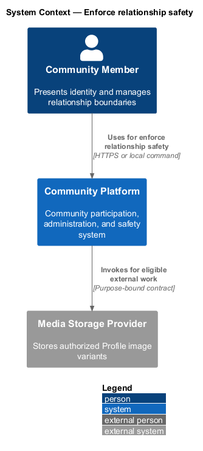
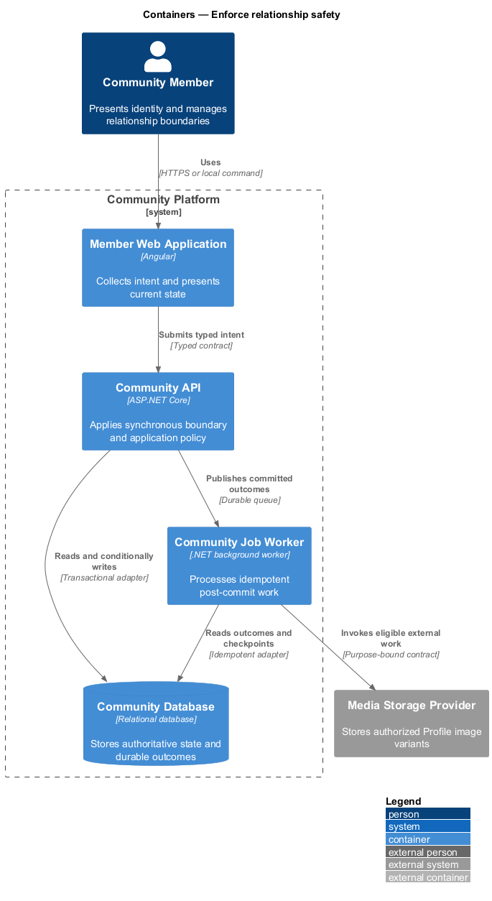
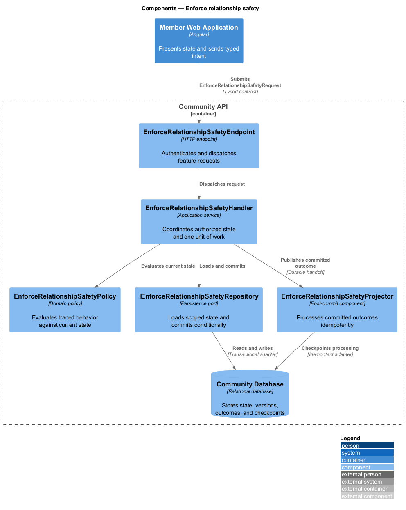
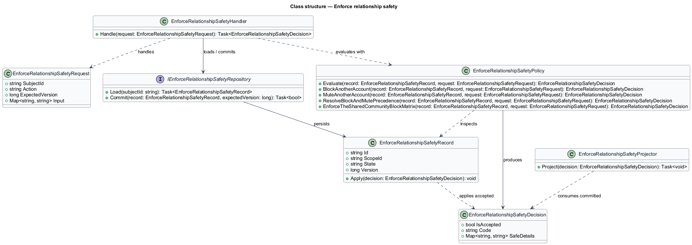
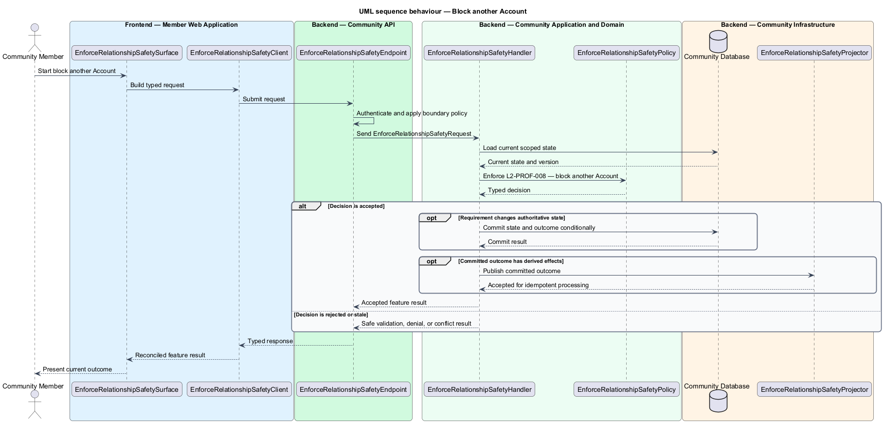
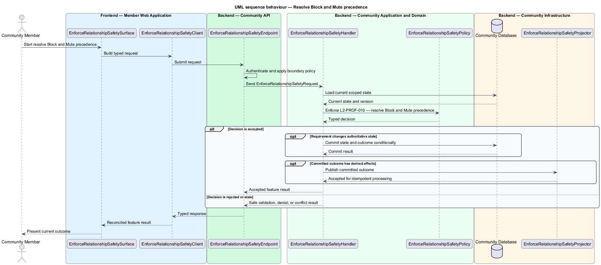
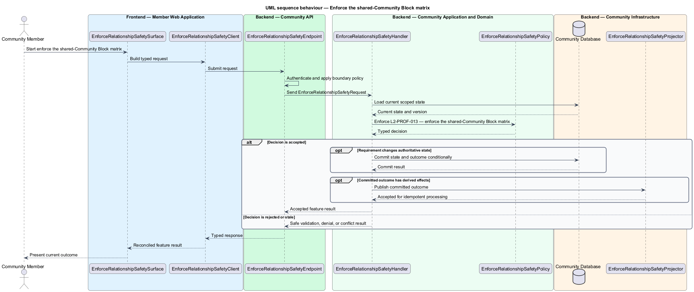

# Enforce relationship safety

## Overview

Community Starter is a community platform divided into product and platform subsystems. The
Profiles and relationships subsystem owns this feature.

*enforce relationship safety* — subsystem capability that covers block another Account, mute another Account, resolve Block and Mute precedence, and enforce the shared-Community Block matrix

Each Account has one canonical Profile for human-facing identity. Block and Mute provide distinct safety and attention controls. Community context may add Membership information, but it never creates a second identity model or bypasses server-owned visibility and Community-isolation rules. The platform shall give an Account immediate, server-enforced Block and Mute controls with clear precedence over Feed, Search result, engagement, and interaction behavior.

The feature groups 4 traced behaviors behind one policy and evidence
boundary: `L2-PROF-008`, `L2-PROF-009`, `L2-PROF-010`, and `L2-PROF-013`. Authoritative state commits before projections, delivery, or external work reports
success.

## Description

The repository contains specifications but no application implementation. This greenfield slice
defines the following building blocks across `Member Web Application`, `Community API`, the
application and domain layer, and infrastructure.

- **`EnforceRelationshipSafetySurface`** — page component in `Member Web Application`. It presents current
  state, submits user intent, and reconciles the typed result.
- **`EnforceRelationshipSafetyClient`** — typed Angular client. It creates `EnforceRelationshipSafetyRequest` values and maps stable
  transport failures into feature results.
- **`EnforceRelationshipSafetyEndpoint`** — HTTP endpoint in `Community API`. It authenticates the
  caller, applies boundary policy, and dispatches the request.
- **`EnforceRelationshipSafetyRequest`** — immutable request carrying `SubjectId`, `Action`, `ExpectedVersion`, and the
  scoped input needed by one traced behavior.
- **`EnforceRelationshipSafetyHandler`** — application service that loads authorized state through
  `IEnforceRelationshipSafetyRepository`, invokes `EnforceRelationshipSafetyPolicy`, and commits an accepted transition.
- **`EnforceRelationshipSafetyPolicy`** — domain policy that evaluates current state and returns a typed
  `EnforceRelationshipSafetyDecision` without performing external work.
- **`EnforceRelationshipSafetyRecord`** — authoritative record containing the feature state, scope, and concurrency
  version.
- **`IEnforceRelationshipSafetyRepository`** — persistence port that loads scoped state and commits one conditional
  unit of work.
- **`EnforceRelationshipSafetyProjector`** — idempotent post-commit component in `Community Job Worker`. It updates
  eligible projections and invokes configured external providers.

`EnforceRelationshipSafetyPolicy` exposes one named operation for each traced behavior:

- **`EnforceRelationshipSafetyPolicy.BlockAnotherAccount(record, request)`** — evaluates `L2-PROF-008` (block another Account) and returns a typed decision before any state change.
- **`EnforceRelationshipSafetyPolicy.MuteAnotherAccount(record, request)`** — evaluates `L2-PROF-009` (mute another Account) and returns a typed decision before any state change.
- **`EnforceRelationshipSafetyPolicy.ResolveBlockAndMutePrecedence(record, request)`** — evaluates `L2-PROF-010` (resolve Block and Mute precedence) and returns a typed decision before any state change.
- **`EnforceRelationshipSafetyPolicy.EnforceTheSharedCommunityBlockMatrix(record, request)`** — evaluates `L2-PROF-013` (enforce the shared-Community Block matrix) and returns a typed decision before any state change.

## Requirements

The feature realizes the following level-2 (L2) requirements. Each row preserves the specification
identifier, its level-1 (L1) parent, and the requirement statement verbatim.

| L2 ID | Refines (L1) | Requirement |
|-------|--------------|-------------|
| `L2-PROF-008` | `L1-PROF-003` | Block is a private Account safety control that immediately prevents direct relationship and interaction paths in both directions, independent of shared Community Membership. |
| `L2-PROF-009` | `L1-PROF-003` | Mute privately suppresses eligible content and notifications from another Account for the muting Account without changing Membership, Permission, or the muted Account's access. |
| `L2-PROF-010` | `L1-PROF-003` | The server applies one consistent relationship precedence: Block safety restrictions override Mute presentation, while Community Role and Permission remain separately enforced. |
| `L2-PROF-013` | `L1-PROF-003` | The baseline Block policy is bilateral for the blocked pair and suppresses their ordinary discovery, authored content, attribution, engagement, direct interaction, and personal delivery paths while leaving Community Membership and third-party access unchanged. |

## Diagrams

### System context

The `Community Member` uses `Community Platform` for the feature. The system invokes
`Media Storage Provider` only for configured external work after authoritative decisions.

### Containers

`Member Web Application` collects intent, `Community API` applies the synchronous boundary,
and `Community Database` holds authoritative state. `Community Job Worker` handles eligible
post-commit work against `Media Storage Provider`.

### Components

Inside `Community API`, `EnforceRelationshipSafetyEndpoint` dispatches `EnforceRelationshipSafetyHandler`. The handler evaluates
`EnforceRelationshipSafetyPolicy`, persists through `IEnforceRelationshipSafetyRepository`, and hands committed outcomes to
`EnforceRelationshipSafetyProjector`.

### Class structure

`EnforceRelationshipSafetyHandler` depends on the immutable request, domain policy, and repository port.
`EnforceRelationshipSafetyRecord` owns versioned state, while `EnforceRelationshipSafetyProjector` consumes committed results.

### Behaviour — block another Account

The interaction loads current scoped state before `EnforceRelationshipSafetyPolicy` enforces
`L2-PROF-008`. Rejected decisions return without changing authoritative state; accepted
state changes commit before optional derived work starts.

### Behaviour — mute another Account

The interaction loads current scoped state before `EnforceRelationshipSafetyPolicy` enforces
`L2-PROF-009`. Rejected decisions return without changing authoritative state; accepted
state changes commit before optional derived work starts.

### Behaviour — resolve Block and Mute precedence

The interaction loads current scoped state before `EnforceRelationshipSafetyPolicy` enforces
`L2-PROF-010`. Rejected decisions return without changing authoritative state; accepted
state changes commit before optional derived work starts.

### Behaviour — enforce the shared-Community Block matrix

The interaction loads current scoped state before `EnforceRelationshipSafetyPolicy` enforces
`L2-PROF-013`. Rejected decisions return without changing authoritative state; accepted
state changes commit before optional derived work starts.

