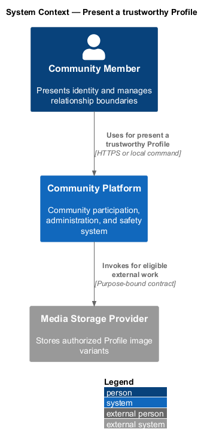
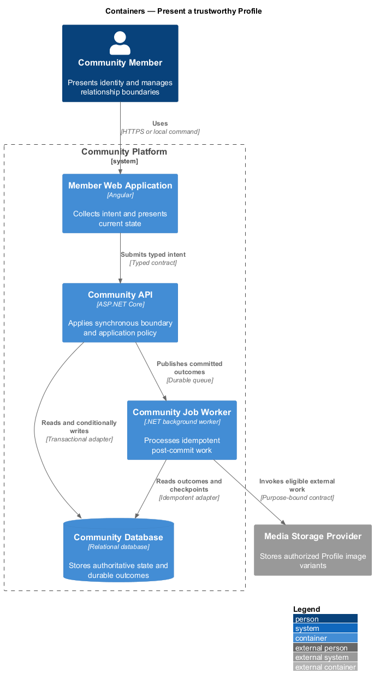
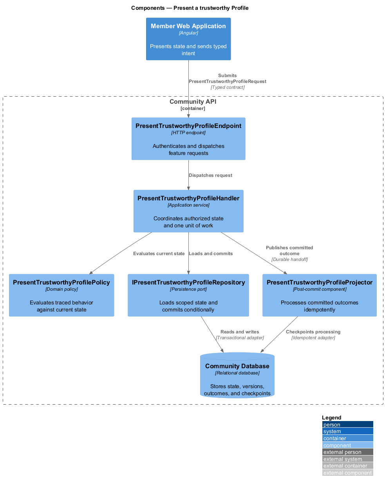
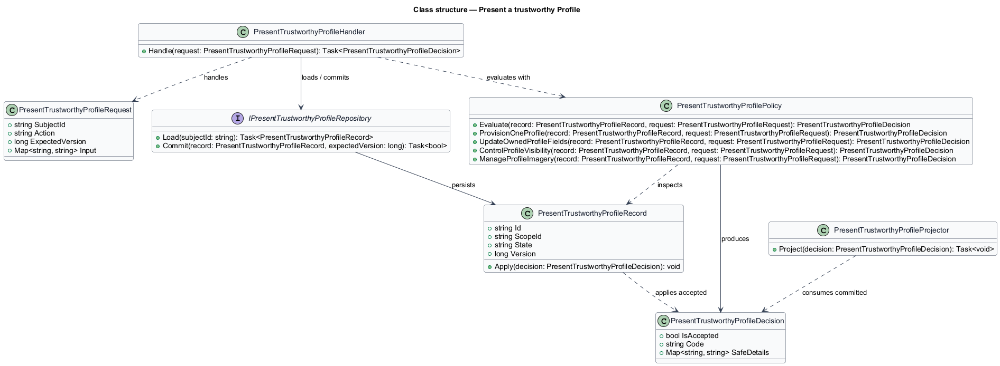
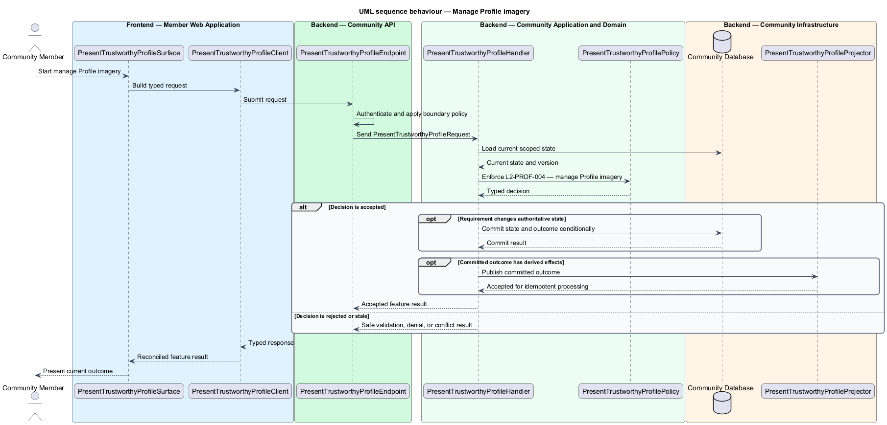

# Present a trustworthy Profile

## Overview

Community Starter is a community platform divided into product and platform subsystems. The
Profiles and relationships subsystem owns this feature.

*present a trustworthy Profile* — subsystem capability that covers provision one Profile, update owned Profile fields, control Profile visibility, and manage Profile imagery

Each Account has one canonical Profile for human-facing identity. Block and Mute provide distinct safety and attention controls. Community context may add Membership information, but it never creates a second identity model or bypasses server-owned visibility and Community-isolation rules. The platform shall provision, update, render, and protect Profile fields and imagery with explicit ownership, validation, visibility, and lifecycle behavior.

The feature groups 4 traced behaviors behind one policy and evidence
boundary: `L2-PROF-001`, `L2-PROF-002`, `L2-PROF-003`, and `L2-PROF-004`. Authoritative state commits before projections, delivery, or external work reports
success.

## Description

The repository contains specifications but no application implementation. This greenfield slice
defines the following building blocks across `Member Web Application`, `Community API`, the
application and domain layer, and infrastructure.

- **`PresentTrustworthyProfileSurface`** — page component in `Member Web Application`. It presents current
  state, submits user intent, and reconciles the typed result.
- **`PresentTrustworthyProfileClient`** — typed Angular client. It creates `PresentTrustworthyProfileRequest` values and maps stable
  transport failures into feature results.
- **`PresentTrustworthyProfileEndpoint`** — HTTP endpoint in `Community API`. It authenticates the
  caller, applies boundary policy, and dispatches the request.
- **`PresentTrustworthyProfileRequest`** — immutable request carrying `SubjectId`, `Action`, `ExpectedVersion`, and the
  scoped input needed by one traced behavior.
- **`PresentTrustworthyProfileHandler`** — application service that loads authorized state through
  `IPresentTrustworthyProfileRepository`, invokes `PresentTrustworthyProfilePolicy`, and commits an accepted transition.
- **`PresentTrustworthyProfilePolicy`** — domain policy that evaluates current state and returns a typed
  `PresentTrustworthyProfileDecision` without performing external work.
- **`PresentTrustworthyProfileRecord`** — authoritative record containing the feature state, scope, and concurrency
  version.
- **`IPresentTrustworthyProfileRepository`** — persistence port that loads scoped state and commits one conditional
  unit of work.
- **`PresentTrustworthyProfileProjector`** — idempotent post-commit component in `Community Job Worker`. It updates
  eligible projections and invokes configured external providers.

`PresentTrustworthyProfilePolicy` exposes one named operation for each traced behavior:

- **`PresentTrustworthyProfilePolicy.ProvisionOneProfile(record, request)`** — evaluates `L2-PROF-001` (provision one Profile) and returns a typed decision before any state change.
- **`PresentTrustworthyProfilePolicy.UpdateOwnedProfileFields(record, request)`** — evaluates `L2-PROF-002` (update owned Profile fields) and returns a typed decision before any state change.
- **`PresentTrustworthyProfilePolicy.ControlProfileVisibility(record, request)`** — evaluates `L2-PROF-003` (control Profile visibility) and returns a typed decision before any state change.
- **`PresentTrustworthyProfilePolicy.ManageProfileImagery(record, request)`** — evaluates `L2-PROF-004` (manage Profile imagery) and returns a typed decision before any state change.

## Requirements

The feature realizes the following level-2 (L2) requirements. Each row preserves the specification
identifier, its level-1 (L1) parent, and the requirement statement verbatim.

| L2 ID | Refines (L1) | Requirement |
|-------|--------------|-------------|
| `L2-PROF-001` | `L1-PROF-001` | Each eligible Account owns exactly one canonical Profile with a stable identifier and safe defaults; Community Memberships reference that Profile rather than duplicating personal identity. |
| `L2-PROF-002` | `L1-PROF-001` | An Account can update only its owned Profile through bounded, normalized fields and optimistic concurrency, with server-side validation and sanitization. |
| `L2-PROF-003` | `L1-PROF-001` | Profile visibility is server-filtered by field and audience using the owner's current policy, relationship safety, and Community access; hidden fields are omitted rather than client-masked. |
| `L2-PROF-004` | `L1-PROF-001` | An Account can attach or remove an approved Profile image through the same validated Attachment lifecycle used by the platform, with a deterministic accessible fallback. |

## Diagrams

### System context

The `Community Member` uses `Community Platform` for the feature. The system invokes
`Media Storage Provider` only for configured external work after authoritative decisions.

### Containers

`Member Web Application` collects intent, `Community API` applies the synchronous boundary,
and `Community Database` holds authoritative state. `Community Job Worker` handles eligible
post-commit work against `Media Storage Provider`.

### Components

Inside `Community API`, `PresentTrustworthyProfileEndpoint` dispatches `PresentTrustworthyProfileHandler`. The handler evaluates
`PresentTrustworthyProfilePolicy`, persists through `IPresentTrustworthyProfileRepository`, and hands committed outcomes to
`PresentTrustworthyProfileProjector`.

### Class structure

`PresentTrustworthyProfileHandler` depends on the immutable request, domain policy, and repository port.
`PresentTrustworthyProfileRecord` owns versioned state, while `PresentTrustworthyProfileProjector` consumes committed results.

### Behaviour — provision one Profile

The interaction loads current scoped state before `PresentTrustworthyProfilePolicy` enforces
`L2-PROF-001`. Rejected decisions return without changing authoritative state; accepted
state changes commit before optional derived work starts.

### Behaviour — update owned Profile fields

The interaction loads current scoped state before `PresentTrustworthyProfilePolicy` enforces
`L2-PROF-002`. Rejected decisions return without changing authoritative state; accepted
state changes commit before optional derived work starts.

### Behaviour — control Profile visibility

The interaction loads current scoped state before `PresentTrustworthyProfilePolicy` enforces
`L2-PROF-003`. Rejected decisions return without changing authoritative state; accepted
state changes commit before optional derived work starts.

### Behaviour — manage Profile imagery

The interaction loads current scoped state before `PresentTrustworthyProfilePolicy` enforces
`L2-PROF-004`. Rejected decisions return without changing authoritative state; accepted
state changes commit before optional derived work starts.

