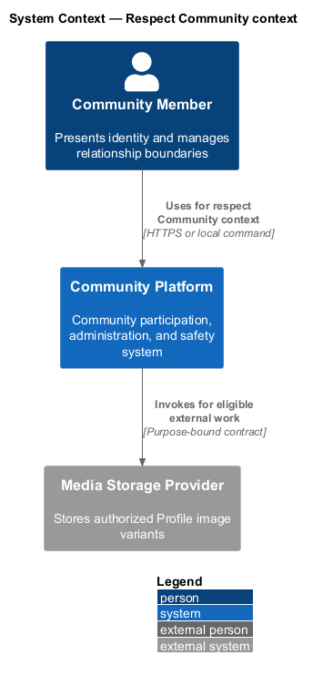
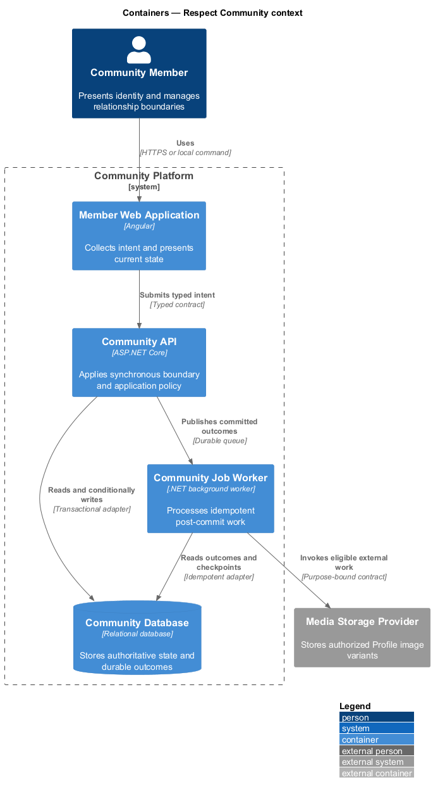
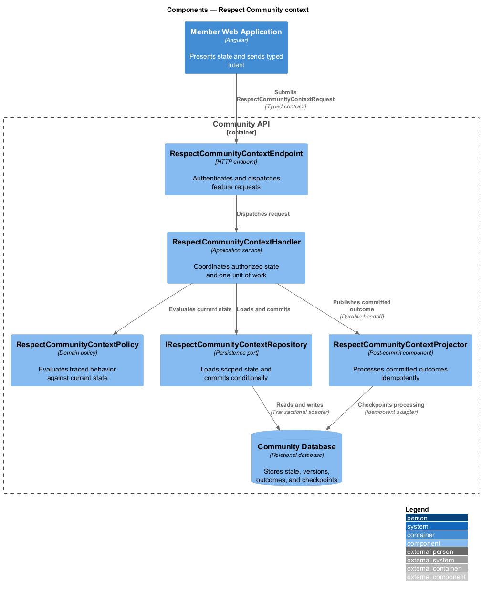
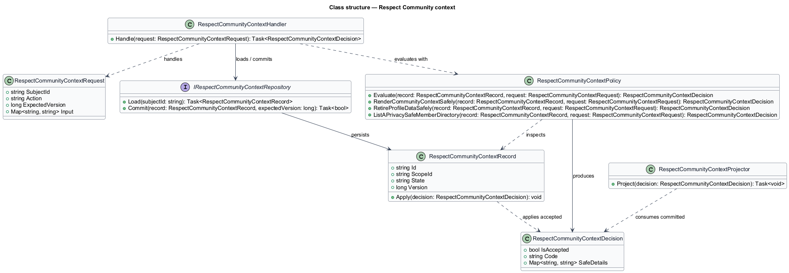
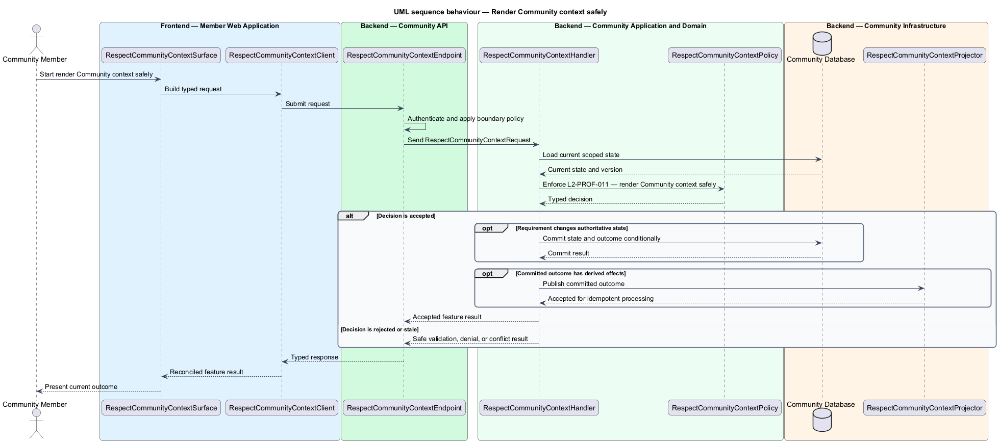
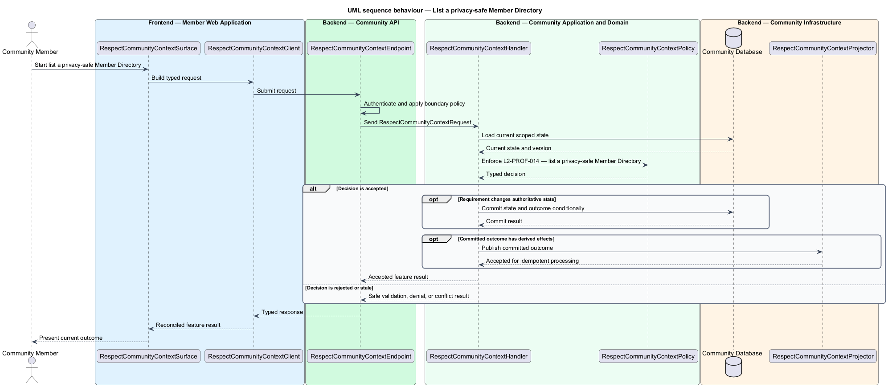

# Respect Community context

## Overview

Community Starter is a community platform divided into product and platform subsystems. The
Profiles and relationships subsystem owns this feature.

*respect Community context* — subsystem capability that covers render Community context safely, retire Profile data safely, and list a privacy-safe Member Directory

Each Account has one canonical Profile for human-facing identity. Block and Mute provide distinct safety and attention controls. Community context may add Membership information, but it never creates a second identity model or bypasses server-owned visibility and Community-isolation rules. The platform shall reveal Profile and relationship information only within authorized Account and Community contexts and handle Account deactivation or deletion without corrupting authored or relationship records.

The feature groups 3 traced behaviors behind one policy and evidence
boundary: `L2-PROF-011`, `L2-PROF-012`, and `L2-PROF-014`. Authoritative state commits before projections, delivery, or external work reports
success.

## Description

The repository contains specifications but no application implementation. This greenfield slice
defines the following building blocks across `Member Web Application`, `Community API`, the
application and domain layer, and infrastructure.

- **`RespectCommunityContextSurface`** — page component in `Member Web Application`. It presents current
  state, submits user intent, and reconciles the typed result.
- **`RespectCommunityContextClient`** — typed Angular client. It creates `RespectCommunityContextRequest` values and maps stable
  transport failures into feature results.
- **`RespectCommunityContextEndpoint`** — HTTP endpoint in `Community API`. It authenticates the
  caller, applies boundary policy, and dispatches the request.
- **`RespectCommunityContextRequest`** — immutable request carrying `SubjectId`, `Action`, `ExpectedVersion`, and the
  scoped input needed by one traced behavior.
- **`RespectCommunityContextHandler`** — application service that loads authorized state through
  `IRespectCommunityContextRepository`, invokes `RespectCommunityContextPolicy`, and commits an accepted transition.
- **`RespectCommunityContextPolicy`** — domain policy that evaluates current state and returns a typed
  `RespectCommunityContextDecision` without performing external work.
- **`RespectCommunityContextRecord`** — authoritative record containing the feature state, scope, and concurrency
  version.
- **`IRespectCommunityContextRepository`** — persistence port that loads scoped state and commits one conditional
  unit of work.
- **`RespectCommunityContextProjector`** — idempotent post-commit component in `Community Job Worker`. It updates
  eligible projections and invokes configured external providers.

`RespectCommunityContextPolicy` exposes one named operation for each traced behavior:

- **`RespectCommunityContextPolicy.RenderCommunityContextSafely(record, request)`** — evaluates `L2-PROF-011` (render Community context safely) and returns a typed decision before any state change.
- **`RespectCommunityContextPolicy.RetireProfileDataSafely(record, request)`** — evaluates `L2-PROF-012` (retire Profile data safely) and returns a typed decision before any state change.
- **`RespectCommunityContextPolicy.ListAPrivacySafeMemberDirectory(record, request)`** — evaluates `L2-PROF-014` (list a privacy-safe Member Directory) and returns a typed decision before any state change.

## Requirements

The feature realizes the following level-2 (L2) requirements. Each row preserves the specification
identifier, its level-1 (L1) parent, and the requirement statement verbatim.

| L2 ID | Refines (L1) | Requirement |
|-------|--------------|-------------|
| `L2-PROF-011` | `L1-PROF-004` | A Profile shown in Community context combines only authorized canonical Profile fields with safe current Membership and Role information from that same Community. |
| `L2-PROF-012` | `L1-PROF-004` | When an Account deactivates, its Profile enters the reversible privacy state; when deletion completes, Profile and relationship data are removed, de-identified, or narrowly retained according to policy without deleting Community records outside that policy. |
| `L2-PROF-014` | `L1-PROF-004` | Each Community may expose a Member Directory whose rows combine only current eligible Membership context and permitted Profile fields under explicit viewer, subject, Block, and lifecycle policy. |

## Diagrams

### System context

The `Community Member` uses `Community Platform` for the feature. The system invokes
`Media Storage Provider` only for configured external work after authoritative decisions.

### Containers

`Member Web Application` collects intent, `Community API` applies the synchronous boundary,
and `Community Database` holds authoritative state. `Community Job Worker` handles eligible
post-commit work against `Media Storage Provider`.

### Components

Inside `Community API`, `RespectCommunityContextEndpoint` dispatches `RespectCommunityContextHandler`. The handler evaluates
`RespectCommunityContextPolicy`, persists through `IRespectCommunityContextRepository`, and hands committed outcomes to
`RespectCommunityContextProjector`.

### Class structure

`RespectCommunityContextHandler` depends on the immutable request, domain policy, and repository port.
`RespectCommunityContextRecord` owns versioned state, while `RespectCommunityContextProjector` consumes committed results.

### Behaviour — render Community context safely

The interaction loads current scoped state before `RespectCommunityContextPolicy` enforces
`L2-PROF-011`. Rejected decisions return without changing authoritative state; accepted
state changes commit before optional derived work starts.

### Behaviour — retire Profile data safely

The interaction loads current scoped state before `RespectCommunityContextPolicy` enforces
`L2-PROF-012`. Rejected decisions return without changing authoritative state; accepted
state changes commit before optional derived work starts.

### Behaviour — list a privacy-safe Member Directory

The interaction loads current scoped state before `RespectCommunityContextPolicy` enforces
`L2-PROF-014`. Rejected decisions return without changing authoritative state; accepted
state changes commit before optional derived work starts.

