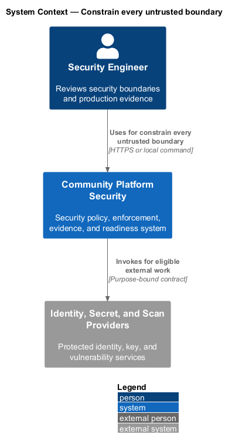
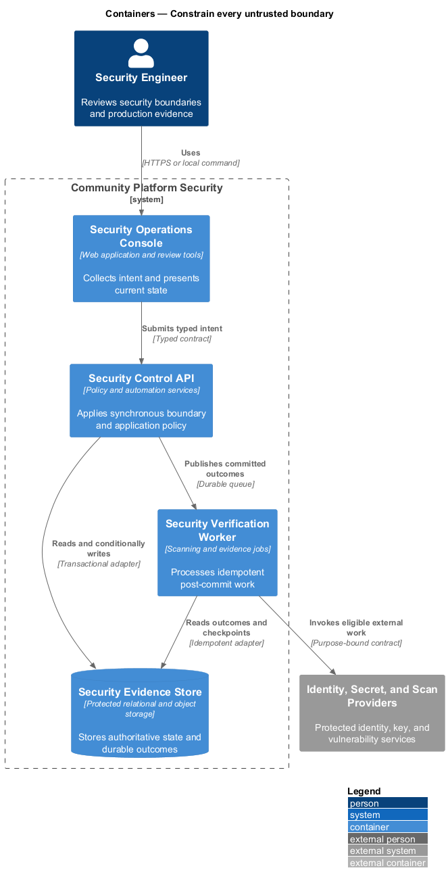
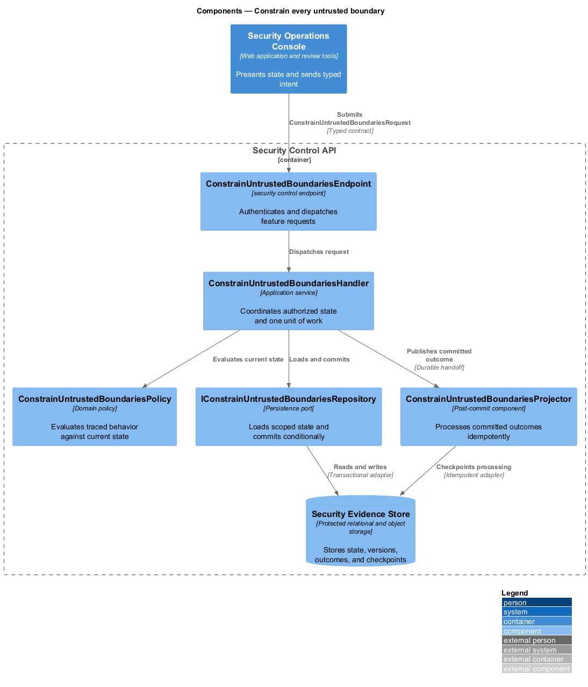
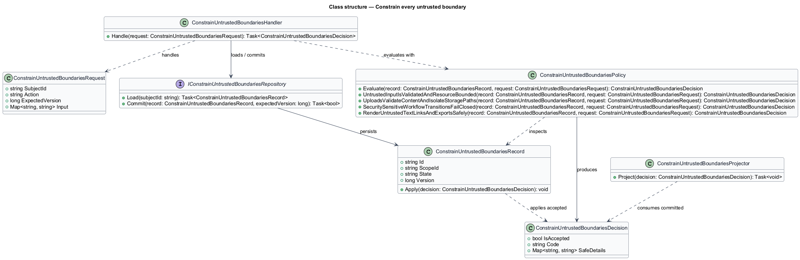
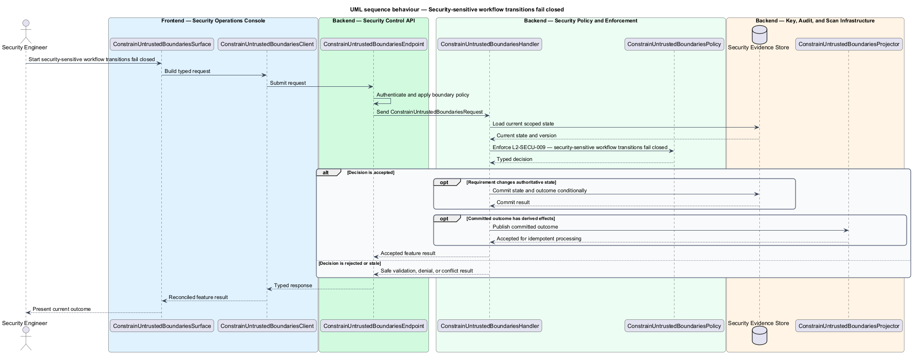
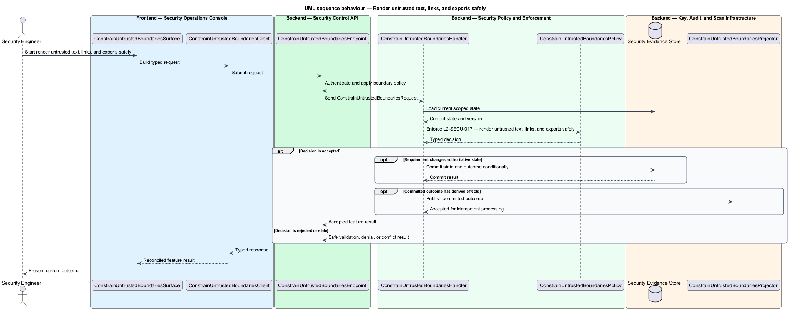

# Constrain every untrusted boundary

## Overview

Community Starter is a community platform divided into product and platform subsystems. The
Security and privacy baseline subsystem owns this feature.

*constrain every untrusted boundary* — subsystem capability that covers untrusted input is validated and resource-bounded, uploads validate content and isolate storage paths, security-sensitive workflow transitions fail closed, and render untrusted text, links, and exports safely

The starter will hold identities and data across multiple isolated Communities, including Memberships, content, moderation records, invitations, uploads, and activity data. Its baseline shall prevent client-side trust, cross-Community access, secret leakage, unsafe public input, and insecure delivery shortcuts while making unresolved production risk explicit. HTTP input, uploads, invitations, share links, external callbacks, and destructive operations shall be validated and bounded at ingress, then rechecked at the authoritative policy layer.

The feature groups 4 traced behaviors behind one policy and evidence
boundary: `L2-SECU-007`, `L2-SECU-008`, `L2-SECU-009`, and `L2-SECU-017`. Authoritative state commits before projections, delivery, or external work reports
success.

## Description

The repository contains specifications but no application implementation. This greenfield slice
defines the following building blocks across `Security Operations Console`, `Security Control API`, the
application and domain layer, and infrastructure.

- **`ConstrainUntrustedBoundariesSurface`** — security review surface in `Security Operations Console`. It presents current
  state, submits user intent, and reconciles the typed result.
- **`ConstrainUntrustedBoundariesClient`** — typed security adapter. It creates `ConstrainUntrustedBoundariesRequest` values and maps stable
  transport failures into feature results.
- **`ConstrainUntrustedBoundariesEndpoint`** — security control endpoint in `Security Control API`. It authenticates the
  caller, applies boundary policy, and dispatches the request.
- **`ConstrainUntrustedBoundariesRequest`** — immutable request carrying `SubjectId`, `Action`, `ExpectedVersion`, and the
  scoped input needed by one traced behavior.
- **`ConstrainUntrustedBoundariesHandler`** — application service that loads authorized state through
  `IConstrainUntrustedBoundariesRepository`, invokes `ConstrainUntrustedBoundariesPolicy`, and commits an accepted transition.
- **`ConstrainUntrustedBoundariesPolicy`** — domain policy that evaluates current state and returns a typed
  `ConstrainUntrustedBoundariesDecision` without performing external work.
- **`ConstrainUntrustedBoundariesRecord`** — authoritative record containing the feature state, scope, and concurrency
  version.
- **`IConstrainUntrustedBoundariesRepository`** — persistence port that loads scoped state and commits one conditional
  unit of work.
- **`ConstrainUntrustedBoundariesProjector`** — idempotent post-commit component in `Security Verification Worker`. It updates
  eligible projections and invokes configured external providers.

`ConstrainUntrustedBoundariesPolicy` exposes one named operation for each traced behavior:

- **`ConstrainUntrustedBoundariesPolicy.UntrustedInputIsValidatedAndResourceBounded(record, request)`** — evaluates `L2-SECU-007` (untrusted input is validated and resource-bounded) and returns a typed decision before any state change.
- **`ConstrainUntrustedBoundariesPolicy.UploadsValidateContentAndIsolateStoragePaths(record, request)`** — evaluates `L2-SECU-008` (uploads validate content and isolate storage paths) and returns a typed decision before any state change.
- **`ConstrainUntrustedBoundariesPolicy.SecuritySensitiveWorkflowTransitionsFailClosed(record, request)`** — evaluates `L2-SECU-009` (security-sensitive workflow transitions fail closed) and returns a typed decision before any state change.
- **`ConstrainUntrustedBoundariesPolicy.RenderUntrustedTextLinksAndExportsSafely(record, request)`** — evaluates `L2-SECU-017` (render untrusted text, links, and exports safely) and returns a typed decision before any state change.

## Requirements

The feature realizes the following level-2 (L2) requirements. Each row preserves the specification
identifier, its level-1 (L1) parent, and the requirement statement verbatim.

| L2 ID | Refines (L1) | Requirement |
|-------|--------------|-------------|
| `L2-SECU-007` | `L1-SECU-003` | Every untrusted HTTP, hub, form, provider-feedback, and external-service boundary shall validate shape, type, identifiers, lengths, counts, and applicable product constraints. Critical rules shall be repeated at the authoritative domain or application layer. Payload size, concurrency, execution time, retries, and external work shall be bounded according to risk, and cancellation shall propagate. The server shall not trust duplicated body identifiers over authoritative route identifiers. |
| `L2-SECU-008` | `L1-SECU-003` | Every upload shall validate allowed content type, extension, size, filename, and storage path on the server; client-provided MIME and names shall be untrusted. Storage access shall remain behind an Application boundary, derive Community ownership server-side, prevent path traversal and executable placement, and return only stable identifiers or safe delivery URLs according to the threat model. |
| `L2-SECU-009` | `L1-SECU-003` | Invitation and share-link use, Role changes, Moderation Actions, provider feedback, Account deactivation or deletion, Space archival, and irreversible erasure shall authenticate or validate the caller as applicable, establish current Community scope, enforce authoritative state and anti-abuse controls identified by threat modeling, persist atomically, and emit success only after commit. Unknown, expired, replayed, stale, unauthorized, or malformed attempts shall fail without partial state. |
| `L2-SECU-017` | `L1-SECU-003` | Every Account-authored, provider-supplied, support, administrator, and moderation field is plain text by default or passes one centralized allow-list sanitizer for its explicitly declared markup subset. Output uses contextual encoding for HTML text/attributes, URLs, JSON, email, privacy-export files, logs, and other sinks. This applies to Messages, Events and locations, Reports, internal notes, reasons, Appeal grounds, Profiles, names, labels, and any future rich-text field, not only Posts and Comments. |

## Diagrams

### System context

The `Security Engineer` uses `Community Platform Security` for the feature. The system invokes
`Identity, Secret, and Scan Providers` only for configured external work after authoritative decisions.

### Containers

`Security Operations Console` collects intent, `Security Control API` applies the synchronous boundary,
and `Security Evidence Store` holds authoritative state. `Security Verification Worker` handles eligible
post-commit work against `Identity, Secret, and Scan Providers`.

### Components

Inside `Security Control API`, `ConstrainUntrustedBoundariesEndpoint` dispatches `ConstrainUntrustedBoundariesHandler`. The handler evaluates
`ConstrainUntrustedBoundariesPolicy`, persists through `IConstrainUntrustedBoundariesRepository`, and hands committed outcomes to
`ConstrainUntrustedBoundariesProjector`.

### Class structure

`ConstrainUntrustedBoundariesHandler` depends on the immutable request, domain policy, and repository port.
`ConstrainUntrustedBoundariesRecord` owns versioned state, while `ConstrainUntrustedBoundariesProjector` consumes committed results.

### Behaviour — untrusted input is validated and resource-bounded

The interaction loads current scoped state before `ConstrainUntrustedBoundariesPolicy` enforces
`L2-SECU-007`. Rejected decisions return without changing authoritative state; accepted
state changes commit before optional derived work starts.

### Behaviour — uploads validate content and isolate storage paths

The interaction loads current scoped state before `ConstrainUntrustedBoundariesPolicy` enforces
`L2-SECU-008`. Rejected decisions return without changing authoritative state; accepted
state changes commit before optional derived work starts.

### Behaviour — security-sensitive workflow transitions fail closed

The interaction loads current scoped state before `ConstrainUntrustedBoundariesPolicy` enforces
`L2-SECU-009`. Rejected decisions return without changing authoritative state; accepted
state changes commit before optional derived work starts.

### Behaviour — render untrusted text, links, and exports safely

The interaction loads current scoped state before `ConstrainUntrustedBoundariesPolicy` enforces
`L2-SECU-017`. Rejected decisions return without changing authoritative state; accepted
state changes commit before optional derived work starts.

