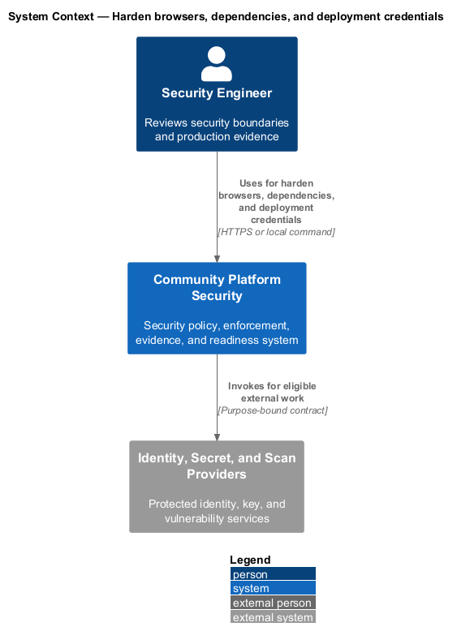
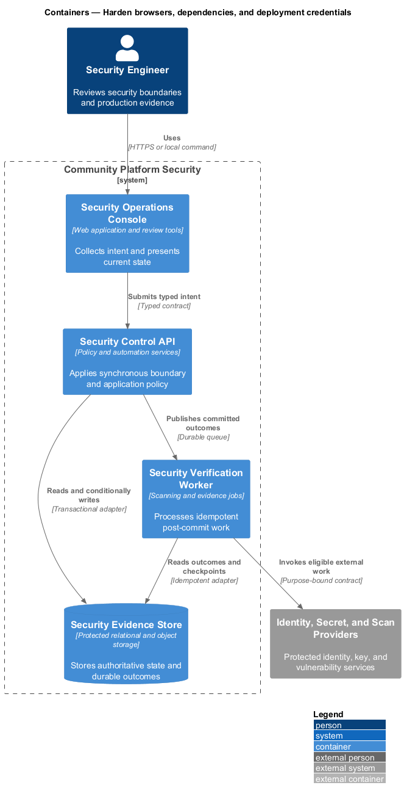
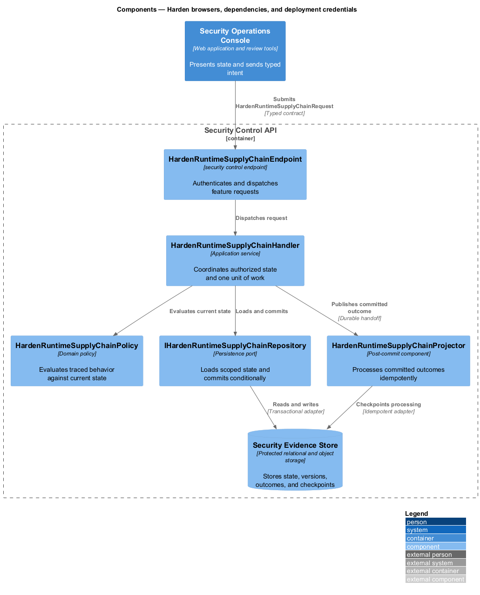
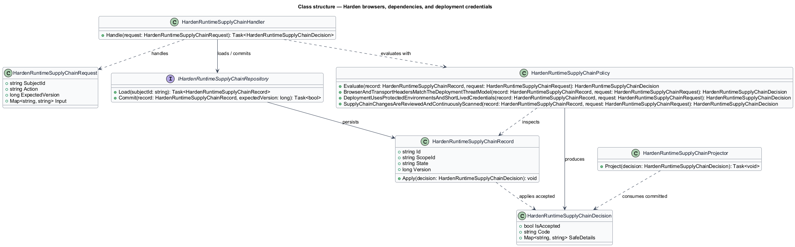
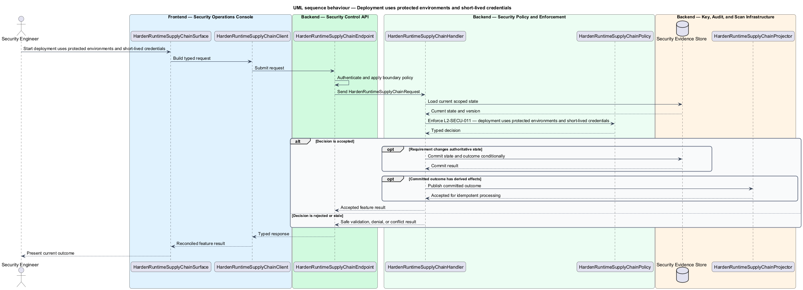
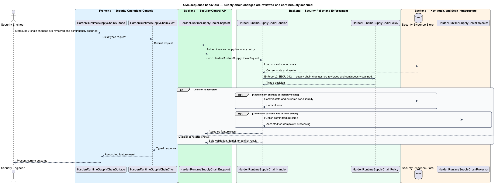

# Harden browsers, dependencies, and deployment credentials

## Overview

Community Starter is a community platform divided into product and platform subsystems. The
Security and privacy baseline subsystem owns this feature.

*harden browsers, dependencies, and deployment credentials* — subsystem capability that covers browser and transport headers match the deployment threat model, deployment uses protected environments and short-lived credentials, and supply-chain changes are reviewed and continuously scanned

The starter will hold identities and data across multiple isolated Communities, including Memberships, content, moderation records, invitations, uploads, and activity data. Its baseline shall prevent client-side trust, cross-Community access, secret leakage, unsafe public input, and insecure delivery shortcuts while making unresolved production risk explicit. Web responses, dependency intake, CI execution, and production deployment shall use defense-in-depth controls and shall not expose persistent credentials to untrusted code.

The feature groups 3 traced behaviors behind one policy and evidence
boundary: `L2-SECU-010`, `L2-SECU-011`, and `L2-SECU-012`. Authoritative state commits before projections, delivery, or external work reports
success.

## Description

The repository contains specifications but no application implementation. This greenfield slice
defines the following building blocks across `Security Operations Console`, `Security Control API`, the
application and domain layer, and infrastructure.

- **`HardenRuntimeSupplyChainSurface`** — security review surface in `Security Operations Console`. It presents current
  state, submits user intent, and reconciles the typed result.
- **`HardenRuntimeSupplyChainClient`** — typed security adapter. It creates `HardenRuntimeSupplyChainRequest` values and maps stable
  transport failures into feature results.
- **`HardenRuntimeSupplyChainEndpoint`** — security control endpoint in `Security Control API`. It authenticates the
  caller, applies boundary policy, and dispatches the request.
- **`HardenRuntimeSupplyChainRequest`** — immutable request carrying `SubjectId`, `Action`, `ExpectedVersion`, and the
  scoped input needed by one traced behavior.
- **`HardenRuntimeSupplyChainHandler`** — application service that loads authorized state through
  `IHardenRuntimeSupplyChainRepository`, invokes `HardenRuntimeSupplyChainPolicy`, and commits an accepted transition.
- **`HardenRuntimeSupplyChainPolicy`** — domain policy that evaluates current state and returns a typed
  `HardenRuntimeSupplyChainDecision` without performing external work.
- **`HardenRuntimeSupplyChainRecord`** — authoritative record containing the feature state, scope, and concurrency
  version.
- **`IHardenRuntimeSupplyChainRepository`** — persistence port that loads scoped state and commits one conditional
  unit of work.
- **`HardenRuntimeSupplyChainProjector`** — idempotent post-commit component in `Security Verification Worker`. It updates
  eligible projections and invokes configured external providers.

`HardenRuntimeSupplyChainPolicy` exposes one named operation for each traced behavior:

- **`HardenRuntimeSupplyChainPolicy.BrowserAndTransportHeadersMatchTheDeploymentThreatModel(record, request)`** — evaluates `L2-SECU-010` (browser and transport headers match the deployment threat model) and returns a typed decision before any state change.
- **`HardenRuntimeSupplyChainPolicy.DeploymentUsesProtectedEnvironmentsAndShortLivedCredentials(record, request)`** — evaluates `L2-SECU-011` (deployment uses protected environments and short-lived credentials) and returns a typed decision before any state change.
- **`HardenRuntimeSupplyChainPolicy.SupplyChainChangesAreReviewedAndContinuouslyScanned(record, request)`** — evaluates `L2-SECU-012` (supply-chain changes are reviewed and continuously scanned) and returns a typed decision before any state change.

## Requirements

The feature realizes the following level-2 (L2) requirements. Each row preserves the specification
identifier, its level-1 (L1) parent, and the requirement statement verbatim.

| L2 ID | Refines (L1) | Requirement |
|-------|--------------|-------------|
| `L2-SECU-010` | `L1-SECU-004` | Production responses shall set Content Security Policy, framing, content-type, referrer, permissions, and transport-security headers appropriate to the deployed public, application, API, and asset surfaces. Cookie-based authentication shall include explicit secure, domain, SameSite, and CSRF analysis and controls. CORS shall be least-privilege and shall not be introduced between marketing and API when marketing has no API requirement. |
| `L2-SECU-011` | `L1-SECU-004` | Production deployment shall occur only from protected branches and environments using OIDC or equivalent short-lived, scoped credentials. Untrusted pull requests shall never receive production secrets or deployment authority. Deployment shall remain conditional when an environment is intentionally absent, and artifact promotion shall use the already-built verified artifact rather than rebuild under more privileged credentials. |
| `L2-SECU-012` | `L1-SECU-004` | SDKs, package managers, dependencies, and lockfiles shall be pinned and committed as applicable. A dependency shall be accepted only for a clear capability after reviewing platform alternatives, maintenance health, license compatibility, security posture, and bundle/runtime cost. CI shall scan dependencies and source for known vulnerabilities and secrets; patches shall be deliberate, and risk or license exceptions shall be documented with owner and expiry/review trigger. |

## Diagrams

### System context

The `Security Engineer` uses `Community Platform Security` for the feature. The system invokes
`Identity, Secret, and Scan Providers` only for configured external work after authoritative decisions.

### Containers

`Security Operations Console` collects intent, `Security Control API` applies the synchronous boundary,
and `Security Evidence Store` holds authoritative state. `Security Verification Worker` handles eligible
post-commit work against `Identity, Secret, and Scan Providers`.

### Components

Inside `Security Control API`, `HardenRuntimeSupplyChainEndpoint` dispatches `HardenRuntimeSupplyChainHandler`. The handler evaluates
`HardenRuntimeSupplyChainPolicy`, persists through `IHardenRuntimeSupplyChainRepository`, and hands committed outcomes to
`HardenRuntimeSupplyChainProjector`.

### Class structure

`HardenRuntimeSupplyChainHandler` depends on the immutable request, domain policy, and repository port.
`HardenRuntimeSupplyChainRecord` owns versioned state, while `HardenRuntimeSupplyChainProjector` consumes committed results.

### Behaviour — browser and transport headers match the deployment threat model

The interaction loads current scoped state before `HardenRuntimeSupplyChainPolicy` enforces
`L2-SECU-010`. Rejected decisions return without changing authoritative state; accepted
state changes commit before optional derived work starts.

### Behaviour — deployment uses protected environments and short-lived credentials

The interaction loads current scoped state before `HardenRuntimeSupplyChainPolicy` enforces
`L2-SECU-011`. Rejected decisions return without changing authoritative state; accepted
state changes commit before optional derived work starts.

### Behaviour — supply-chain changes are reviewed and continuously scanned

The interaction loads current scoped state before `HardenRuntimeSupplyChainPolicy` enforces
`L2-SECU-012`. Rejected decisions return without changing authoritative state; accepted
state changes commit before optional derived work starts.

