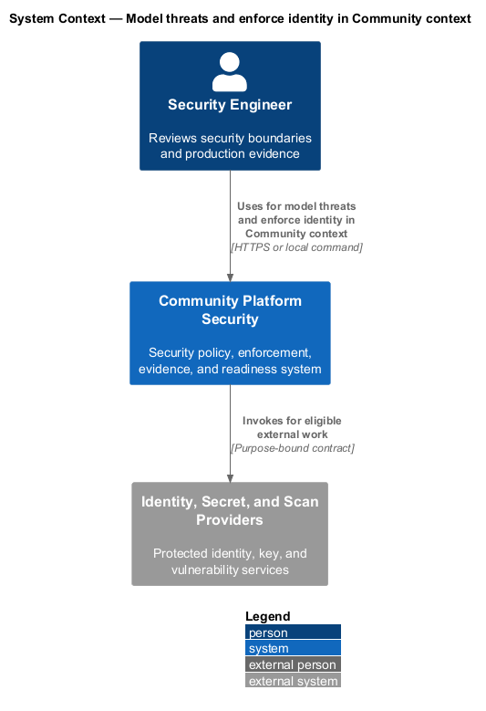
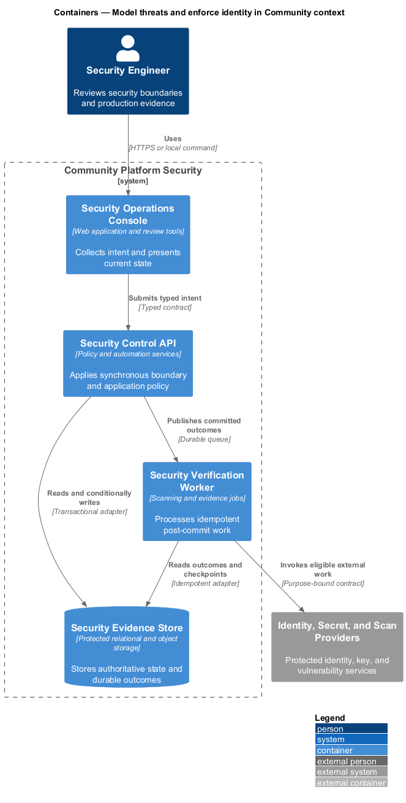
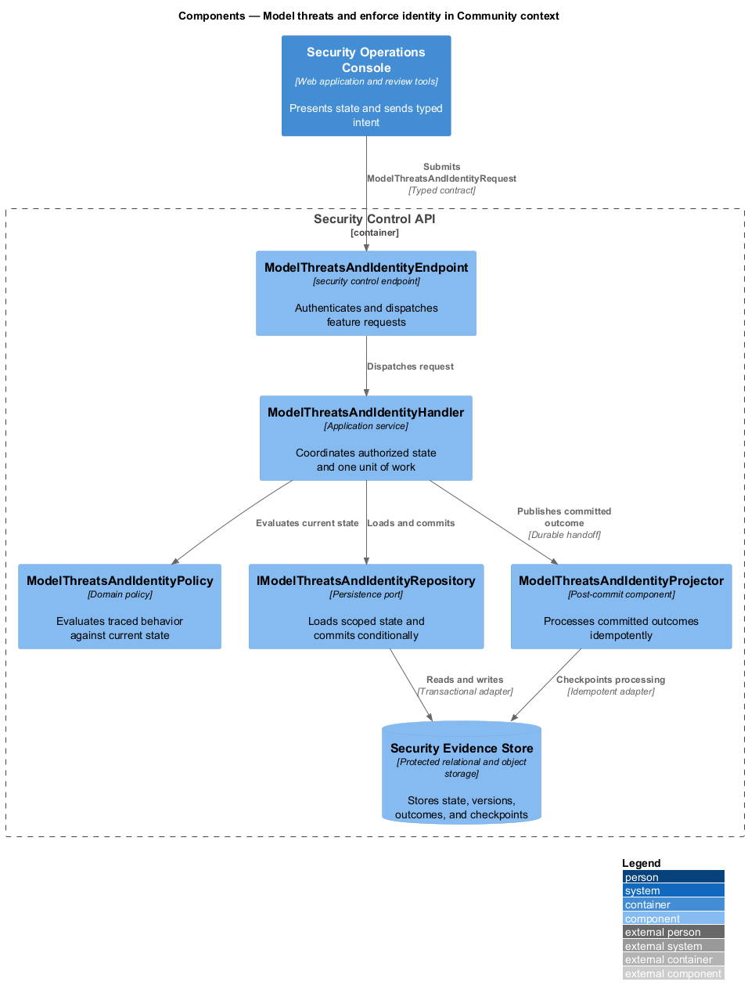
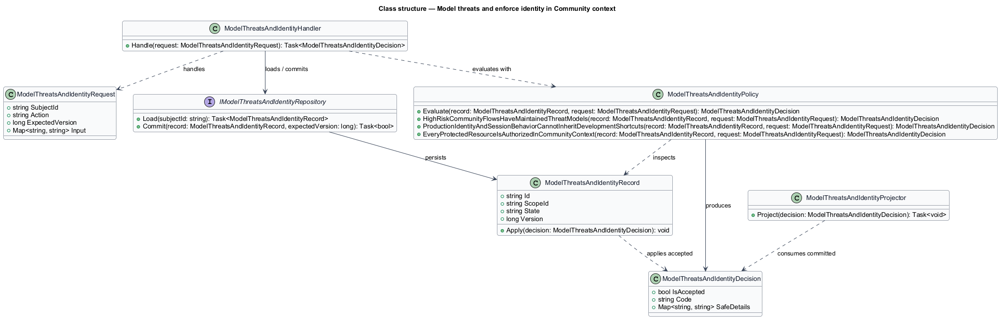
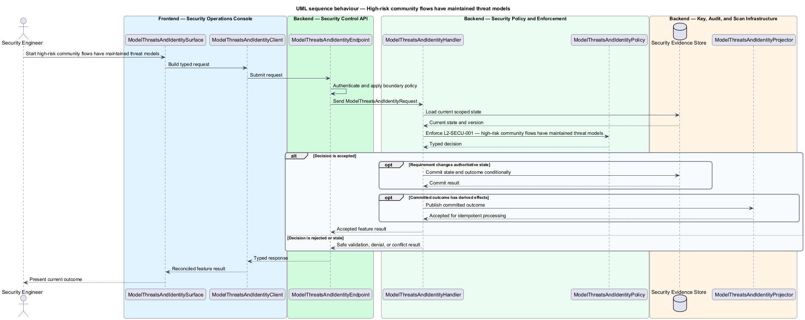
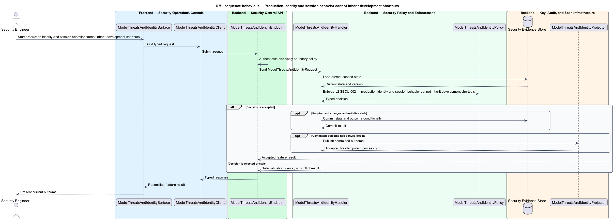

# Model threats and enforce identity in Community context

## Overview

Community Starter is a community platform divided into product and platform subsystems. The
Security and privacy baseline subsystem owns this feature.

*model threats and enforce identity in Community context* — subsystem capability that covers high-risk community flows have maintained threat models, production identity and session behavior cannot inherit development shortcuts, and every protected resource is authorized in Community context

The starter will hold identities and data across multiple isolated Communities, including Memberships, content, moderation records, invitations, uploads, and activity data. Its baseline shall prevent client-side trust, cross-Community access, secret leakage, unsafe public input, and insecure delivery shortcuts while making unresolved production risk explicit. Identity, Session, Community isolation, invitation, sharing, upload, callback, and destructive-action risks shall be documented, with every protected resource authorized by the server in its current Community context.

The feature groups 3 traced behaviors behind one policy and evidence
boundary: `L2-SECU-001`, `L2-SECU-002`, and `L2-SECU-003`. Authoritative state commits before projections, delivery, or external work reports
success.

## Description

The repository contains specifications but no application implementation. This greenfield slice
defines the following building blocks across `Security Operations Console`, `Security Control API`, the
application and domain layer, and infrastructure.

- **`ModelThreatsAndIdentitySurface`** — security review surface in `Security Operations Console`. It presents current
  state, submits user intent, and reconciles the typed result.
- **`ModelThreatsAndIdentityClient`** — typed security adapter. It creates `ModelThreatsAndIdentityRequest` values and maps stable
  transport failures into feature results.
- **`ModelThreatsAndIdentityEndpoint`** — security control endpoint in `Security Control API`. It authenticates the
  caller, applies boundary policy, and dispatches the request.
- **`ModelThreatsAndIdentityRequest`** — immutable request carrying `SubjectId`, `Action`, `ExpectedVersion`, and the
  scoped input needed by one traced behavior.
- **`ModelThreatsAndIdentityHandler`** — application service that loads authorized state through
  `IModelThreatsAndIdentityRepository`, invokes `ModelThreatsAndIdentityPolicy`, and commits an accepted transition.
- **`ModelThreatsAndIdentityPolicy`** — domain policy that evaluates current state and returns a typed
  `ModelThreatsAndIdentityDecision` without performing external work.
- **`ModelThreatsAndIdentityRecord`** — authoritative record containing the feature state, scope, and concurrency
  version.
- **`IModelThreatsAndIdentityRepository`** — persistence port that loads scoped state and commits one conditional
  unit of work.
- **`ModelThreatsAndIdentityProjector`** — idempotent post-commit component in `Security Verification Worker`. It updates
  eligible projections and invokes configured external providers.

`ModelThreatsAndIdentityPolicy` exposes one named operation for each traced behavior:

- **`ModelThreatsAndIdentityPolicy.HighRiskCommunityFlowsHaveMaintainedThreatModels(record, request)`** — evaluates `L2-SECU-001` (high-risk community flows have maintained threat models) and returns a typed decision before any state change.
- **`ModelThreatsAndIdentityPolicy.ProductionIdentityAndSessionBehaviorCannotInheritDevelopmentShortcuts(record, request)`** — evaluates `L2-SECU-002` (production identity and session behavior cannot inherit development shortcuts) and returns a typed decision before any state change.
- **`ModelThreatsAndIdentityPolicy.EveryProtectedResourceIsAuthorizedInCommunityContext(record, request)`** — evaluates `L2-SECU-003` (every protected resource is authorized in Community context) and returns a typed decision before any state change.

## Requirements

The feature realizes the following level-2 (L2) requirements. Each row preserves the specification
identifier, its level-1 (L1) parent, and the requirement statement verbatim.

| L2 ID | Refines (L1) | Requirement |
|-------|--------------|-------------|
| `L2-SECU-001` | `L1-SECU-001` | The starter shall maintain threat models for identity and Session handling, Community isolation, Roles and moderation boundaries, invitations and share links, uploads, direct Messaging, Event locations and access links, purpose-bound support access, Appeals, email-provider feedback, and destructive actions. Each model shall identify assets, actors, trust boundaries, abuse cases, mitigations, residual risk, verification, owner, and a trigger for reassessment. Material architecture or behavior changes shall update the affected model in the same change. |
| `L2-SECU-002` | `L1-SECU-001` | Production shall use an identity and session design selected against the documented threat model. Development-only identity bypasses, seeded credentials, relaxed validation, or placeholder providers shall be visibly labeled, gated to explicit non-production environments, and rejected by production startup validation. Client route guards and hidden controls shall remain navigation affordances, never authentication or authorization controls. |
| `L2-SECU-003` | `L1-SECU-001` | Every server read and mutation over Community-owned data shall establish the current actor and authorized Community scope before accessing the resource. A route, body, query-string, hub, event, or callback Community identifier shall be treated only as input, never proof of access. Authorization, Roles, moderation powers, quotas, and workflow gates shall be evaluated server-side against current state on every action. |

## Diagrams

### System context

The `Security Engineer` uses `Community Platform Security` for the feature. The system invokes
`Identity, Secret, and Scan Providers` only for configured external work after authoritative decisions.

### Containers

`Security Operations Console` collects intent, `Security Control API` applies the synchronous boundary,
and `Security Evidence Store` holds authoritative state. `Security Verification Worker` handles eligible
post-commit work against `Identity, Secret, and Scan Providers`.

### Components

Inside `Security Control API`, `ModelThreatsAndIdentityEndpoint` dispatches `ModelThreatsAndIdentityHandler`. The handler evaluates
`ModelThreatsAndIdentityPolicy`, persists through `IModelThreatsAndIdentityRepository`, and hands committed outcomes to
`ModelThreatsAndIdentityProjector`.

### Class structure

`ModelThreatsAndIdentityHandler` depends on the immutable request, domain policy, and repository port.
`ModelThreatsAndIdentityRecord` owns versioned state, while `ModelThreatsAndIdentityProjector` consumes committed results.

### Behaviour — high-risk community flows have maintained threat models

The interaction loads current scoped state before `ModelThreatsAndIdentityPolicy` enforces
`L2-SECU-001`. Rejected decisions return without changing authoritative state; accepted
state changes commit before optional derived work starts.

### Behaviour — production identity and session behavior cannot inherit development shortcuts

The interaction loads current scoped state before `ModelThreatsAndIdentityPolicy` enforces
`L2-SECU-002`. Rejected decisions return without changing authoritative state; accepted
state changes commit before optional derived work starts.

### Behaviour — every protected resource is authorized in Community context

The interaction loads current scoped state before `ModelThreatsAndIdentityPolicy` enforces
`L2-SECU-003`. Rejected decisions return without changing authoritative state; accepted
state changes commit before optional derived work starts.

