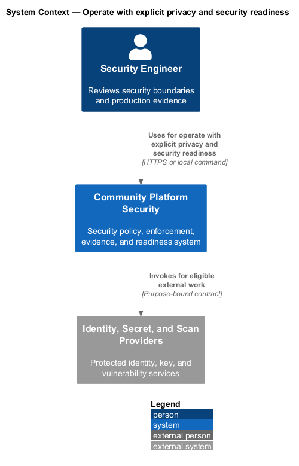
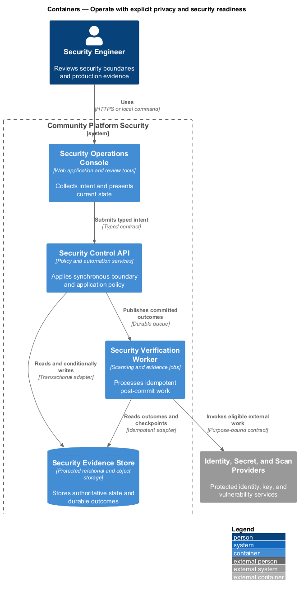
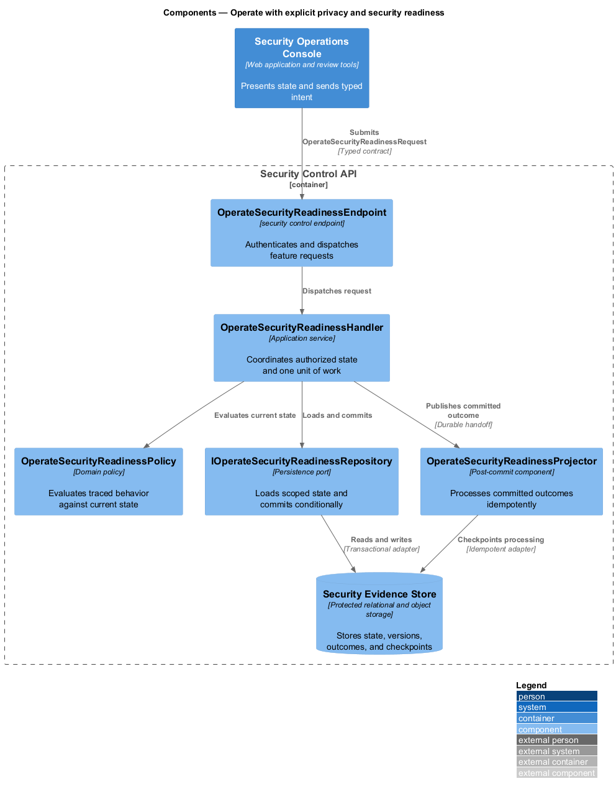
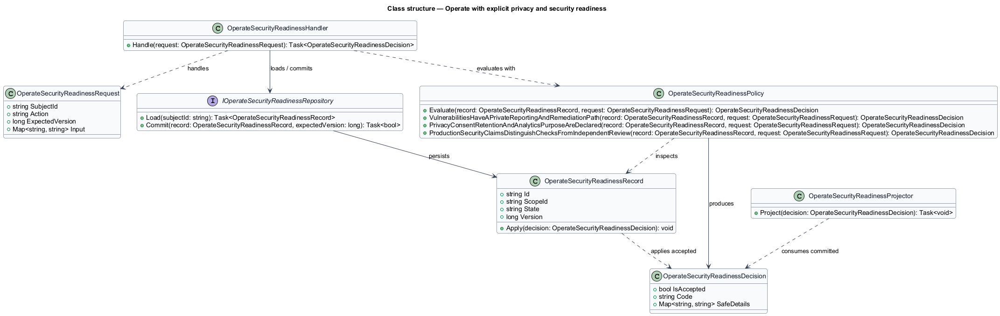
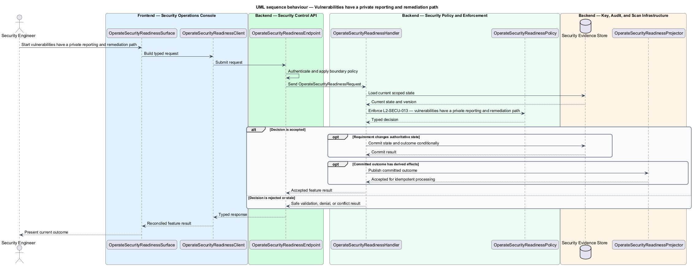
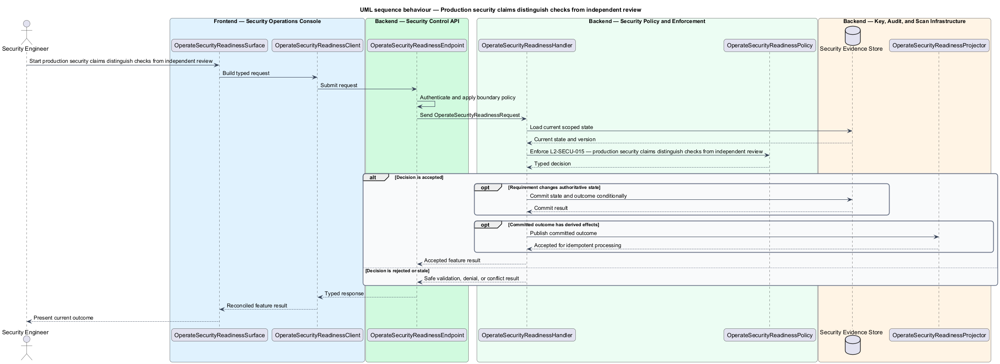

# Operate with explicit privacy and security readiness

## Overview

Community Starter is a community platform divided into product and platform subsystems. The
Security and privacy baseline subsystem owns this feature.

*operate with explicit privacy and security readiness* — subsystem capability that covers vulnerabilities have a private reporting and remediation path, privacy, consent, retention, and analytics purpose are declared, and production security claims distinguish checks from independent review

The starter will hold identities and data across multiple isolated Communities, including Memberships, content, moderation records, invitations, uploads, and activity data. Its baseline shall prevent client-side trust, cross-Community access, secret leakage, unsafe public input, and insecure delivery shortcuts while making unresolved production risk explicit. The starter shall define vulnerability reporting, patch and exception handling, consent-aware analytics, retention ownership, and honest evidence for security-readiness claims.

The feature groups 3 traced behaviors behind one policy and evidence
boundary: `L2-SECU-013`, `L2-SECU-014`, and `L2-SECU-015`. Authoritative state commits before projections, delivery, or external work reports
success.

## Description

The repository contains specifications but no application implementation. This greenfield slice
defines the following building blocks across `Security Operations Console`, `Security Control API`, the
application and domain layer, and infrastructure.

- **`OperateSecurityReadinessSurface`** — security review surface in `Security Operations Console`. It presents current
  state, submits user intent, and reconciles the typed result.
- **`OperateSecurityReadinessClient`** — typed security adapter. It creates `OperateSecurityReadinessRequest` values and maps stable
  transport failures into feature results.
- **`OperateSecurityReadinessEndpoint`** — security control endpoint in `Security Control API`. It authenticates the
  caller, applies boundary policy, and dispatches the request.
- **`OperateSecurityReadinessRequest`** — immutable request carrying `SubjectId`, `Action`, `ExpectedVersion`, and the
  scoped input needed by one traced behavior.
- **`OperateSecurityReadinessHandler`** — application service that loads authorized state through
  `IOperateSecurityReadinessRepository`, invokes `OperateSecurityReadinessPolicy`, and commits an accepted transition.
- **`OperateSecurityReadinessPolicy`** — domain policy that evaluates current state and returns a typed
  `OperateSecurityReadinessDecision` without performing external work.
- **`OperateSecurityReadinessRecord`** — authoritative record containing the feature state, scope, and concurrency
  version.
- **`IOperateSecurityReadinessRepository`** — persistence port that loads scoped state and commits one conditional
  unit of work.
- **`OperateSecurityReadinessProjector`** — idempotent post-commit component in `Security Verification Worker`. It updates
  eligible projections and invokes configured external providers.

`OperateSecurityReadinessPolicy` exposes one named operation for each traced behavior:

- **`OperateSecurityReadinessPolicy.VulnerabilitiesHaveAPrivateReportingAndRemediationPath(record, request)`** — evaluates `L2-SECU-013` (vulnerabilities have a private reporting and remediation path) and returns a typed decision before any state change.
- **`OperateSecurityReadinessPolicy.PrivacyConsentRetentionAndAnalyticsPurposeAreDeclared(record, request)`** — evaluates `L2-SECU-014` (privacy, consent, retention, and analytics purpose are declared) and returns a typed decision before any state change.
- **`OperateSecurityReadinessPolicy.ProductionSecurityClaimsDistinguishChecksFromIndependentReview(record, request)`** — evaluates `L2-SECU-015` (production security claims distinguish checks from independent review) and returns a typed decision before any state change.

## Requirements

The feature realizes the following level-2 (L2) requirements. Each row preserves the specification
identifier, its level-1 (L1) parent, and the requirement statement verbatim.

| L2 ID | Refines (L1) | Requirement |
|-------|--------------|-------------|
| `L2-SECU-013` | `L1-SECU-005` | The project shall publish a private vulnerability-reporting path and define ownership for triage, severity, communication, remediation, verification, disclosure, and exception handling. Security findings from reports, scans, tests, incidents, or provider advisories shall be tracked without exposing exploit details prematurely, patched deliberately, and linked to affected threat models, requirements, runbooks, and release notes when appropriate. |
| `L2-SECU-014` | `L1-SECU-005` | Collection and use of identity, profile, content, moderation, activity, telemetry, and analytics data shall have a declared product/operational purpose, minimization rule, owner, retention/deletion behavior, access boundary, and applicable consent or notice. Product analytics shall answer declared questions and operate under the privacy/consent policy. Public marketing shall not call authenticated APIs, and optional analytics or embeds shall not run before required consent. |
| `L2-SECU-015` | `L1-SECU-005` | Project documentation and public claims shall distinguish automated checks, internal threat review, and independent security, privacy, recovery, load, accessibility, or operational assessment. Passing builds and tests shall not be described as production-ready security. The release record shall state completed reviews, unresolved risks, accepted exceptions, development/demo limitations, and the evidence or owner needed to close each gap. |

## Diagrams

### System context

The `Security Engineer` uses `Community Platform Security` for the feature. The system invokes
`Identity, Secret, and Scan Providers` only for configured external work after authoritative decisions.

### Containers

`Security Operations Console` collects intent, `Security Control API` applies the synchronous boundary,
and `Security Evidence Store` holds authoritative state. `Security Verification Worker` handles eligible
post-commit work against `Identity, Secret, and Scan Providers`.

### Components

Inside `Security Control API`, `OperateSecurityReadinessEndpoint` dispatches `OperateSecurityReadinessHandler`. The handler evaluates
`OperateSecurityReadinessPolicy`, persists through `IOperateSecurityReadinessRepository`, and hands committed outcomes to
`OperateSecurityReadinessProjector`.

### Class structure

`OperateSecurityReadinessHandler` depends on the immutable request, domain policy, and repository port.
`OperateSecurityReadinessRecord` owns versioned state, while `OperateSecurityReadinessProjector` consumes committed results.

### Behaviour — vulnerabilities have a private reporting and remediation path

The interaction loads current scoped state before `OperateSecurityReadinessPolicy` enforces
`L2-SECU-013`. Rejected decisions return without changing authoritative state; accepted
state changes commit before optional derived work starts.

### Behaviour — privacy, consent, retention, and analytics purpose are declared

The interaction loads current scoped state before `OperateSecurityReadinessPolicy` enforces
`L2-SECU-014`. Rejected decisions return without changing authoritative state; accepted
state changes commit before optional derived work starts.

### Behaviour — production security claims distinguish checks from independent review

The interaction loads current scoped state before `OperateSecurityReadinessPolicy` enforces
`L2-SECU-015`. Rejected decisions return without changing authoritative state; accepted
state changes commit before optional derived work starts.

