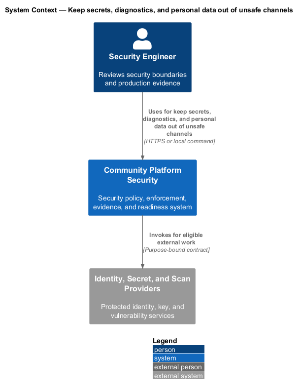
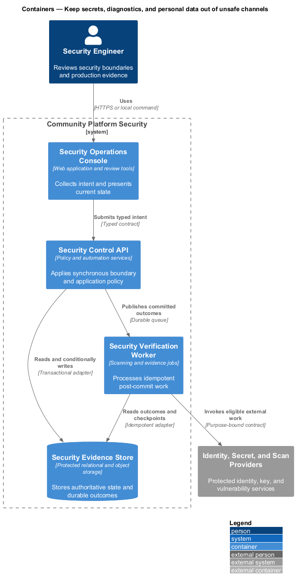
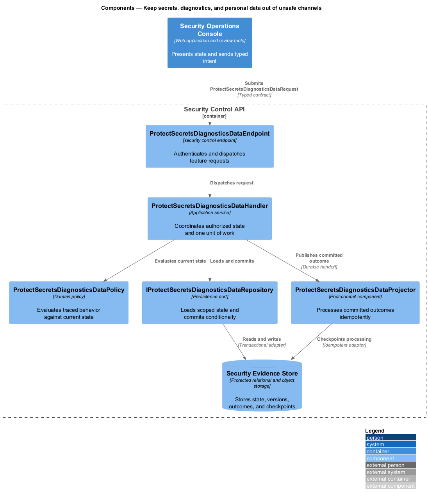
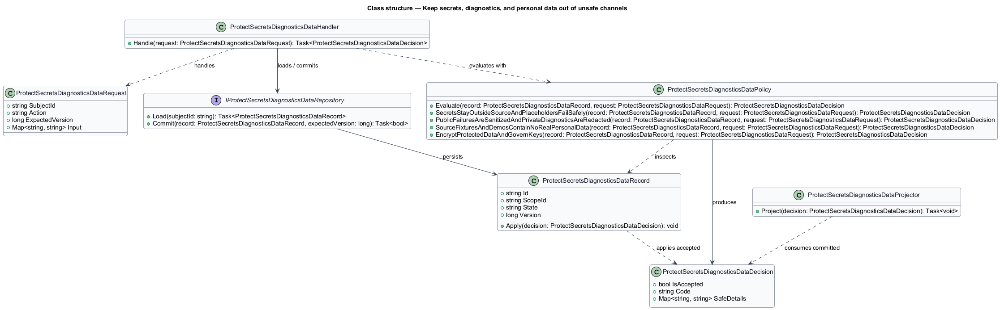
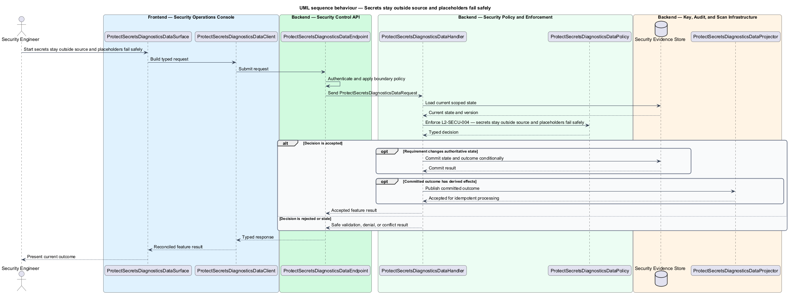
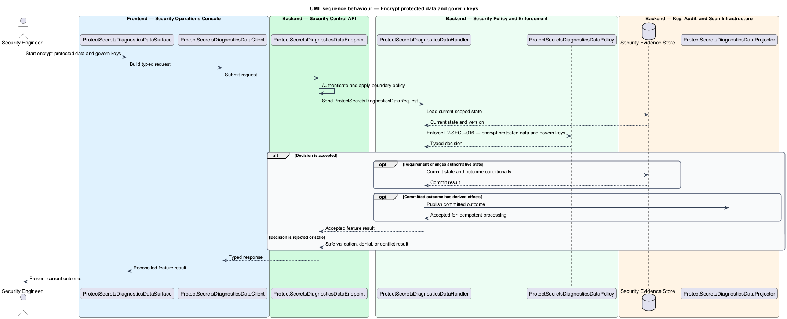

# Keep secrets, diagnostics, and personal data out of unsafe channels

## Overview

Community Starter is a community platform divided into product and platform subsystems. The
Security and privacy baseline subsystem owns this feature.

*keep secrets, diagnostics, and personal data out of unsafe channels* — subsystem capability that covers secrets stay outside source and placeholders fail safely, public failures are sanitized and private diagnostics are redacted, source, fixtures, and demos contain no real personal data, and encrypt protected data and govern keys

The starter will hold identities and data across multiple isolated Communities, including Memberships, content, moderation records, invitations, uploads, and activity data. Its baseline shall prevent client-side trust, cross-Community access, secret leakage, unsafe public input, and insecure delivery shortcuts while making unresolved production risk explicit. Production configuration, logs, error contracts, source control, fixtures, and demonstration environments shall protect credentials and member information by construction.

The feature groups 4 traced behaviors behind one policy and evidence
boundary: `L2-SECU-004`, `L2-SECU-005`, `L2-SECU-006`, and `L2-SECU-016`. Authoritative state commits before projections, delivery, or external work reports
success.

## Description

The repository contains specifications but no application implementation. This greenfield slice
defines the following building blocks across `Security Operations Console`, `Security Control API`, the
application and domain layer, and infrastructure.

- **`ProtectSecretsDiagnosticsDataSurface`** — security review surface in `Security Operations Console`. It presents current
  state, submits user intent, and reconciles the typed result.
- **`ProtectSecretsDiagnosticsDataClient`** — typed security adapter. It creates `ProtectSecretsDiagnosticsDataRequest` values and maps stable
  transport failures into feature results.
- **`ProtectSecretsDiagnosticsDataEndpoint`** — security control endpoint in `Security Control API`. It authenticates the
  caller, applies boundary policy, and dispatches the request.
- **`ProtectSecretsDiagnosticsDataRequest`** — immutable request carrying `SubjectId`, `Action`, `ExpectedVersion`, and the
  scoped input needed by one traced behavior.
- **`ProtectSecretsDiagnosticsDataHandler`** — application service that loads authorized state through
  `IProtectSecretsDiagnosticsDataRepository`, invokes `ProtectSecretsDiagnosticsDataPolicy`, and commits an accepted transition.
- **`ProtectSecretsDiagnosticsDataPolicy`** — domain policy that evaluates current state and returns a typed
  `ProtectSecretsDiagnosticsDataDecision` without performing external work.
- **`ProtectSecretsDiagnosticsDataRecord`** — authoritative record containing the feature state, scope, and concurrency
  version.
- **`IProtectSecretsDiagnosticsDataRepository`** — persistence port that loads scoped state and commits one conditional
  unit of work.
- **`ProtectSecretsDiagnosticsDataProjector`** — idempotent post-commit component in `Security Verification Worker`. It updates
  eligible projections and invokes configured external providers.

`ProtectSecretsDiagnosticsDataPolicy` exposes one named operation for each traced behavior:

- **`ProtectSecretsDiagnosticsDataPolicy.SecretsStayOutsideSourceAndPlaceholdersFailSafely(record, request)`** — evaluates `L2-SECU-004` (secrets stay outside source and placeholders fail safely) and returns a typed decision before any state change.
- **`ProtectSecretsDiagnosticsDataPolicy.PublicFailuresAreSanitizedAndPrivateDiagnosticsAreRedacted(record, request)`** — evaluates `L2-SECU-005` (public failures are sanitized and private diagnostics are redacted) and returns a typed decision before any state change.
- **`ProtectSecretsDiagnosticsDataPolicy.SourceFixturesAndDemosContainNoRealPersonalData(record, request)`** — evaluates `L2-SECU-006` (source, fixtures, and demos contain no real personal data) and returns a typed decision before any state change.
- **`ProtectSecretsDiagnosticsDataPolicy.EncryptProtectedDataAndGovernKeys(record, request)`** — evaluates `L2-SECU-016` (encrypt protected data and govern keys) and returns a typed decision before any state change.

## Requirements

The feature realizes the following level-2 (L2) requirements. Each row preserves the specification
identifier, its level-1 (L1) parent, and the requirement statement verbatim.

| L2 ID | Refines (L1) | Requirement |
|-------|--------------|-------------|
| `L2-SECU-004` | `L1-SECU-002` | Credentials, signing material, tokens, connection secrets, and production-sensitive configuration shall come from environment or managed secret stores and shall never be committed. Typed startup validation shall reject missing production values and known placeholders without echoing secrets. Local examples shall use unmistakably non-secret names and documented provisioning. Generated output, local databases, credentials, and secret-bearing test results shall be excluded from version control. |
| `L2-SECU-005` | `L1-SECU-002` | Expected application failures shall map centrally to stable sanitized Problem Details, while unexpected diagnostics shall remain server-side. Logs, traces, metrics, support artifacts, and error responses shall omit tokens, passwords, credentials, raw authentication material, and sensitive community content. Structured diagnostics shall use correlation/request identifiers and stable event names so authorized operators can investigate without exposing payloads. |
| `L2-SECU-006` | `L1-SECU-002` | Source, documentation, mocks, screenshots, fixtures, seed data, local databases, and committed test artifacts shall contain no real personal or community data. Demonstration data shall be synthetic, deterministic, and enabled only in development or dedicated demo environments. Screenshots and examples shall avoid production identifiers, tokens, private posts, messages, reports, or member attributes. |
| `L2-SECU-016` | `L1-SECU-002` | Production traffic shall use authenticated current TLS according to the accepted threat model. Relational data, object storage, queues, Search where enabled, backups, and exported sensitive artifacts shall use provider-supported encryption at rest with named key ownership, least-privilege use, rotation, revocation, recovery, and audit policy. Product code shall not invent cryptography when a reviewed platform primitive meets the requirement. |

## Diagrams

### System context

The `Security Engineer` uses `Community Platform Security` for the feature. The system invokes
`Identity, Secret, and Scan Providers` only for configured external work after authoritative decisions.

### Containers

`Security Operations Console` collects intent, `Security Control API` applies the synchronous boundary,
and `Security Evidence Store` holds authoritative state. `Security Verification Worker` handles eligible
post-commit work against `Identity, Secret, and Scan Providers`.

### Components

Inside `Security Control API`, `ProtectSecretsDiagnosticsDataEndpoint` dispatches `ProtectSecretsDiagnosticsDataHandler`. The handler evaluates
`ProtectSecretsDiagnosticsDataPolicy`, persists through `IProtectSecretsDiagnosticsDataRepository`, and hands committed outcomes to
`ProtectSecretsDiagnosticsDataProjector`.

### Class structure

`ProtectSecretsDiagnosticsDataHandler` depends on the immutable request, domain policy, and repository port.
`ProtectSecretsDiagnosticsDataRecord` owns versioned state, while `ProtectSecretsDiagnosticsDataProjector` consumes committed results.

### Behaviour — secrets stay outside source and placeholders fail safely

The interaction loads current scoped state before `ProtectSecretsDiagnosticsDataPolicy` enforces
`L2-SECU-004`. Rejected decisions return without changing authoritative state; accepted
state changes commit before optional derived work starts.

### Behaviour — public failures are sanitized and private diagnostics are redacted

The interaction loads current scoped state before `ProtectSecretsDiagnosticsDataPolicy` enforces
`L2-SECU-005`. Rejected decisions return without changing authoritative state; accepted
state changes commit before optional derived work starts.

### Behaviour — source, fixtures, and demos contain no real personal data

The interaction loads current scoped state before `ProtectSecretsDiagnosticsDataPolicy` enforces
`L2-SECU-006`. Rejected decisions return without changing authoritative state; accepted
state changes commit before optional derived work starts.

### Behaviour — encrypt protected data and govern keys

The interaction loads current scoped state before `ProtectSecretsDiagnosticsDataPolicy` enforces
`L2-SECU-016`. Rejected decisions return without changing authoritative state; accepted
state changes commit before optional derived work starts.

