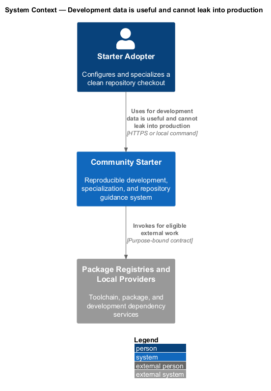
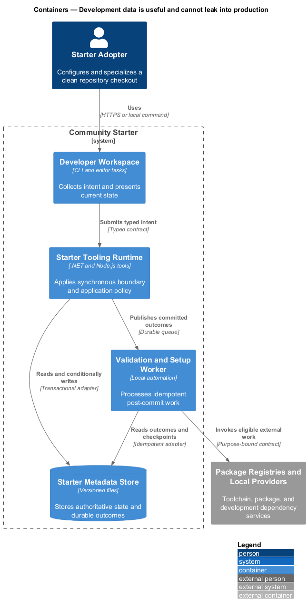
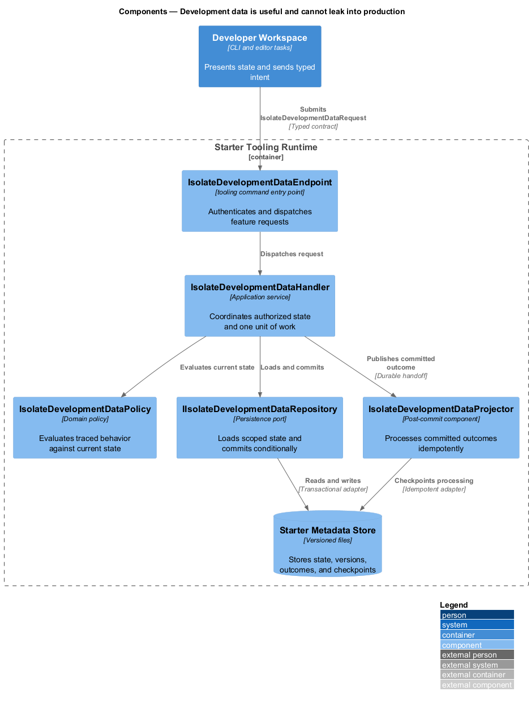
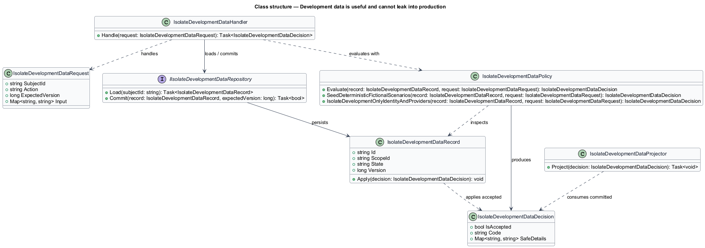
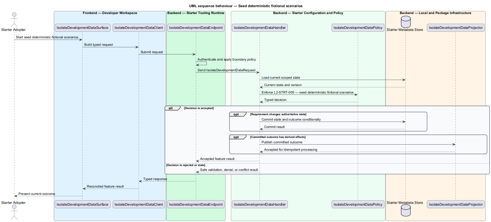
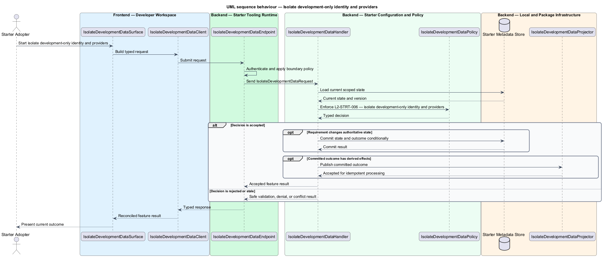

# Development data is useful and cannot leak into production

## Overview

Community Starter is a community platform divided into product and platform subsystems. The
Starter adoption and developer experience subsystem owns this feature.

*development data is useful and cannot leak into production* — subsystem capability that covers seed deterministic fictional scenarios and isolate development-only identity and providers

Product teams need to clone, understand, specialize, run, verify, and publish the starter without reverse-engineering hidden workstation state or accidentally shipping sample identities, placeholder secrets, or starter branding. The starter is a working, traceable baseline rather than an archive of empty projects or a generator whose output immediately drifts from its source. Fictional deterministic scenarios, local delivery tools, and any development identity shortcut make critical journeys inspectable while production profiles reject demonstration data and unsafe access.

The feature groups 2 traced behaviors behind one policy and evidence
boundary: `L2-STRT-005` and `L2-STRT-006`. Authoritative state commits before projections, delivery, or external work reports
success.

## Description

The repository contains specifications but no application implementation. This greenfield slice
defines the following building blocks across `Developer Workspace`, `Starter Tooling Runtime`, the
application and domain layer, and infrastructure.

- **`IsolateDevelopmentDataSurface`** — developer command surface in `Developer Workspace`. It presents current
  state, submits user intent, and reconciles the typed result.
- **`IsolateDevelopmentDataClient`** — typed tooling adapter. It creates `IsolateDevelopmentDataRequest` values and maps stable
  transport failures into feature results.
- **`IsolateDevelopmentDataEndpoint`** — tooling command entry point in `Starter Tooling Runtime`. It authenticates the
  caller, applies boundary policy, and dispatches the request.
- **`IsolateDevelopmentDataRequest`** — immutable request carrying `SubjectId`, `Action`, `ExpectedVersion`, and the
  scoped input needed by one traced behavior.
- **`IsolateDevelopmentDataHandler`** — application service that loads authorized state through
  `IIsolateDevelopmentDataRepository`, invokes `IsolateDevelopmentDataPolicy`, and commits an accepted transition.
- **`IsolateDevelopmentDataPolicy`** — domain policy that evaluates current state and returns a typed
  `IsolateDevelopmentDataDecision` without performing external work.
- **`IsolateDevelopmentDataRecord`** — authoritative record containing the feature state, scope, and concurrency
  version.
- **`IIsolateDevelopmentDataRepository`** — persistence port that loads scoped state and commits one conditional
  unit of work.
- **`IsolateDevelopmentDataProjector`** — idempotent post-commit component in `Validation and Setup Worker`. It updates
  eligible projections and invokes configured external providers.

`IsolateDevelopmentDataPolicy` exposes one named operation for each traced behavior:

- **`IsolateDevelopmentDataPolicy.SeedDeterministicFictionalScenarios(record, request)`** — evaluates `L2-STRT-005` (seed deterministic fictional scenarios) and returns a typed decision before any state change.
- **`IsolateDevelopmentDataPolicy.IsolateDevelopmentOnlyIdentityAndProviders(record, request)`** — evaluates `L2-STRT-006` (isolate development-only identity and providers) and returns a typed decision before any state change.

## Requirements

The feature realizes the following level-2 (L2) requirements. Each row preserves the specification
identifier, its level-1 (L1) parent, and the requirement statement verbatim.

| L2 ID | Refines (L1) | Requirement |
|-------|--------------|-------------|
| `L2-STRT-005` | `L1-STRT-002` | Development and dedicated demo profiles can create clearly fictional Accounts, Communities, Membership states, content, Events, Messages, Reports, Notifications, and failure edges needed by specifications and mocks. Seeds use stable identifiers and clocks where tests or screenshots require them and never derive from real people or production exports. |
| `L2-STRT-006` | `L1-STRT-002` | Any local sign-in shortcut, fixed code, mail catcher, storage substitute, provider-feedback fixture, or disabled safety check is explicitly labeled, registered only in an allowed development profile, and structurally rejected by production validation. |

## Diagrams

### System context

The `Starter Adopter` uses `Community Starter` for the feature. The system invokes
`Package Registries and Local Providers` only for configured external work after authoritative decisions.

### Containers

`Developer Workspace` collects intent, `Starter Tooling Runtime` applies the synchronous boundary,
and `Starter Metadata Store` holds authoritative state. `Validation and Setup Worker` handles eligible
post-commit work against `Package Registries and Local Providers`.

### Components

Inside `Starter Tooling Runtime`, `IsolateDevelopmentDataEndpoint` dispatches `IsolateDevelopmentDataHandler`. The handler evaluates
`IsolateDevelopmentDataPolicy`, persists through `IIsolateDevelopmentDataRepository`, and hands committed outcomes to
`IsolateDevelopmentDataProjector`.

### Class structure

`IsolateDevelopmentDataHandler` depends on the immutable request, domain policy, and repository port.
`IsolateDevelopmentDataRecord` owns versioned state, while `IsolateDevelopmentDataProjector` consumes committed results.

### Behaviour — seed deterministic fictional scenarios

The interaction loads current scoped state before `IsolateDevelopmentDataPolicy` enforces
`L2-STRT-005`. Rejected decisions return without changing authoritative state; accepted
state changes commit before optional derived work starts.

### Behaviour — isolate development-only identity and providers

The interaction loads current scoped state before `IsolateDevelopmentDataPolicy` enforces
`L2-STRT-006`. Rejected decisions return without changing authoritative state; accepted
state changes commit before optional derived work starts.

