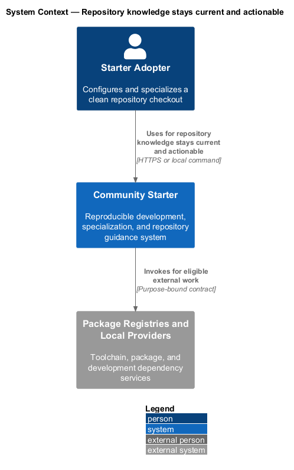
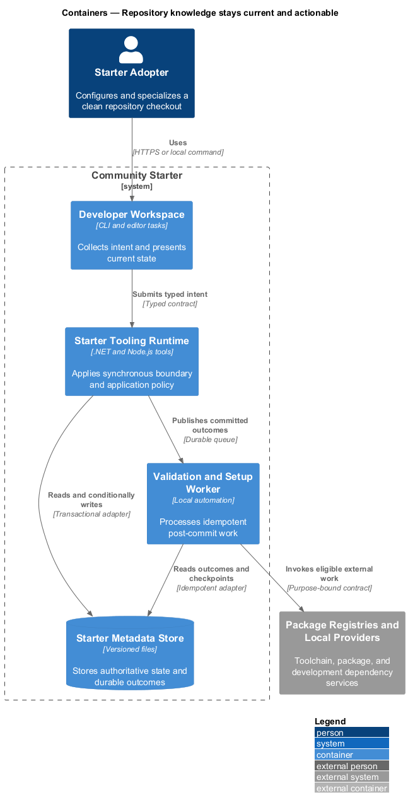
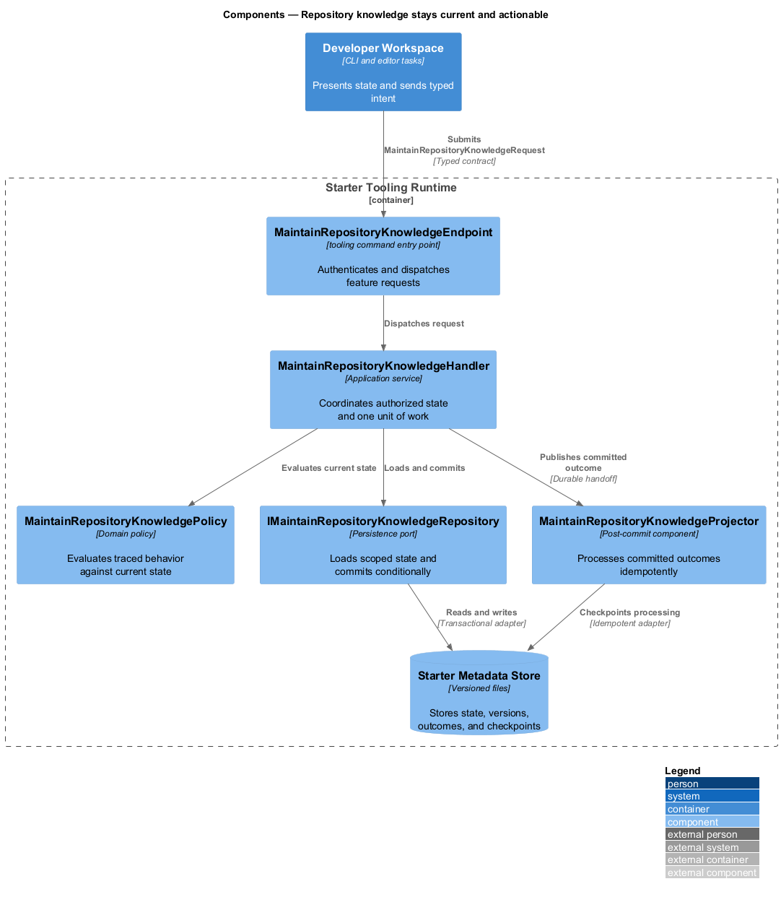
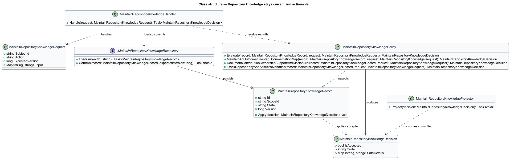
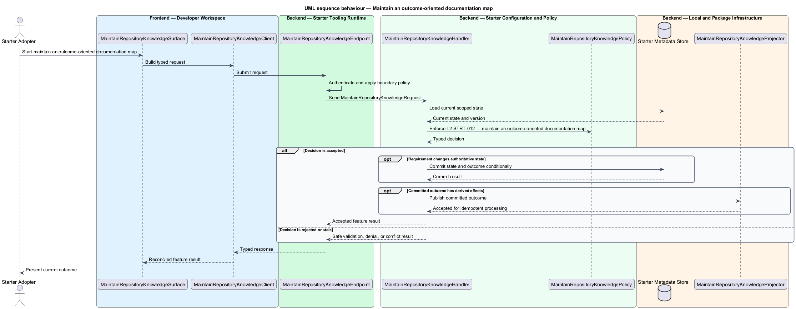
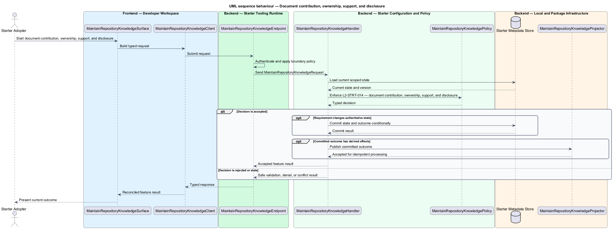
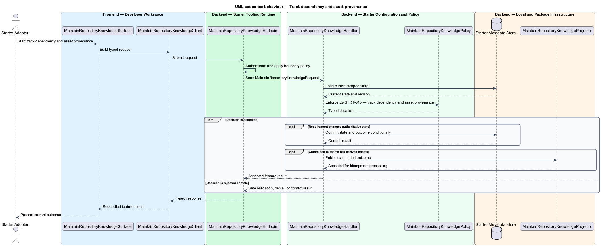

# Repository knowledge stays current and actionable

## Overview

Community Starter is a community platform divided into product and platform subsystems. The
Starter adoption and developer experience subsystem owns this feature.

*repository knowledge stays current and actionable* — subsystem capability that covers maintain an outcome-oriented documentation map, document contribution, ownership, support, and disclosure, and track dependency and asset provenance

Product teams need to clone, understand, specialize, run, verify, and publish the starter without reverse-engineering hidden workstation state or accidentally shipping sample identities, placeholder secrets, or starter branding. The starter is a working, traceable baseline rather than an archive of empty projects or a generator whose output immediately drifts from its source. Outcome-oriented documentation, architecture maps, contribution and support contracts, decision history, change records, and dependency provenance remain validated alongside behavior.

The feature groups 3 traced behaviors behind one policy and evidence
boundary: `L2-STRT-012`, `L2-STRT-014`, and `L2-STRT-015`. Authoritative state commits before projections, delivery, or external work reports
success.

## Description

The repository contains specifications but no application implementation. This greenfield slice
defines the following building blocks across `Developer Workspace`, `Starter Tooling Runtime`, the
application and domain layer, and infrastructure.

- **`MaintainRepositoryKnowledgeSurface`** — developer command surface in `Developer Workspace`. It presents current
  state, submits user intent, and reconciles the typed result.
- **`MaintainRepositoryKnowledgeClient`** — typed tooling adapter. It creates `MaintainRepositoryKnowledgeRequest` values and maps stable
  transport failures into feature results.
- **`MaintainRepositoryKnowledgeEndpoint`** — tooling command entry point in `Starter Tooling Runtime`. It authenticates the
  caller, applies boundary policy, and dispatches the request.
- **`MaintainRepositoryKnowledgeRequest`** — immutable request carrying `SubjectId`, `Action`, `ExpectedVersion`, and the
  scoped input needed by one traced behavior.
- **`MaintainRepositoryKnowledgeHandler`** — application service that loads authorized state through
  `IMaintainRepositoryKnowledgeRepository`, invokes `MaintainRepositoryKnowledgePolicy`, and commits an accepted transition.
- **`MaintainRepositoryKnowledgePolicy`** — domain policy that evaluates current state and returns a typed
  `MaintainRepositoryKnowledgeDecision` without performing external work.
- **`MaintainRepositoryKnowledgeRecord`** — authoritative record containing the feature state, scope, and concurrency
  version.
- **`IMaintainRepositoryKnowledgeRepository`** — persistence port that loads scoped state and commits one conditional
  unit of work.
- **`MaintainRepositoryKnowledgeProjector`** — idempotent post-commit component in `Validation and Setup Worker`. It updates
  eligible projections and invokes configured external providers.

`MaintainRepositoryKnowledgePolicy` exposes one named operation for each traced behavior:

- **`MaintainRepositoryKnowledgePolicy.MaintainAnOutcomeOrientedDocumentationMap(record, request)`** — evaluates `L2-STRT-012` (maintain an outcome-oriented documentation map) and returns a typed decision before any state change.
- **`MaintainRepositoryKnowledgePolicy.DocumentContributionOwnershipSupportAndDisclosure(record, request)`** — evaluates `L2-STRT-014` (document contribution, ownership, support, and disclosure) and returns a typed decision before any state change.
- **`MaintainRepositoryKnowledgePolicy.TrackDependencyAndAssetProvenance(record, request)`** — evaluates `L2-STRT-015` (track dependency and asset provenance) and returns a typed decision before any state change.

## Requirements

The feature realizes the following level-2 (L2) requirements. Each row preserves the specification
identifier, its level-1 (L1) parent, and the requirement statement verbatim.

| L2 ID | Refines (L1) | Requirement |
|-------|--------------|-------------|
| `L2-STRT-012` | `L1-STRT-004` | The root README states the product outcome and differentiator, honest readiness, prerequisites, setup, canonical commands, repository and architecture map, configuration entry points, deployed surfaces, and documentation map. Detailed documents cover architecture flows, development, testing, data, security, deployment, recovery, support, and troubleshooting without duplicating unstable facts. |
| `L2-STRT-014` | `L1-STRT-004` | The repository defines contribution setup and gates, code and operational ownership, review expectations, conduct, support channels and service boundaries, issue templates, private vulnerability reporting, privacy or safety escalation, and pull-request handoff evidence. Contacts are role-based where continuity matters. |
| `L2-STRT-015` | `L1-STRT-004` | Every runtime, build, test, font, icon, image, fixture, and distributed document dependency has a known source, version or revision, license, purpose, distribution status, maintenance and security posture, and owner. Additions require evidence that platform code or an existing dependency is not a better fit and record bundle/runtime or operational cost. |

## Diagrams

### System context

The `Starter Adopter` uses `Community Starter` for the feature. The system invokes
`Package Registries and Local Providers` only for configured external work after authoritative decisions.

### Containers

`Developer Workspace` collects intent, `Starter Tooling Runtime` applies the synchronous boundary,
and `Starter Metadata Store` holds authoritative state. `Validation and Setup Worker` handles eligible
post-commit work against `Package Registries and Local Providers`.

### Components

Inside `Starter Tooling Runtime`, `MaintainRepositoryKnowledgeEndpoint` dispatches `MaintainRepositoryKnowledgeHandler`. The handler evaluates
`MaintainRepositoryKnowledgePolicy`, persists through `IMaintainRepositoryKnowledgeRepository`, and hands committed outcomes to
`MaintainRepositoryKnowledgeProjector`.

### Class structure

`MaintainRepositoryKnowledgeHandler` depends on the immutable request, domain policy, and repository port.
`MaintainRepositoryKnowledgeRecord` owns versioned state, while `MaintainRepositoryKnowledgeProjector` consumes committed results.

### Behaviour — maintain an outcome-oriented documentation map

The interaction loads current scoped state before `MaintainRepositoryKnowledgePolicy` enforces
`L2-STRT-012`. Rejected decisions return without changing authoritative state; accepted
state changes commit before optional derived work starts.

### Behaviour — document contribution, ownership, support, and disclosure

The interaction loads current scoped state before `MaintainRepositoryKnowledgePolicy` enforces
`L2-STRT-014`. Rejected decisions return without changing authoritative state; accepted
state changes commit before optional derived work starts.

### Behaviour — track dependency and asset provenance

The interaction loads current scoped state before `MaintainRepositoryKnowledgePolicy` enforces
`L2-STRT-015`. Rejected decisions return without changing authoritative state; accepted
state changes commit before optional derived work starts.

