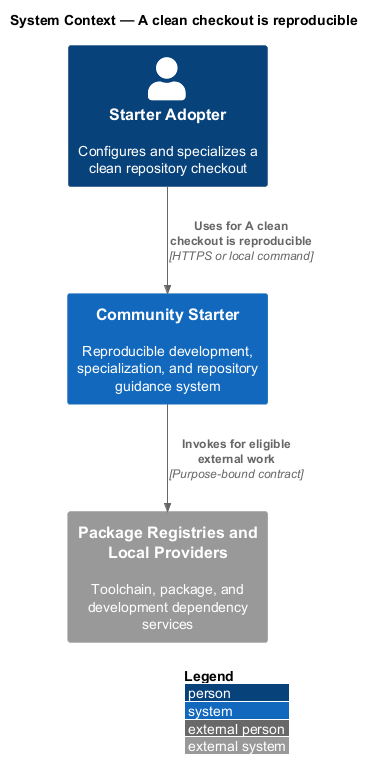
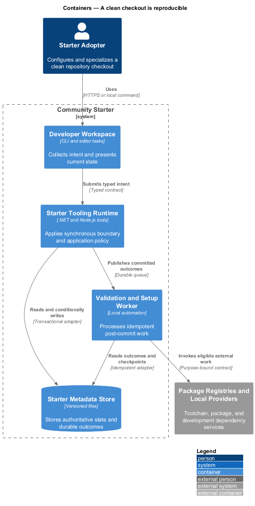
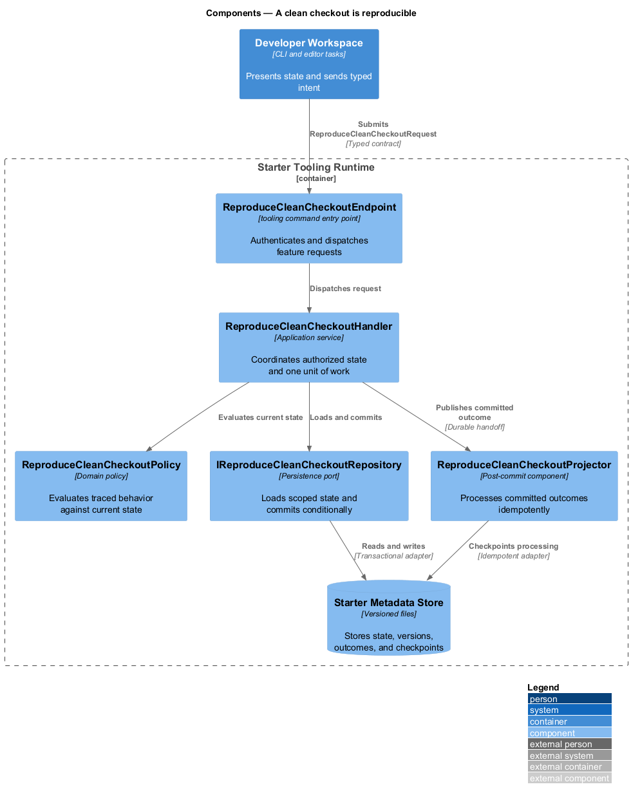
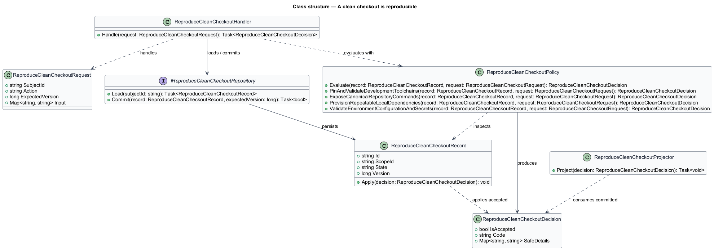
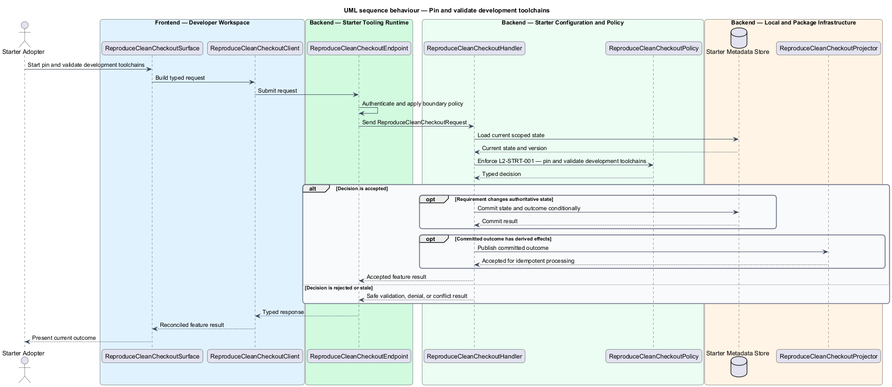
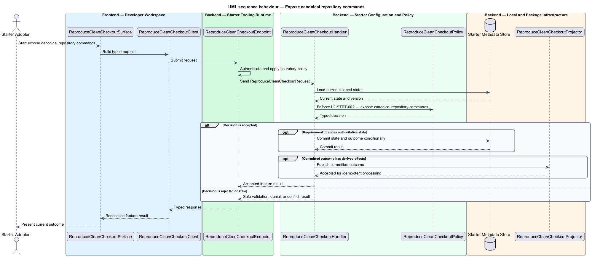
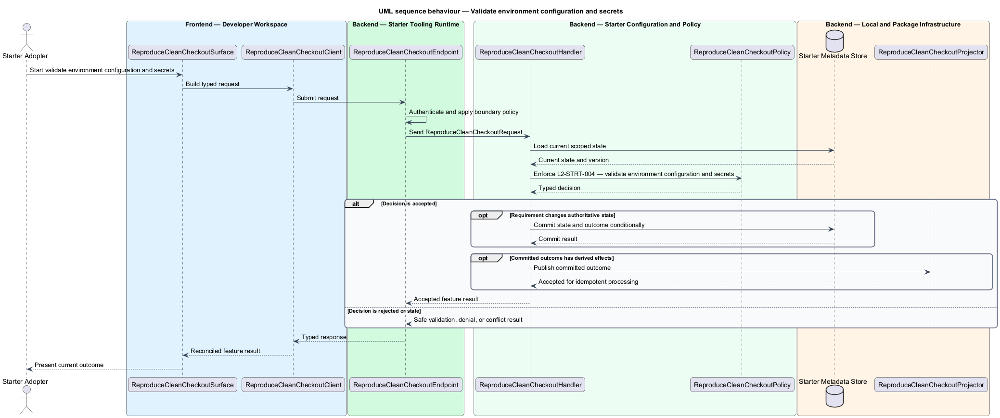

# A clean checkout is reproducible

## Overview

Community Starter is a community platform divided into product and platform subsystems. The
Starter adoption and developer experience subsystem owns this feature.

*A clean checkout is reproducible* — subsystem capability that covers pin and validate development toolchains, expose canonical repository commands, provision repeatable local dependencies, and validate environment configuration and secrets

Product teams need to clone, understand, specialize, run, verify, and publish the starter without reverse-engineering hidden workstation state or accidentally shipping sample identities, placeholder secrets, or starter branding. The starter is a working, traceable baseline rather than an archive of empty projects or a generator whose output immediately drifts from its source. Pinned toolchains, committed dependency resolution, repeatable local services, safe configuration, and canonical commands take a supported workstation from clone to a verified application.

The feature groups 4 traced behaviors behind one policy and evidence
boundary: `L2-STRT-001`, `L2-STRT-002`, `L2-STRT-003`, and `L2-STRT-004`. Authoritative state commits before projections, delivery, or external work reports
success.

## Description

The repository contains specifications but no application implementation. This greenfield slice
defines the following building blocks across `Developer Workspace`, `Starter Tooling Runtime`, the
application and domain layer, and infrastructure.

- **`ReproduceCleanCheckoutSurface`** — developer command surface in `Developer Workspace`. It presents current
  state, submits user intent, and reconciles the typed result.
- **`ReproduceCleanCheckoutClient`** — typed tooling adapter. It creates `ReproduceCleanCheckoutRequest` values and maps stable
  transport failures into feature results.
- **`ReproduceCleanCheckoutEndpoint`** — tooling command entry point in `Starter Tooling Runtime`. It authenticates the
  caller, applies boundary policy, and dispatches the request.
- **`ReproduceCleanCheckoutRequest`** — immutable request carrying `SubjectId`, `Action`, `ExpectedVersion`, and the
  scoped input needed by one traced behavior.
- **`ReproduceCleanCheckoutHandler`** — application service that loads authorized state through
  `IReproduceCleanCheckoutRepository`, invokes `ReproduceCleanCheckoutPolicy`, and commits an accepted transition.
- **`ReproduceCleanCheckoutPolicy`** — domain policy that evaluates current state and returns a typed
  `ReproduceCleanCheckoutDecision` without performing external work.
- **`ReproduceCleanCheckoutRecord`** — authoritative record containing the feature state, scope, and concurrency
  version.
- **`IReproduceCleanCheckoutRepository`** — persistence port that loads scoped state and commits one conditional
  unit of work.
- **`ReproduceCleanCheckoutProjector`** — idempotent post-commit component in `Validation and Setup Worker`. It updates
  eligible projections and invokes configured external providers.

`ReproduceCleanCheckoutPolicy` exposes one named operation for each traced behavior:

- **`ReproduceCleanCheckoutPolicy.PinAndValidateDevelopmentToolchains(record, request)`** — evaluates `L2-STRT-001` (pin and validate development toolchains) and returns a typed decision before any state change.
- **`ReproduceCleanCheckoutPolicy.ExposeCanonicalRepositoryCommands(record, request)`** — evaluates `L2-STRT-002` (expose canonical repository commands) and returns a typed decision before any state change.
- **`ReproduceCleanCheckoutPolicy.ProvisionRepeatableLocalDependencies(record, request)`** — evaluates `L2-STRT-003` (provision repeatable local dependencies) and returns a typed decision before any state change.
- **`ReproduceCleanCheckoutPolicy.ValidateEnvironmentConfigurationAndSecrets(record, request)`** — evaluates `L2-STRT-004` (validate environment configuration and secrets) and returns a typed decision before any state change.

## Requirements

The feature realizes the following level-2 (L2) requirements. Each row preserves the specification
identifier, its level-1 (L1) parent, and the requirement statement verbatim.

| L2 ID | Refines (L1) | Requirement |
|-------|--------------|-------------|
| `L2-STRT-001` | `L1-STRT-001` | The repository selects supported stable or LTS .NET, Node.js, package-manager, browser-test, and infrastructure-tool versions at adoption time. SDK selectors, lockfiles, central package versions, and reproducible restore settings are committed and used identically by local and CI workflows. |
| `L2-STRT-002` | `L1-STRT-001` | The root README and repeatable `eng/` entry points expose setup, start, stop, format, lint, analyze, build, unit, integration, journey, accessibility, migration, seed, publish, and smoke commands. Wrappers preserve underlying exit codes and invoke the same behavior in CI. |
| `L2-STRT-003` | `L1-STRT-001` | A versioned local environment supplies the relational database, mail catcher, object-storage substitute, and any enabled Search, cache, queue, or telemetry dependencies. It has deterministic ports or discoverable configuration, health waits, persisted-volume policy, and clean teardown without requiring shared developer services. |
| `L2-STRT-004` | `L1-STRT-001` | Configuration is grouped in typed options, documented by a safe example containing names and non-secret placeholders only, and validated at startup. Production rejects development values, default credentials, missing cryptographic material, localhost provider endpoints, and incompatible capability settings before readiness. |

## Diagrams

### System context

The `Starter Adopter` uses `Community Starter` for the feature. The system invokes
`Package Registries and Local Providers` only for configured external work after authoritative decisions.

### Containers

`Developer Workspace` collects intent, `Starter Tooling Runtime` applies the synchronous boundary,
and `Starter Metadata Store` holds authoritative state. `Validation and Setup Worker` handles eligible
post-commit work against `Package Registries and Local Providers`.

### Components

Inside `Starter Tooling Runtime`, `ReproduceCleanCheckoutEndpoint` dispatches `ReproduceCleanCheckoutHandler`. The handler evaluates
`ReproduceCleanCheckoutPolicy`, persists through `IReproduceCleanCheckoutRepository`, and hands committed outcomes to
`ReproduceCleanCheckoutProjector`.

### Class structure

`ReproduceCleanCheckoutHandler` depends on the immutable request, domain policy, and repository port.
`ReproduceCleanCheckoutRecord` owns versioned state, while `ReproduceCleanCheckoutProjector` consumes committed results.

### Behaviour — pin and validate development toolchains

The interaction loads current scoped state before `ReproduceCleanCheckoutPolicy` enforces
`L2-STRT-001`. Rejected decisions return without changing authoritative state; accepted
state changes commit before optional derived work starts.

### Behaviour — expose canonical repository commands

The interaction loads current scoped state before `ReproduceCleanCheckoutPolicy` enforces
`L2-STRT-002`. Rejected decisions return without changing authoritative state; accepted
state changes commit before optional derived work starts.

### Behaviour — provision repeatable local dependencies

The interaction loads current scoped state before `ReproduceCleanCheckoutPolicy` enforces
`L2-STRT-003`. Rejected decisions return without changing authoritative state; accepted
state changes commit before optional derived work starts.

### Behaviour — validate environment configuration and secrets

The interaction loads current scoped state before `ReproduceCleanCheckoutPolicy` enforces
`L2-STRT-004`. Rejected decisions return without changing authoritative state; accepted
state changes commit before optional derived work starts.

