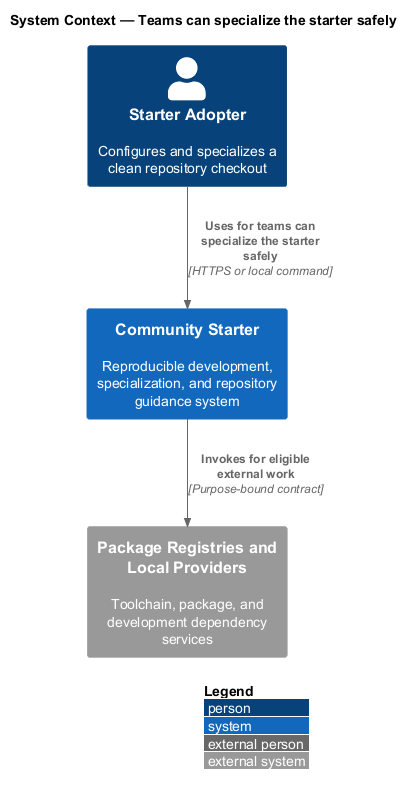
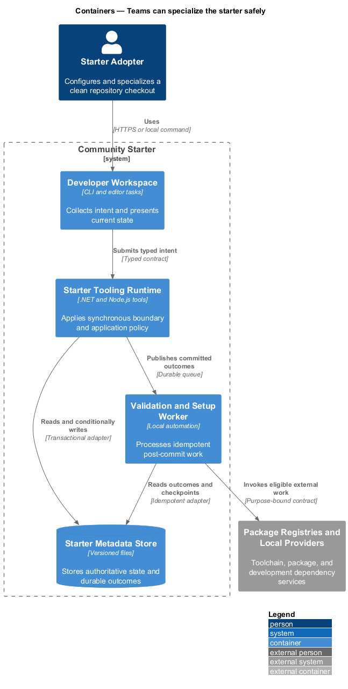
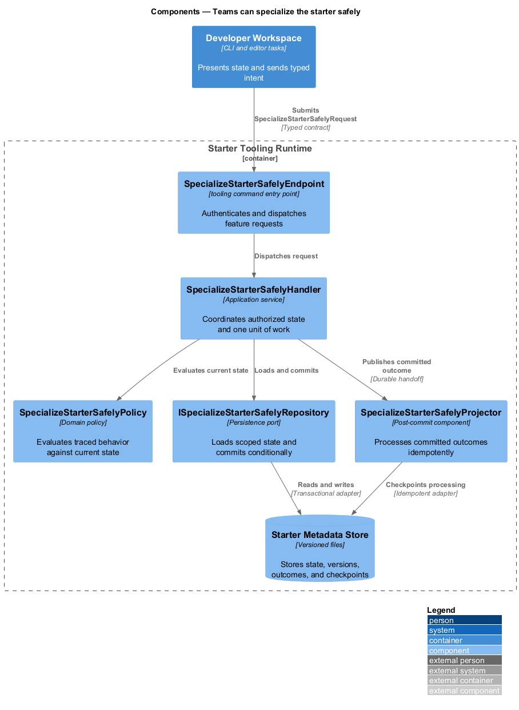
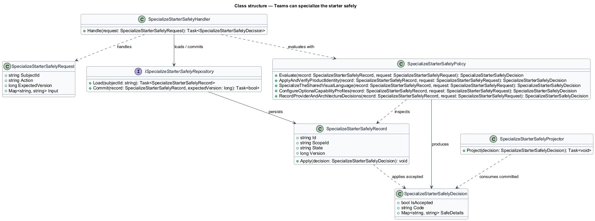
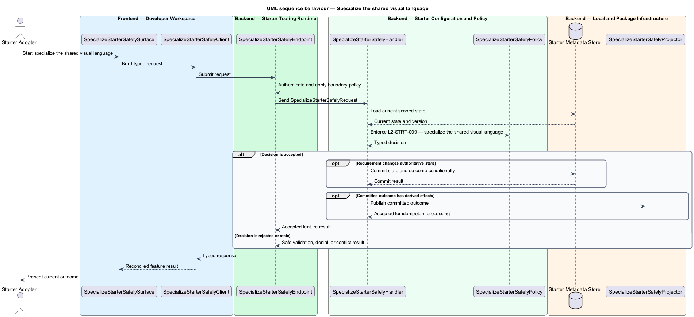
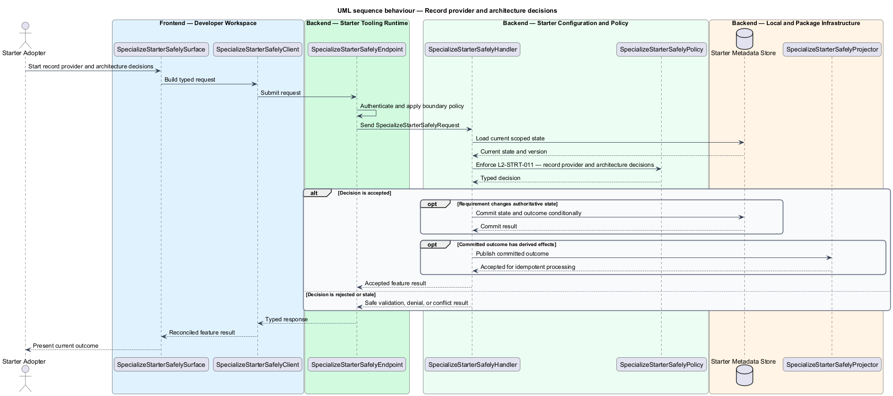

# Teams can specialize the starter safely

## Overview

Community Starter is a community platform divided into product and platform subsystems. The
Starter adoption and developer experience subsystem owns this feature.

*teams can specialize the starter safely* — subsystem capability that covers apply and verify product identity, specialize the shared visual language, configure optional capability profiles, and record provider and architecture decisions

Product teams need to clone, understand, specialize, run, verify, and publish the starter without reverse-engineering hidden workstation state or accidentally shipping sample identities, placeholder secrets, or starter branding. The starter is a working, traceable baseline rather than an archive of empty projects or a generator whose output immediately drifts from its source. Product name, namespaces, domains, visual identity, contact paths, capability profiles, and provider choices can change through a documented mechanism whose verification detects stale placeholders and preserves required platform controls.

The feature groups 4 traced behaviors behind one policy and evidence
boundary: `L2-STRT-008`, `L2-STRT-009`, `L2-STRT-010`, and `L2-STRT-011`. Authoritative state commits before projections, delivery, or external work reports
success.

## Description

The repository contains specifications but no application implementation. This greenfield slice
defines the following building blocks across `Developer Workspace`, `Starter Tooling Runtime`, the
application and domain layer, and infrastructure.

- **`SpecializeStarterSafelySurface`** — developer command surface in `Developer Workspace`. It presents current
  state, submits user intent, and reconciles the typed result.
- **`SpecializeStarterSafelyClient`** — typed tooling adapter. It creates `SpecializeStarterSafelyRequest` values and maps stable
  transport failures into feature results.
- **`SpecializeStarterSafelyEndpoint`** — tooling command entry point in `Starter Tooling Runtime`. It authenticates the
  caller, applies boundary policy, and dispatches the request.
- **`SpecializeStarterSafelyRequest`** — immutable request carrying `SubjectId`, `Action`, `ExpectedVersion`, and the
  scoped input needed by one traced behavior.
- **`SpecializeStarterSafelyHandler`** — application service that loads authorized state through
  `ISpecializeStarterSafelyRepository`, invokes `SpecializeStarterSafelyPolicy`, and commits an accepted transition.
- **`SpecializeStarterSafelyPolicy`** — domain policy that evaluates current state and returns a typed
  `SpecializeStarterSafelyDecision` without performing external work.
- **`SpecializeStarterSafelyRecord`** — authoritative record containing the feature state, scope, and concurrency
  version.
- **`ISpecializeStarterSafelyRepository`** — persistence port that loads scoped state and commits one conditional
  unit of work.
- **`SpecializeStarterSafelyProjector`** — idempotent post-commit component in `Validation and Setup Worker`. It updates
  eligible projections and invokes configured external providers.

`SpecializeStarterSafelyPolicy` exposes one named operation for each traced behavior:

- **`SpecializeStarterSafelyPolicy.ApplyAndVerifyProductIdentity(record, request)`** — evaluates `L2-STRT-008` (apply and verify product identity) and returns a typed decision before any state change.
- **`SpecializeStarterSafelyPolicy.SpecializeTheSharedVisualLanguage(record, request)`** — evaluates `L2-STRT-009` (specialize the shared visual language) and returns a typed decision before any state change.
- **`SpecializeStarterSafelyPolicy.ConfigureOptionalCapabilityProfiles(record, request)`** — evaluates `L2-STRT-010` (configure optional capability profiles) and returns a typed decision before any state change.
- **`SpecializeStarterSafelyPolicy.RecordProviderAndArchitectureDecisions(record, request)`** — evaluates `L2-STRT-011` (record provider and architecture decisions) and returns a typed decision before any state change.

## Requirements

The feature realizes the following level-2 (L2) requirements. Each row preserves the specification
identifier, its level-1 (L1) parent, and the requirement statement verbatim.

| L2 ID | Refines (L1) | Requirement |
|-------|--------------|-------------|
| `L2-STRT-008` | `L1-STRT-003` | A documented specialization mechanism updates the product display name, safe code identifier, namespaces, solution and project names, app selector prefix, package metadata, domains, cookie names, email sender, public links, support/security contacts, deployment labels, and documentation without blind text replacement inside generated or historical evidence. |
| `L2-STRT-009` | `L1-STRT-003` | Adopters customize canonical logo assets, fonts, semantic brand tokens, icons, social imagery, and email identity from one documented cross-surface source. Specialization preserves component states, contrast, focus, reduced motion, responsive behavior, licenses, and build-time asset validation. |
| `L2-STRT-010` | `L1-STRT-003` | Optional Messaging, Events, public indexing, realtime, analytics, and email Delivery profiles have explicit defaults, dependency validation, route and navigation behavior, processing and credential behavior, data-migration consequences, and tests. Disabling a capability removes its claims and attack surface while preserving shared requirements. |
| `L2-STRT-011` | `L1-STRT-003` | Adoption records consequential choices for identity, relational database, media, email, Search, realtime, Jobs, analytics, hosting, domains, secrets, telemetry, recovery, and licensing in immutable architecture decision records with drivers, alternatives, trade-offs, verification, and revisit triggers. |

## Diagrams

### System context

The `Starter Adopter` uses `Community Starter` for the feature. The system invokes
`Package Registries and Local Providers` only for configured external work after authoritative decisions.

### Containers

`Developer Workspace` collects intent, `Starter Tooling Runtime` applies the synchronous boundary,
and `Starter Metadata Store` holds authoritative state. `Validation and Setup Worker` handles eligible
post-commit work against `Package Registries and Local Providers`.

### Components

Inside `Starter Tooling Runtime`, `SpecializeStarterSafelyEndpoint` dispatches `SpecializeStarterSafelyHandler`. The handler evaluates
`SpecializeStarterSafelyPolicy`, persists through `ISpecializeStarterSafelyRepository`, and hands committed outcomes to
`SpecializeStarterSafelyProjector`.

### Class structure

`SpecializeStarterSafelyHandler` depends on the immutable request, domain policy, and repository port.
`SpecializeStarterSafelyRecord` owns versioned state, while `SpecializeStarterSafelyProjector` consumes committed results.

### Behaviour — apply and verify product identity

The interaction loads current scoped state before `SpecializeStarterSafelyPolicy` enforces
`L2-STRT-008`. Rejected decisions return without changing authoritative state; accepted
state changes commit before optional derived work starts.

### Behaviour — specialize the shared visual language

The interaction loads current scoped state before `SpecializeStarterSafelyPolicy` enforces
`L2-STRT-009`. Rejected decisions return without changing authoritative state; accepted
state changes commit before optional derived work starts.

### Behaviour — configure optional capability profiles

The interaction loads current scoped state before `SpecializeStarterSafelyPolicy` enforces
`L2-STRT-010`. Rejected decisions return without changing authoritative state; accepted
state changes commit before optional derived work starts.

### Behaviour — record provider and architecture decisions

The interaction loads current scoped state before `SpecializeStarterSafelyPolicy` enforces
`L2-STRT-011`. Rejected decisions return without changing authoritative state; accepted
state changes commit before optional derived work starts.

